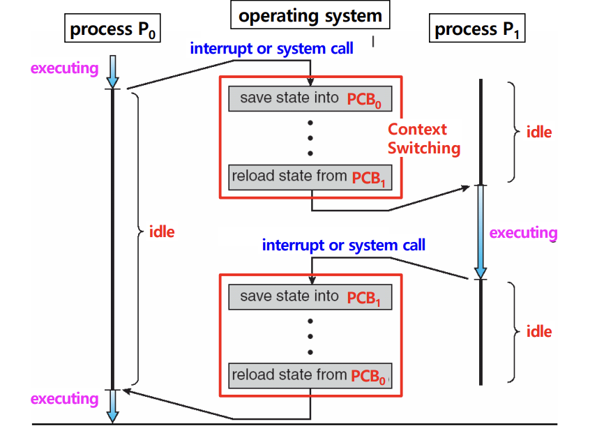

## 📖 문맥 교환

### 문맥 교환 개요

- **문맥 (Context)**: 프로세스가 다시 실행될 때 이어서 수행하기 위해 필요한 정보
    - 레지스터 값, 프로그램 카운터, 메모리 상태 등
- **문맥 교환 (Context Switch)**: 실행 중이던 프로세스의 문맥을 저장하고, 다른 프로세스의 문맥을 불러와 실행을 전환하는 것

#### 문맥 교환으로 인한 오버헤드

- 문맥 교환 중에는 CPU가 실제 작업 불가 → 성능 저하 가능성
- 문맥 교환에는 보통 N ms 걸림 (많이 소요됨)
    - 저장해야 하는 레지스터 수, 메모리 속도, 하드웨어 지원 여부에 따라 달라짐
- 하드웨어 지원 (특수 명령어, 레지스터 파일 등) 있으면 속도 개선

 

### 문맥 교환이 일어나는 시점

#### 멀티 태스킹

- 여러 프로세스들이 OS 스케줄러에 의해 CPU를 번갈아 사용
- CPU를 프로세스에 할당할 때 문맥 교환이 일어남
- 빠르게 번갈아가며 실행되기 때문에, 사용자 입장에서는 동시에 처리되는 것처럼 느낌

#### 인터럽트 처리

- 입출력 요청 처리 완료, CPU 사용시간 만료, 예외 발생, 자식 프로세스 생성 등

#### 사용자 ↔ 커널 모드 전환

- 운영체제에 따라 사용자 모드와 커널 모드 간 전환이 필요할 때 문맥 교환 발생
- 시스템 콜, 입출력 요청, 예외 처리 등

 

### 문맥 교환 과정

> 프로세스 P0에서 P1로의 문맥 교환
> 

1. **요청 발생** (스케줄링, 인터럽트 등)
2. **P0의 문맥 저장** (PCB0에 P0의 실행 정보 기록)
3. **P1의 문맥 복원** (PCB1에서 불러와 CPU에 로드)
4. **실행 재개** (P1 실행, 이후 다시 P0 차례 오면 PCB0 불러와 이어서 실행)