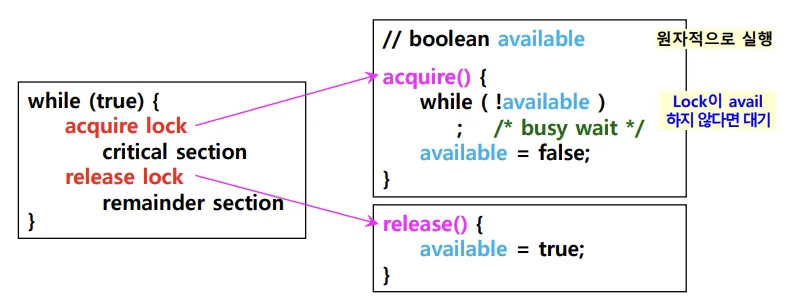
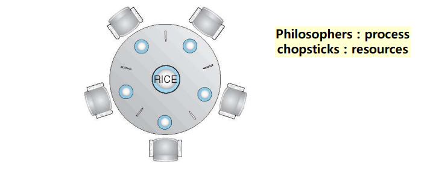

## 📖 동기화 (Synchronization)

### 동기화 개요

- **동기화 (Synchronization)**: 여러 프로세스 또는 스레드가 동시에 실행될 때, 수행 시점을 조율하고 공유 자원에 안전하게 접근할 수 있도록 제어하는 것
- 목적
    1. **실행 순서 제어** → 올바른 실행 순서 보장
    2. **상호 배제** → 공유 자원에 동시에 접근하는 것을 방지 

<br>

### 공유 자원과 임계 구역

- **공유 자원 (Shared Resource)**: 여러 프로세스가 동시에 접근하면 문제가 생길 수 있는 자원
    - 전역 변수, 파일, 프린터 등
- **임계 구역 (Critical Section)**: 공유 자원에 접근하는 코드 부분
- **레이스 컨디션 (Race Condition)**: 둘 이상의 프로세스가 동시에 임계 구역을 실행해 잘못된 결과를 만드는 상황

<br>

### 상호 배제를 위한 동기화 조건 (세 가지 원칙)

1. **상호 배제 (Mutual Exclusion)**: 한 프로세스가 임계 구역에 있으면 다른 프로세스는 임계 구역에 들어갈 수 없음
2. **진행 (Progress)**: 임계 구역에 어떤 프로세스도 진입하지 않았다면, 대기 중인(임계 구역에 진입하고자 하는) 프로세스 중 하나는 반드시 들어가야 함
3. **유한 대기 (Bounded Waiting)**: 한 프로세스가 임계 구역에 진입하고자 한다면, 그 프로세스는 언젠가는 임계 구역에 들어갈 수 있어야 함 (무한정 대기 x)

<br>

## 📖 동기화 기법

> 대표적인 동기화 도구: 뮤텍스 락, 세마포, 모니터
> 

### 뮤텍스 락 (Mutex Lock)

> MUTual EXclusion Lock
> 
- 가장 단순한 동기화 도구
- 임계 구역에 들어가기 전에 잠금을 걸고 (lock), 나오면서 잠금 해제 (unlock)
- 임계 구역은 동시에 오직 하나의 프로세스만 진입 가능

#### 뮤텍스 락 구현

> 전역변수 `lock`, 함수 `acquire()`, `release()`
> 
- `lock`: 프로세스들이 공유하는 전역변수. 자물쇠 역할
- `acquire()`:  임계 구역 진입 전, 잠금 시도
    - 임계 구역이 잠겨 있다면, 임계 구역이 열릴 때까지 반복적으로 확인
    - 임계 구역이 열려 있다면, 임계 구역을 잠금
- `release()`: 임계 구역 실행 후, 잠금 해제
    
    
    

- 임계 구역 전후로 `acquire()`, `release()`를 호출함으로써 하나의 프로세스만 임계 구역에 진입 가능

#### 바쁜 대기 문제 (busy wait)

- 임계 구역이 잠겨 있는지 반복적으로 확인하는 것
- 락이 풀릴 때까지 계속 반복 → CPU 낭비

<br>

### 세마포 (Semaphore)

- 뮤텍스를 일반화한 동기화 기법
- 공유 자원이 여러 개일 때도 적용 가능

#### 세마포 구현

> 세마포 변수 `S`, 함수 `wait()`, `signal()`
> 
- `S`: 임계 구역에 진입할 수 있는 프로세스의 개수 (= 사용 가능한 공유 자원의 개수)
    - 한 프로세스가 세마포 값을 변경중일 때, 다른 프로세스가 동시에 접근 불가
- `wait()`: 임계 구역 진입 전에 호출, 자원 사용 요청
    - `S > 0`이면 자원 사용 가능; `S--` 후 임계 구역 진입
    - `S<=0`이면 대기
- `signal()`: 임계 구역 작업을 마친 후 호출, 자원 사용 해제
    - `S++`로 대기 중인 프로세스에 신호 줌

#### 뮤텍스 락 vs. 세마포

|  | Mutex Lock | Semaphore |
| --- | --- | --- |
| 개념 | 자원을 하나만 보호하는 잠금 도구 | 여러 자원 개수를 카운트하는 신호 도구 |
| 방식 | Lock / Unlock | Wait / Signal |
| 용도 | 단순 상호 배제 | 상호 배제 + 실행 순서 제어 |
| 범위 | 한 번에 1개 프로세스만 접근 | 여러 개 동시에 접근 가능 |

<br>

### 모니터 (Monitor)

- 세마포의 단점 보완: 매번 임계 구역 앞뒤로 `wait()`, `signal()` 명시하기 번거로운 점
- 공유 자원 + 접근 메서드를 하나로 묶어 관리
- `wait()`, `signal()` 같은 세부 제어를 직접 사용하지 않음
    - 모니터가 자동으로 상호 배제 보장
    - 공유 자원을 다루는 인터페이스에 접근하기 위한 큐를 만들고, 모니터 안에 항상 하나의 프로세스만 들어오게 함

#### 조건 변수 (Condition Variable)

- 모니터 안에서 실행 순서를 제어하기 위한 도구
- `wait()`: 특정 조건이 만족될 때까지 프로세스 대기
- `signal()`: 조건이 만족되면 대기 중인 프로세스가 실행 재개하도록

<br>

## 📖 대표적인 동기화 문제

### 생산자 - 소비자 문제 (Bounded-Buffer Problem)

- 제한된 크기의 버퍼에서 생산자(데이터 넣음) & 소비자(데이터 꺼냄) 가 동시에 동작할 때 발생하는 문제
- 버퍼가 가득 차면 생산자는 기다려야 하고, 버퍼가 비면 소비자는 기다려야 함

#### Semaphore 활용 해결 

- 3가지 세마포
    - `mutex` : 버퍼 접근에 대한 상호 배제
    - `empty` : 남은 빈 칸 수
    - `full` : 채워진 칸 수
- 생산자 흐름:
    
    ```
    wait(empty);    /* 빈 칸이 있어야만 접근 가능 */
    wait(mutex);    /* 버퍼 접근 잠금 */
    ...아이템 넣기...
    signal(mutex);  /* 버퍼 잠금 해제 */
    signal(full);   /* 소비자가 가져갈 수 있게 알림 */
    ```
    
- 소비자 흐름:
    
    ```
    wait(full);      /* 채워진 칸이 있어야만 접근 가능 */
    wait(mutex);     /* 버퍼 접근 잠금 */
    ...아이템 꺼내기...
    signal(mutex);   /* 버퍼 잠금 해제 */
    signal(empty);   /* 생산자가 새 아이템 넣을 수 있게 알림 */
    ```
    
<br>

### Readers-Writers 문제

- 공유 데이터베이스를 여러 프로세스가 접근할 때 발생하는 문제
- Reader는 읽기만 수행 → 동시에 여러 Reader 접근 가능
- Writer는 읽기+쓰기 수행 → 반드시 단독 접근 필요
- Problem:
    - Reader 우선 → Writer가 starvation 가능성
    - Writer 우선 → Reader가 starvation 가능성

#### Semaphore 활용 해결

- 변수
    - `read_count`: 진입 가능한 프로세스 개수 (현재 읽는 Reader 수)
    - `ru_mutex`: Reader/Writer 모두 공유 (Reader 여러개, Writer 1개)
        - 임계 구역에 처음 접근하는 / 마지막으로 나가는 Reader가 업데이트
        - Writer의 상호 배제 제공
    - `mutex`: `read_count`처리할 때의 상호 배제
- Reader 흐름:
    
    ```
    wait(mutex);       /* read_count 값 변경 보호  */
    read_count++;
    wait(ru_mutex);    /* 첫 Reader라면 */
    signal(mutex)      /* Reader 입장 완료 */
    ...읽기 작업...
    wait(mutex);       /* read_count 값 변경 보호 */
    read_count--;
    signal(ru_mutex);  /* 마지막 Reader라면 */
    signal(mutex);     /* Reader 종료 완료 */
    ```
    
- Writer 흐름:
    
    ```
    wait(ru_mutex);    /* 단독 접근 보장 */
    ...쓰기 작업...
    signal(ru_mutex);  /* Writer 작업 끝 */
    ```

<br>

### 식사하는 철학자 문제 (Dining Philosophers Problem)



- 철학자 5명이 원탁에 앉아 있고, 각자 양옆의 젓가락 2개를 들어야 식사 가능
- 젓가락 = 공유 자원, 철학자 = 프로세스
- 공유 자원을 동시에 집으려다 Deadlock 또는 Starvation 발생 가능

#### Semaphore 활용 해결

- 젓가락 각각을 세마포로 표현
- 자원(젓가락)의 소유 상태를 직접 제어
- 젓가락 들 때 `wait()`, 젓가락 놓을 때 `signal()` 호출
- 문제: 모든 철학자가 동시에 한쪽 젓가락 집음 → 교착 상태 (deadlock)
- 해결:
    - 최대 4명만 동시에 먹게
    - 양쪽 젓가락이 모두 가능할 때만 집기
    - 홀수/짝수 철학자 동작 비대칭

#### Monitor 활용 해결

- 철학자 상태를 `THINKING`, `HUNGRY`, `EATING`으로 관리
- 조건 변수 `self` → 배고플 때 양옆 철학자 상태 검사
    - 양옆이 먹고 있지 않으면 `EATING`, 아니면 `wait()`
    - 식사 끝나고 젓가락 놓으면 옆 철학자에 `signal()`
- 철학자 상태와 조건 변수를 통해 자원 배분

- Monitor 활용 해결
    - 교착 상태 없이 안전하게 관리 가능
    - 양쪽 젓가락이 모두 가능할 때만 집게 하기