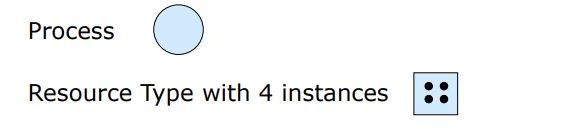
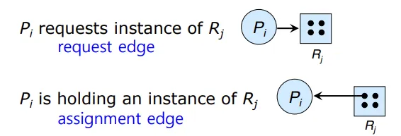
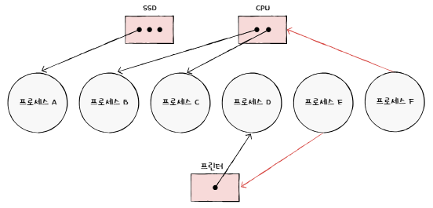

## 📖 교착 상태

### 교착 상태 개요

- 여러 프로세스가 자원을 점유한 채 서로가 가진 자원을 기다리며 무한 대기에 빠진 상태
- 멀티프로그래밍 환경에서 주로 발생

 

### 자원 할당 그래프 (Resource-Allocation Graph)

> 어떤 프로세스가 어떤 자원을 사용하고 있고, 또 어떤 프로세스가 어떤 자원을 기다리고 있는지 표현하는 간단한 그래프

#### 자원 할당 그래프를 그리는 규칙

- 프로세스는 원으로, 자원은 사각형으로 표현
- 사용할 수 있는 자원의 개수는 사각형 내 점들로 표현
  

- `자원 → 프로세스` 간선: Assignment edge. 자원이 프로세스에 할당됨
- `프로세스 → 자원` 간선: Request edge. 프로세스가 자원의 할당을 기다리고 있음
  

#### example

- 사용 가능한 자원: SSD 자원 3개, CPU 자원 2개, 프린터 1개
- 프로세스에 할당된 자원: 프로세스 A는 SSD, 프로세스 B와 C는 CPU, 프로세스 D는 프린터를 사용 중
- 할당을 대기 중인 프로세스: 프로세스 E는 프린터를, 프로세스 F는 CPU 할당을 기다리는 중

#### 자원 할당 그래프에서 사이클

- 그래프에 **사이클이 있으면 교착 상태일 가능성**이 있음.
- 자원 인스턴스가 1개인 경우: 사이클 있음 → 교착 상태
- 여러 개인 경우: 사이클 있어도 교착 상태 아닐 수 있음.

 

### 교착 상태 발생 조건

> 4개 조건이 모두 만족되어야 교착 상태 발생. 하나라도 깨지면 교착 상태 X
> 

#### 1. 상호 배제 (Mutual Exclusion)

- 자원을 한번에 한 프로세스만 사용할 수 있어 다른 프로세스는 그 자원을 사용 중인 프로세스가 있으면 해제될 때까지 기다려야 함
- 프린터, 파일 등

#### 2. 점유와 대기 (Hold and Wait)

- 이미 자원을 점유한 프로세스가 다른 자원을 추가로 요청하며 대기중인 것

#### 3. 비선점

- 다른 프로세스가 점유 중인 자원을 강제로 빼앗을 수 없는 것

#### 4. 원형 대기 

- 프로세스들과 프로세스들이 요청/할당된 자원이 원의 형태를 이루는 것
- T0은 T1이 사용중인 자원을 기다리고, T1은 T2가 사용중인 자원을 기다리고, …, Tn은 T0이 사용중인 자원을 기다리는 상황

 

## 📖 교착 상태 해결 방법

### 1. 무시 (Ignore)

> i.e., 타조 알고리즘
> 
- 교착 상태를 특별히 관려하지 않고 무시함
- 교착 상태를 검출하거나 회복하는 별개의 알고리즘 없음
- 대부분의 범용 OS (Windows, Linux, macOS)가 채택

#### 왜 무시하는가?

- 실제로 Deadlock 상태의 빈도가 낮음
- 따라서 복잡한 알고리즘을 사용하는 것보다 문제가 발생했을 때 사용자가 재시작하는 게 더 경제적

 

### 2. 예방 (Prevention)

- 교착 상태가 발생하는 4가지 조건 중 하나를 애초에 불가능하게 만듦
- 임베디드 시스템, 실시간 OS 일부 등에서 주로 사용됨
    - 안정성이 최우선인 경우
    - 자원 접근 순서가 고정되어 있고, 미리 모든 자원을 할당할 수 있는 경우

#### (1) 상호 배제

- 모든 자원을 공유 가능하게 함
- (-) 현실적으로 불가능

#### (2) 점유와 대기

- 프로세스들이 점유하는 동시에 대기할 수 없도록 함
- 즉, 자원을 한 번에 모두 할당하거나, 아니면 아예 할당하지 않음
- (-) 자원의 활용률이 낮아짐
    - 특히 많은 자원을 사용하는 프로세스는 매우 불리함 (그 자원들을 다 확보하기 어려우므로)
    - → 기아 현상 발생 가능

#### (3) 비선점

- 자원을 강제로 회수 가능하게 함
- (-) 선점이 불가능한 자원이 있음 (ex: 프린터를 사용중일 때 강제로 선점하는 건 불가능)

#### (4) 원형 대기

- 모든 자원에 번호를 부여하고, 오름차순으로만 할당
- (1)~(3)에 비해 비교적 현실적이고 실용적인 방법
- (-) 수많은 자원들에 전부 번호를 붙여 관리하기는 매우 복잡함
- (-) 어떤 번호를 붙이는지에 따라 특정 자원 활용률 저하될 수 있음

#### 예방 기법의 장단점

- 장점: 확실히 막을 수 있음
- 단점: 시스템 효율성이 크게 저하됨

 

### 3. 회피 (Avoidance)

- 프로세스가 자원 요청 시 **안전한 상태(Safe State)**를 유지하도록 자원 할당
- 추가 정보 (각 프로세스가 어떤 타이밍에 자원을 얼마나 필요로 하는지) 필요
- 데이터베이스에서 주로 사용됨
    - 트랜잭션 관리는 자원 요청/해제를 명확히 추적 및 예측하기 쉬움

#### Safe State

- Safe State: 프로세스들을 어떤 순서로 실행시키면 Deadlock이 발생하지 않도록 자원을 할당할 수 있는 상태
    - 각 프로세스(or 스레드) Ti에 대해, Ti가 필요로 하는 모든 자원이 현재 활용가능한 자원 + j<i인 Tj가 점유 중인 자원의 합으로 충족 가능한 상태
- Unsafe State: 프로세스들이 요청하는 자원의 순서를 고려했을 때, Deadlock으로 발전할 가능성이 있는 상태
    - Unsafe state 자체로 Deadlock은 아님

#### 회피 기법의 장단점

- 장점: Deadlock이 발생하지 않는 것을 보장함
- 단점: 추가 정보가 필요하고, Safe State에서만 자원을 할당하므로 자원 활용률이 낮아질 수 있음

 

### 4. 검출 및 회복 (Detection & Recovery)

- Deadlock 상태 발생을 허용하고, 발생 이후 해결하는 방법
- **Deadlock이 발생했는지 판단하는(Detection)** 알고리즘과, **Deadlock에서 회복하는(Recovery)** 알고리즘이 필요
- 데이터베이스, 대형 서버 시스템에서 주로 사용됨
    - 트랜잭션이 많고, 자원 충돌이 잦은 경우 → 주기적으로 교착 상태 발생을 검사하고 롤백

#### Detection

- 주기적으로 Deadlock 발생 여부를 검사함
- Deadlock이 얼마나 자주 발생하는지 & Deadlock에 연관된 프로세스들이 어떤 것인지 결정해야 함
- (1) 자원 할당 요청이 즉시 승인되지 않을 때마다 검사하는 방법
- (2) 정해진 시간 간격마다 검사하는 방법

#### Recovery

- Deadlock이 발생한 경우, 발생했음을 알려 수동적으로 해결하게 하거나 시스템이 자동으로 해결할 수 있음
- (1) 프로세스 종료해 회복 (Abort)
    - 교착 상태에 있는 모든 프로세스를 종료 → 확실하지만 비용 큼
    - 교착 상태가 없어질 때까지 프로세스를 하나씩 종료 → 오버헤드 크지만 피해는 최소화
- (2) 특정 프로세스들의 자원을 강제로 회수해 회복 (Resource Preemption)
    - 자원 회수된 프로세스는 Safe State로 롤백 후 재시작 필요
    - 동일한 프로세스가 반복해서 자원 회수될 경우 기아 현상 발생 가능 → 회수 횟수 제한 필요

#### 검출 및 회복 기법의 장단점

- (-) 교착 상태 발생 여부를 검사하는 데 추가 비용
- (-) 교착 상태에서 회복하는 과정에서 이미 했던 작업 내용을 버리거나 작업 과정이 꼬일 수 있음
