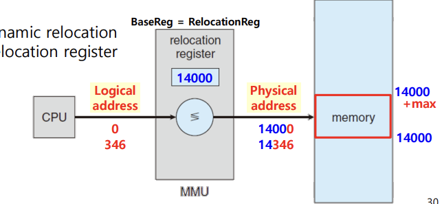
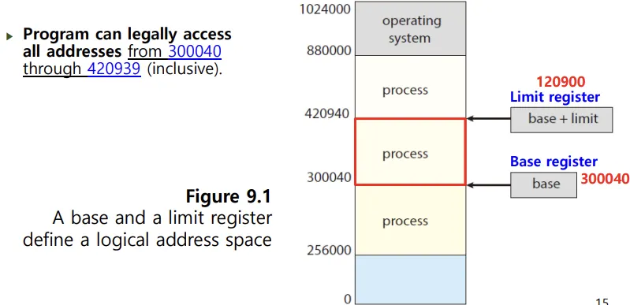
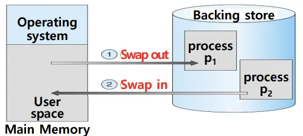
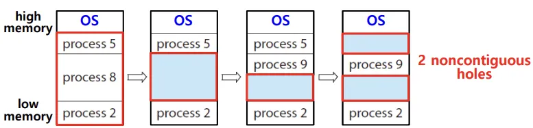
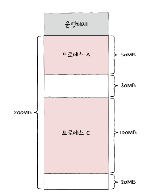

## 📖 메모리 관리 개요

### 물리 주소 vs. 논리 주소

#### 논리 주소 (Logical / Virtual Address)

- CPU가 생성하는 주소 (프로세스에서 사용하는 주소)
- 프로세스 관점에서의 주소
- 논리 주소 공간: `0` ~ `max` (프로그램 크기; 프로세스 입장에서의 주소 범위)

#### 물리 주소 (Physical Address)

- 실제 메모리 하드웨어에 전달되는 주소
- 물리 주소 공간: base register ~ base register + `max` (실제 메모리 범위)

#### MMU (Memory-Management Unit)의 역할

- CPU는 논리 주소를 생성 → MMU가 이를 물리 주소로 매핑
- 따라서 프로그램은 자신이 항상 0번지부터 연속된 메모리를 쓰는 것처럼 착각함

 

### 주소 바인딩 (Address Binding)

- 프로그램 코드나 데이터가 메모리의 실제 물리 주소와 연결되는 것
- 바인딩 시점: 컴파일 시 / 적재 시 / 실행 시로 나눌 수 있음

#### Compile-time binding

- 프로그램이 메모리 어디에 올라갈지 알고 있는 경우
- 그러면 그 위치에 맞는 절대 주소 코드를 생성
- 시작 위치가 바뀌면 다시 컴파일해야 함

#### Load-time binding

- 컴파일 시 메모리에서의 위치를 모르는 경우
- 재배치 가능 코드를 생성
- 실행 시점에서 유저 코드를 물리 주소로 변환

#### Execution-time binding

- 실행 도중에도 프로세스에서의 메모리 위치가 바뀔 수 있음
- 실행 시점마다 CPU가 생성한 논리 주소를 MMU가 물리 주소로 변환
- 대부분의 현대 OS가 사용하는 방식

 

### Base & Limit Register

#### 필요성

- 사용자 프로그램이 OS 영역이나 다른 프로세스의 메모리에 침범하지 않도록 보호 필요
- 하드웨어 차원에서 이를 보호해야 성능 손실이 없음

#### 동작 방식

- **base register**: 최소 물리 주소; 프로세스 시작 주소
- **limit register**: 프로세스가 사용할 수 있는 주소 공간의 크기
- 즉 실제 물리 주소는 `base` + CPU가 생성한 `논리 주소`
- `논리 주소` > `limit` 이면 사용 가능한 메모리 공간에 접근할 수 없으므로 오류 발생 (segmentation fault)

 

### 동적 로딩 & 동적 연결

#### 동적 로딩 (Dynamic Loading)

- 함수나 루틴은 호출되기 전까지 메모리에 올라오지 않고, 호출될 때 적재됨
- 전체 프로그램 크기가 크더라도, 사용하는 부분만 메모리에 올라가므로 메모리 사용은 적음
- OS의 도움 없이도 가능

#### 동적 연결 (Dynamic Linking, DLL)

- 시스템 라이브러리 코드를 실행 시점에 연결
- 여러 프로그램이 공통 라이브러리 코드를 공유하게 해 메모리 절약

 

### 스와핑 (Swapping)

- 메모리에 적재된 프로세스들 중 사용하지 않는 프로세스를 보조기억장치의 스왑 영역으로 내보내고, 필요할 때 다시 메모리로 가져오는 것
- 스왑 아웃 (swap out): 지금 실행되지 않는 프로세스가 메모리에서 스왑 영역으로 옮겨 가는 것
- 스왑 인 (swap in): 프로세스가 메인 메모리로 옮겨오는 것
- 프로세스가 다시 스왑 인될 떄는 스왑 아웃되기 전의 물리 주소와 다른 주소에 적재될 수 있음
- 프로세스들이 요구하는 메모리 주소 공간의 크기가 실제 메모리 크기보다 큰 경우에도 프로세스들을 동시 실행 가능

 

## 📖 연속 메모리 할당 기법

> 프로세스에 연속적인 메모리 공간을 할당하는 법

### 고정 분할 vs. 가변 분할

#### 고정 분할 (Fixed partition)

- 메모리를 미리 **일정한 크기**의 여러 파티션으로 나눔
- 내부 단편화 문제 발생 가능 — 작은 프로그램도 큰 파티션 차지

#### 가변 분할 (Variable partition)

- **프로그램 크기에 맞게**, 필요한 만큼 메모리를 분할해 할당
- 외부 단편화 문제 발생 가능 — 군데군데 낭비되는 메모리 공간

 

### 내부 단편화, 외부 단편화

#### 외부 단편화 (External Fragmentation)

- 프로세스를 할당하기 어려울 만큼의 작은 메모리 공간들로 인해 메모리가 낭비되는 현상
- ex:
    
    
    
    총 50mb의 빈 공간이 있지만 실제로 50mb의 프로세스를 할당할 수는 없는 상황
    
- 해결 방안: 메모리 압축 (Compaction)
    - 여기저기 흩어져 있는 빈 공간들을 하나로 모으는 방식
    - 비용 큼, 항상 가능한 방법은 아님
    - 어떻게 프로세스들을 모아야 오버헤드 최소화할 수 있는지 결정 어려움
- 다른 해결 방안: 가상 메모리 기법 (페이징 & 세그멘테이션)
    - 프로세스를 쪼개어 여러 곳에 적재
    - 현대 OS에서 채택하는 기법

#### 내부 단편화 (Internal Fragmentation)

- 프로세스에 할당된 메모리 파티션 내에서 일부가 사용되지 못하고 낭비되는 경우
- 필요 메모리 공간과 할당받은 메모리 공간 간의 격차

 

### 가변 분할에서의 할당 전략

#### 최초 적합 (First Fit)

- OS가 메모리 내의 빈 공간을 순서대로 검색하다가 적재할 수 있는 공간을 발견하는 즉시 메모리 할당
- 빠른 할당이지만 항상 최적은 아님

#### 최적 적합 (best fit)

- 메모리 내의 빈 공간을 모두 검색한 후, 가장 작은 빈 공간에 할당
- 외부 단편화 줄일 수 있지만 탐색 오버헤드 큼

#### 최악 적합 (worst fit)

- 메모리 내의 빈 공간을 모두 검색한 후, 가장 큰 빈 공간에 할당
- 큰 공간을 쪼개 쓰기 위해 사용
- 실제로 잘 쓰이지 않는 방법