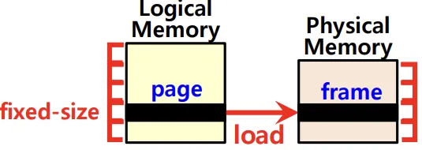
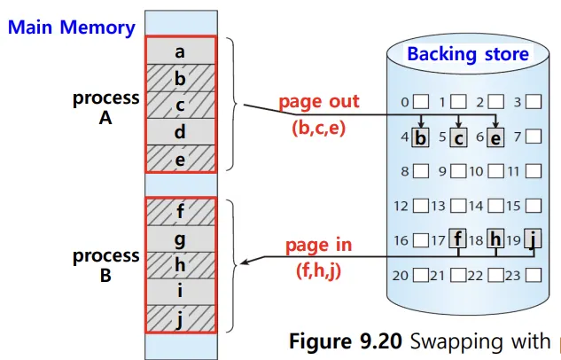
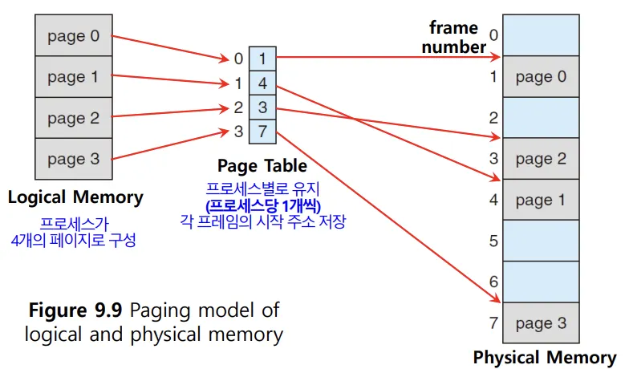
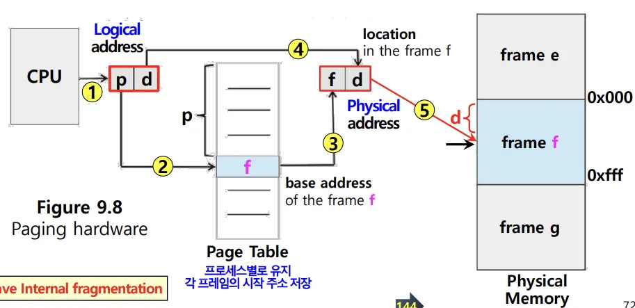
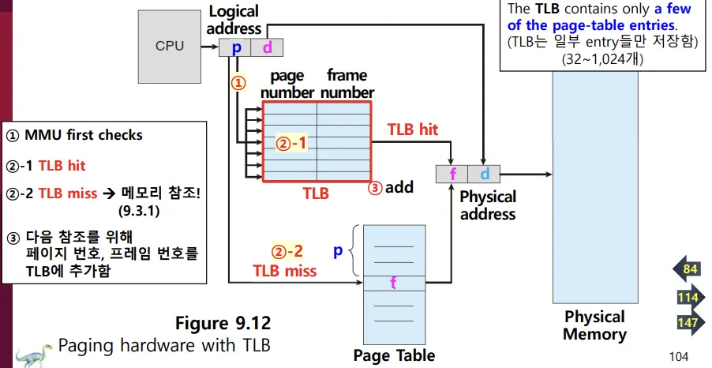
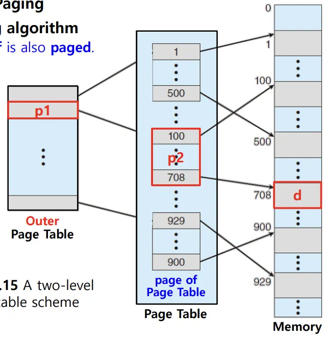
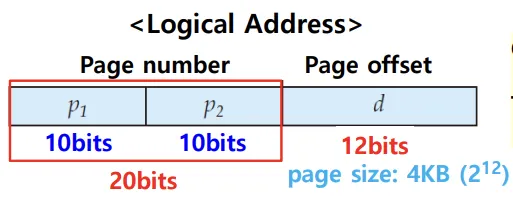
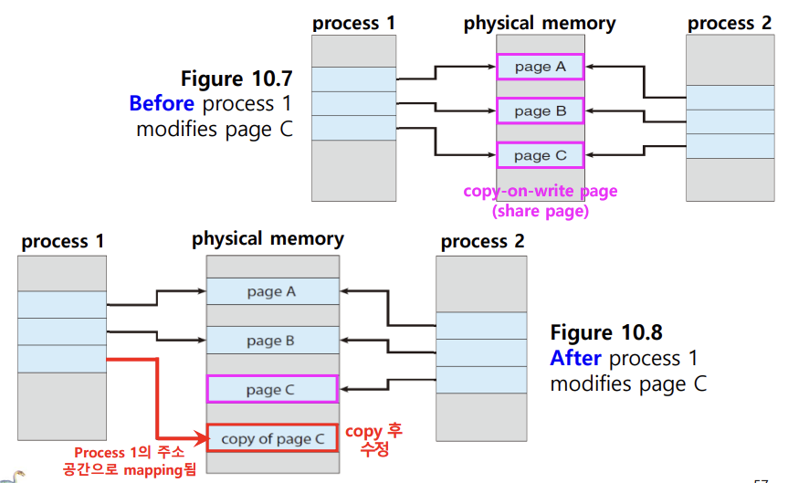

## 📖 가상 메모리 (Virtual Memory)

- 실행하고자 하는 프로그램 일부만 메모리에 적재해 실제 물리 메모리 크기보다 더 큰 프로세스를 실행할 수 있게 하는 기술
- 가상 메모리 기법: 페이징 & 세그멘테이션
    - 대부분 현대 OS는 Paging + Demand Paging
    - Segmentation 단독으로 사용되는 경우 거의 없음

 

### 가상 메모리 기술의 장단점

#### 장점

- 물리 메모리보다 큰 프로그램 실행 가능
- 프로그래머가 메모리 제약 없이 개발 가능
- 프로세스 간 공유 메모리 구현 가능
- 프로세스 생성 효율적

#### 단점

- 구현 복잡함
- Page Fault, 디스크 I/O 등 잘못 설계 시 성능 저하

 

## 📖 페이징 (Paging)

### 페이징 개요

- 프로세스의 **논리 주소** 공간을 일정한 단위(= **page**)로 자름
- **물리 메모리 주소** 공간을 또 일정한 단위(= **frame**)으로 자름
- 각 페이지는 (빈) 프레임에 매핑되어 실행
- 물리적 메모리보다 더 큰 프로세스를 메모리에서 실행할 수 있음
    - 프로세스를 실행하기 위해 프로세스 전체가 메모리에 적재될 필요 x
    
    
- 외부 단편화 문제 해결, 여전히 내부 단편화 문제 발생 가능

#### 페이징에서 스와핑 (Swapping)

- 프로세스 전체가 스왑 인/아웃되는 것이 아니라 페이지 단위로 스왑
- 현대의 swapping 방식
- 프로세스보다 작은 페이지 단위로 스와핑하므로 비용 절감

 

### 페이지 테이블 (Page Table)

- CPU 입장에서는 프로세스가 불연속적으로 메모리에 배치되어 있으므로, 다음에 실행해야 하는 명령어가 어디 있는지 찾기 어려움
- 페이지 번호와 프레임 번호의 매핑 정보 저장
    - 각 프로세스(페이지)별로, 배치된 각 프레임의 시작 주소 저장
- CPU 입장에서는 논리 주소를 순차적으로 실행하면 됨

#### 페이징에서의 논리 주소

- page number **`p`**: 어떤 페이지에 접근하고자 하는지
- offset **`d`**: 접근하려는 주소가 그 페이지에서 얼마나 떨어져 있는지
- `p`로 페이지 테이블 접근 → frame number `f` 찾아 메모리에 접근 → offset `d`로 어디에 원하는 주소가 있는지 찾음

#### TLB (Translation Look-aside Buffer)

- 메인 메모리에 페이지 테이블 저장 → 프레임 접근하기 위해 두 번의 메모리 접근 필요
- **TLB**는 페이지 테이블의 캐시 메모리 역할
- 지역성에 근거해, 최근/자주 사용된 페이지 위주로 가져와 저장
- 메모리 접근 속도 향상

#### 페이지 테이블 엔트리 (PTE) 주요 비트 

- **유효 비트 (valid-invalid bit)**: 현재 해당 페이지에 접근 가능한지
    - 페이지가 현재 메모리에 적재되어 있는지
    - 유효하지 않은 페이지에 접근하려 하면 = page fault
- **보호 비트 (protection bits)**: 페이지 접근 권한 (읽기/쓰기/실행)
- **참조 비트 (reference bit)**: 페이지의 메모리 적재 후, CPU가 이 페이지에 접근한 적 있는지
- **수정 비트 (modified bit)**: 해당 페이지가 수정되었는지 (디스크 반영 시 쓰기 작업 필요한지)

 

### 다단계 페이지 테이블 (Hierarchical Paging)

- 프로세스 크기가 커지며 프로세스 테이블의 크기도 커지기 때문에 프로세스를 이루는 모든 페이지 테이블 엔트리를 메모리에 두는 것은 어려움
- 페이지 테이블을 페이징해서 여러 단계의 페이지를 두는 것
- (ex) 2-level paging
    
    
    
    - 페이징 단계가 나눠지면, 논리 주소의 페이지 넘버도 다시 나눠짐
        - 이전 N bits: **outer** page table을 접근하기 위한 인덱스
        - 이후 M bits: **inner** page table을 접근하기 위한 인덱스
    
    
    
 

## 📖 요구 페이징 (Demang Paging)

### Demand Paging 개요

- 기존 페이징: 프로그램 실행 시 전체 프로그램을 메모리로 로드함
- demang paging: **필요한 페이지만** 메모리로 로드함
- Page Fault 발생하면 디스크에서 해당 페이지를 메모리로 불러옴
- 지역성 때문에 실행 성능 유지 가능

 

### Page Fault 처리 과정

1. CPU가 유효하지 않은 페이지 접근 → Page Fault trap
2. OS가 보조기억장치에서 페이지의 위치 확인
3. 빈 프레임을 확보 후 해당 페이지 적재
    
    (대기 중 CPU는 다른 프로세스 실행 가능)
    
4. 페이지 테이블에서 해당 페이지를 유효하다고 수정 후 프로세스 재개

 

### 쓰기 시 복사 (Copy-on-Write)

- 부모/자식 프로세스가 메모리를 공유하다가, 쓰기 요청 시에만 실제로 복사
    
    
    
- 수정된 페이지만 복사되고, 나머지는 부모/자식 프로세스 간 공유
- 장점:
    - 프로세스 생성 속도 향상 — 자식 프로세스 생성 시의 demand paging 과정 생략
    - 메모리 절약
- 대부분의 현대 OS에서 사용됨
  
 

## 📖 세그멘테이션 (Segmentation)

### 세그멘테이션 개요

- 메모리를 논리적 단위 (= segment; 코드, 데이터, 스택 등)로 나눔
- 크기는 가변적
- 프로그램 구조 반영하기 쉬움

 

### 특징

- 외부 단편화 발생 가능
- 사용자 관점에서 직관적
- 현대 OS에서는 거의 단독으로 사용되지 않고, 페이징과 결합한 형태로 일부 사용