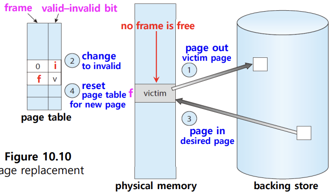
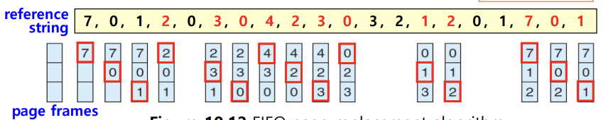
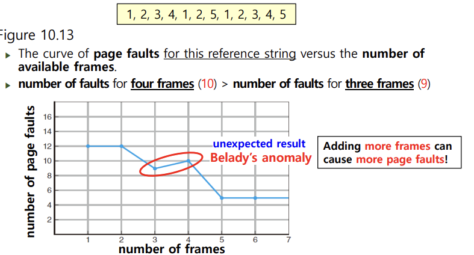
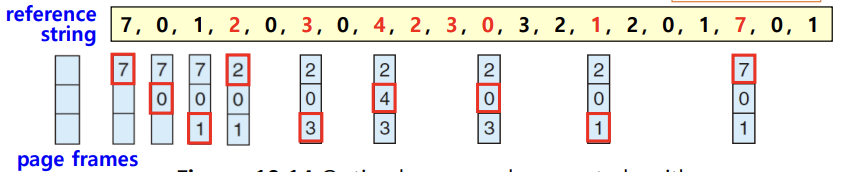
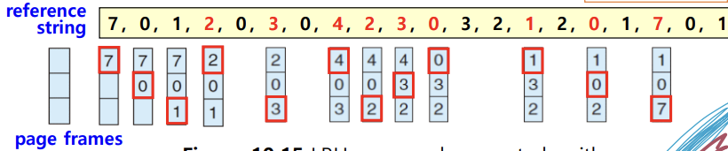

## 📖 가상 메모리 & 요구 페이징

### 가상 메모리 (Virtual Memory)

- 실행하고자 하는 프로그램 일부만 메모리에 적재해 실제 물리 메모리 크기보다 더 큰 프로세스를 실행할 수 있게 하는 기술
- 가상 메모리 기법: 페이징 & 세그멘테이션
    - 대부분 현대 OS는Paging + Demand Paging
    - Segmentation 단독으로 사용되는 경우 거의 없음

#### 장점

- 물리 메모리보다 큰 프로그램 실행 가능
- 프로그래머가 메모리 제약 없이 개발 가능
- 프로세스 간 공유 메모리 구현 가능
- 프로세스 생성 효율적

#### 단점

- 구현 복잡함
- Page Fault, 디스크 I/O 등 잘못 설계 시 성능 저하

 

### 요구 페이징 (Demang Paging)

- 기존 페이징: 프로그램 실행 시 전체 프로그램을 메모리로 로드함
- demang paging: 필요한 페이지만 메모리로 로드함
- Page Fault 발생하면 디스크에서 해당 페이지를 메모리로 불러옴
- 지역성 때문에 실행 성능 유지 가능

#### Page Fault 처리 과정

1. CPU가 유효하지 않은 페이지 접근 → Page Fault trap
2. OS가 보조기억장치에서 페이지의 위치 확인
3. 빈 프레임을 확보 후 해당 페이지 적재
    
    (대기 중 CPU는 다른 프로세스 실행 가능)
    
4. 페이지 테이블에서 해당 페이지를 유효하다고 수정 후 프로세스 재개

#### 쓰기 시 복사 (Copy-on-Write)

- 부모/자식 프로세스가 메모리를 공유하다가, 쓰기 요청 시에만 실제로 복사
- 수정된 페이지만 복사되고, 나머지는 부모/자식 프로세스 간 공유
- 프로세스 생성 속도 향상, 메모리 절약
- 대부분의 현대 OS에서 사용됨

#### 요구 페이징 작동에 필요한 것

- **페이지 교체 (Page Replacement)**
- **프레임 할당 (Frame Allocation)**

 

## 📖 페이지 교체 (Page Replacement)

### 페이지 교체 개요

#### 페이지 교체의 필요성

- 메모리 과할당 프로그램 실행 과정에서 프레임이 부족해질 수 있음
- 이때 OS 입장에서의 선택지:
    1. 프로세스 강제 종료
    2. standard swapping → 전체 프로세스 복사하는 데 오버헤드 큼
    3. **swapping + 페이지 교체** → 대부분 현대 OS에서 채택
- 모든 페이지가 메모리에 적재되지 않는 Demang Paging에서 페이지 교체는 필수적

#### 기본 처리

> 빈 프레임 없으면 → 지금 안 쓰는 프레임을 찾아서 → 빈 프레임으로 만들기

1. 요청된 페이지 위치 확인
2. 빈 프레임이 있으면 사용
3. 없으면 교체 알고리즘으로 희생할 프레임 선택 
4. 필요 시 희생 프레임을 보조기억장치에 기록 후 교체 
5. 페이지 테이블 갱신 후 실행 재개

#### 페이지 교체 알고리즘 

- 메모리에 있는 페이지들 중 내보낼 페이지를 결정하는 방법
- 많은 페이지 교체 알고리즘 중, 가장 **낮은 Page fault rate**을 갖는 알고리즘을 채택해야 함
- **페이지 참조열 (Reference string):**
    - CPU가 참조하는 페이지들을 나타낸 것
    - 페이지 폴트 횟수를 알기 위해 만듦
    - 연속된 페이지는 생략 (중복된 페이지를 참조하는 행위는 페이지 폴트를 발생시키지 않으므로)

 

### First-In-First-Out Page Replacement (FIFO)

- 가장 오래 전에 들어온 페이지를 교체
- 가장 간단한 페이지 교체 알고리즘
- FIFO 큐로 메모리에 있는 모든 페이지를 추적
    
    → head의 페이지를 내보내고, tail에 새로운 페이지 삽입 
    
- 가장 오래된 페이지라도 자주 사용되는 것일 수도 있음
- 잘못된 교체 선택 → 거의 교체 직후 이를 참조하기 위해 또 page fault 발생 → 또 replacement 필요

#### example

→ 15 page faults

#### **Belady’s anomaly** (Belady의 모순)

- FIFO 페이지 교체 알고리즘과 관련된 현상
- 프레임 수를 늘려도 page fault가 증가할 수 있음을 보여줌

- 프로세스에 memory 더 할당하면 성능이 좋아질 것으로 기대하지만 항상 그렇지는 않다는 것을 보여줌

 

### Optimal Page Replacement (OPT, MIN)

- 앞으로 가장 오래 쓰이지 않을 페이지를 교체함
- 최저 page fault rate 보장
- Belady’s anomaly 없음
- 실제로 미래 참조열을 알기는 힘들기 때문에 구현 어려움
- 주로 이론적 최적으로써, 다른 알고리즘과의 비교 기준용으로 활용

#### example

→ 9 page faults

 

### Last Recently Used Page Replacement (LRU)

- 가장 오랫동안 사용되지 않은 페이지를 교체
- 과거 사용 기록을 근거로 미래를 예측
- 미래에 대한 근사치로 과거를 참조하는 것
- 일반적으로 FIFO보다 성능 좋고, OPT보다는 떨어짐
- 실제 OS에서 자주 채택

#### example

→ 12 page faults

 

## 📖스래싱과 프레임 할당

### 스래싱 (Thrashing)

- 프로세스가 실제 실행보다 페이지 교체에 더 많은 시간을 소모하는 상태
- 멀티프로그래밍 정도를 과하게 늘리면 CPU 이용률이 오히려 감소함
    - 각 프로세스들이 사용가능한 프레임 수 감소 → page fault 자주 발생 → CPU 이용률 감소 → 전체 성능 저하
- 스래싱의 근본적인 원인은 각 프로세스가 필요로 하는 최소한의 프레임 수가 보장되지 않기 때문

 

### 프레임 할당

- **균등 할당**: 모든 프로세스에 균등하게 프레임 할당
- **비례 할당**: 프로세스 크기가 클수록 프레임 많이 할당

> 하지만, **실제로** 프로세스가 얼마나 많은 프레임을 필요로 하는지 결정하기 위해서는 결국 실행해 봐야 아는 경우가 많음 ⇒ 동적 할당
> 
- **동적 할당**: 프로세스를 실행하는 과정에서 프레임 분배를 결정하는 방식

#### 동적 할당  방식

- **작업 집합 모델 (Working Set) 기반**: 프로세스가 최근 일정 기간 동안 참조한 페이지 집합을 기준으로 할당
- **페이지 폴트 빈도 (Page Fault Frequency) 기반**:
    - 폴트율 높으면 → 너무 적은 프레임 갖고 있음 → 프레임 추가
    - 폴트율 낮으면 → 너무 많은 프레임 갖고 있음 → 프레임 회수