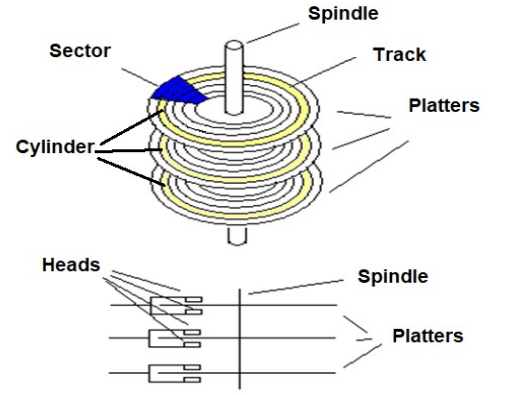
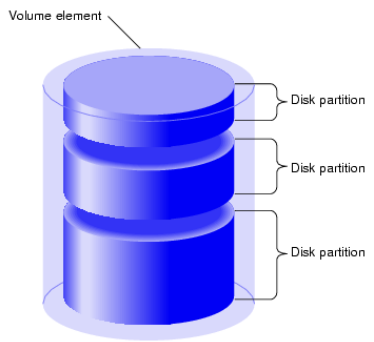
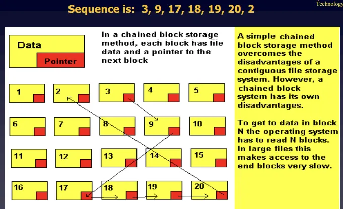
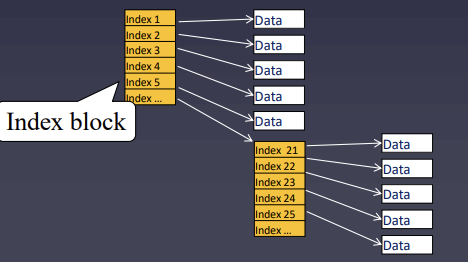
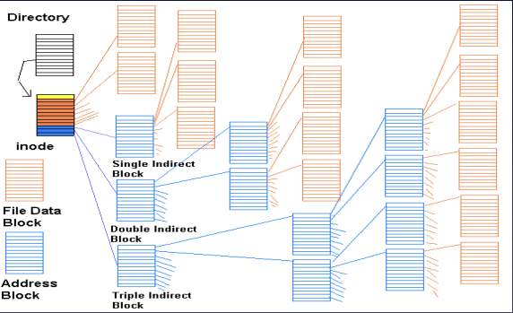

## 📖 파일 개념

### 파일

- 파일(file): 하드 디스크나 SSD와 같은 보조기억장치에 저장된 관련 정보의 집합
- 의미 있고 관련 있는 정보를 모은 논리적 단위

### 파일 속성 (Attributes)

> 파일의 **속성(=메타데이터)**: 운영체제가 파일을 관리하기 위해 유지하는 부가정보

#### 대표적인 파일 속성

| 속성 | 설명 |
| --- | --- |
| **이름** | 파일의 고유 식별자 |
| **크기** | 파일의 현재 크기, 허용 가능한 최대 크기  |
| **보호** | 해당 파일을 읽고, 쓰고, 실행 가능한지 |
| **생성 날짜** | 파일이 생성된 날짜 |
| **마지막 접근 날짜** | 파일에 마지막으로 접근한 날자 |
| **마지막 수정 날짜** | 파일이 수정된 날짜 |
| **생성자** | 파일을 생성한 사용자 |
| **소유자** | 파일을 소유한 사용자 |
| **위치** | 파일의 보조기억 장치상의 현재 위치  |

 

### 파일 유형 (Type)

- 운영체제가 인식하는 파일 종류
- 파일 유형을 알리기 위해 가장 흔히 사용하는 방식은 파일 이름 뒤에 붙는 확장자
- 확장자는 파일 종류가 뭔지 운영체제에 알려주는 힌트 역할

#### 대표적인 파일 유형과 확장자

| 파일 유형 | 대표적인 확장자 |
| --- | --- |
| **실행 파일** | 없는 경우, exe, com, bin |
| **목적 파일** | obj, o |
| **소스 코드 파일** | c, cpp, cc, java, asm, py |
| **워드 프로세스 파일** | xml, rtf, doc, docx |
| **라이브러리 파일** | lib, a, so, dll |
| **멀티미디어 파일**  | mpeg, mov, mp3, mp4, avi |
| **백업/보관 파일** | rar, zip, tar |

 

### 파일 연산을 위한 시스템 호출

- `create()`, `open()`, `read()`, `write()`, `seek()`, `close()`, `delete()`
- 파일을 다루는 모든 작업은 운영체제를 통해서만 가능 (시스템 콜 기반)
- 프로그램이 임의로 조작 X

 

## 📖 파일 시스템 구조 (File System Structure)

### 논리적 vs. 물리적 구조

> [ 사용자 → 시스템 콜 → 커널 → 논리적 FS → 물리적 FS → 디스크]  계층 구조
> 

#### 논리적 파일 시스템 (Logical FS)

- 사용자 입장에서의 구조
- 파일, 디렉터리, 파티션 관리

#### 물리적 파일 시스템 (Physical FS)

- 실제 데이터가 저장되는 방식
- 블록 단위 관리, 디스크 헤드 제어

 

### 디스크 구조

#### Disk Physical Structure

| 구성요소 | 설명 |
| --- | --- |
| **플래터 (Platter)** | 자기 원판 |
| **트랙 (Track)** | 원판의 동심원 |
| **실린더 (Cylinder)** | 여러 플래터에서 같은 위치의 트랙 집합 |
| **섹터 (Sector)** | 트랙을 나눈 데이터 단위 |
| **헤드 (Head)** | 데이터를 읽고 쓰는 장치 |
- SSD는 실제(물리적) 회전 X, 하드디스크를 논리적으로 에뮬레이션함
- NVMe, PCIe SSD 등 최신 인터페이스 사용

#### Disk Logical Structure 

| 구성요소 | 설명 |
| --- | --- |
| **파티션 (Partition)** | 물리 디스크를 논리적으로 분할한 단위 |
| **블록 (Block)** | 운영체제가 관리하는 논리적 저장 단위
최소 데이터 전송 단위  |

 

### 파티셔닝 & 포매팅

- **파티셔닝:** 저장 장치를 **논리적인 영역 (파티션)** 으로 분할하는 작업
- **포매팅:** 파일 시스템을 설정해 저장 구조를 초기화하는 작업

 

## 📖 디렉터리 구조 (Directory Structure)

### 디렉터리 개념

- 디렉터리 = 파일을 논리적으로 묶은 **특수한 파일**
- 하위 디렉터리를 포함할 수 있는 **계층적(트리형) 구조**
- **디렉터리 엔트리**: 디렉터리 내부에 저장된 파일들의 이름, 블록 위치, 크기, 생성 시간 등이 저장된 메타데이터 테이블

 

### 구조 유형

#### 단일 구조 (1단계)

- 모든 파일이 하나의 디렉터리 내에 존재
- 옛날 운영체제의 구조

#### 트리 구조 

- 여러 계층을 가진 구조
- 최상위 디렉터리 (=루트, `/`) 기준으로 다단계 디렉터리들의 계층 구조
- 이러한 계층 구조로 인해 **경로**의 개념 등장

 

### 절대경로 & 상대경로

- 절대경로, 상대경로
    - 절대경로: 루트 디렉터리에서 자기 자신까지 이르는 고유한 경로
        - 모든 파일은 이런 고유한 경로가 있음
        - 운영체제에 따라 디렉터리 간 구분자로 / 사용하기도하고 \ 사용하기도하고
    - 상대경로: 현재 디렉터리부터 시작하는 경로

- 디렉터리 연산을 위한 시스템 호출
    - 운영체제는 파일뿐만 아니라 디렉터리 연산을 위한 시스템 호출도 제공함
    - 디렉터리 생성, 삭제, 열기, …

 
 

## 📖 파일 시스템 구현

### 파일 할당 방법

> 파일을 보조기억장치에 할당하는 방법
> 
> - 연속 할당
> - 불연속 할당
>     - 연결 할당
>     - 색인 할당

#### 연속 할당 (Contiguous)

- 연속적인 블록에 파일 저장
- 원하는 파일에 접근하려면 첫 번째 블록 주소와 블록 단위의 크기만 알면 됨
- (+) 빠른 순차 접근
- (-) 외부 단편화 발생 가능성

#### 연결 할당 (Linked)

- 각 블록 일부에 다음 블록의 주소 저장
- 연결 리스트 형태
- (+) 외부 단편화 문제 해결
- (-) 임의 접근 불가
- (-) 일부가 손상되면 그 이후 블록들에도 접근 불가 (데이터 손실)

#### 색인 할당 (Indexed)

- 모든 블록 주소를 색인 블록 (Index Block) 이라는 별도의 한 블록에 모아 관리
- (+) 임의 접근 가능, 관리 용이
- (-) 색인 블록의 크기 제약으로 인한 문제

 

### FAT (File Allocation Table)

- 연결 할당의 변형
- 각 블록의 다음 주소를 블록 내에 저장하지 않고, 주소들을 별도의 테이블(FAT 테이블)에 모아 관리
- FAT 테이블이 캐시되면 접근 속도 향상 → 기존 연결 할당 방식의 임의 접근 성능 문제 개선

 

### UNIX / Linux 파일 시스템

- 색인 할당 기반
- 각 파일마다 `i-node` 존재
- `i-node`는 파일 속성 + 최대 15개의 블록 주소 저장
    - 12개: 직접 블록 주소 저장
    - 1개: 단일 간접 블록 주소
    - 1개: 이중 간접 블록
    - 1개: 삼중 간접 블록
- 대용량 파일도 삼중 간접 참조까지 활용해 표현 가능

#### 그 외 대표 파일 시스템

| 운영체제 | 파일 시스템 | 특징 |
| --- | --- | --- |
| **Windows** | FAT, NTFS | FAT은 단순, NTFS는 보안/저널링 지원 |
| **Linux** | EXT2/3/4 | 색인 기반 i-node 구조, 저널링 지원 |
| **macOS** | APFS | 스냅샷, 암호화 지원 |
| **모바일** | exFAT | 플래시 메모리 최적화 |