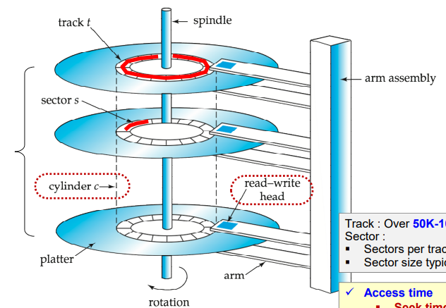
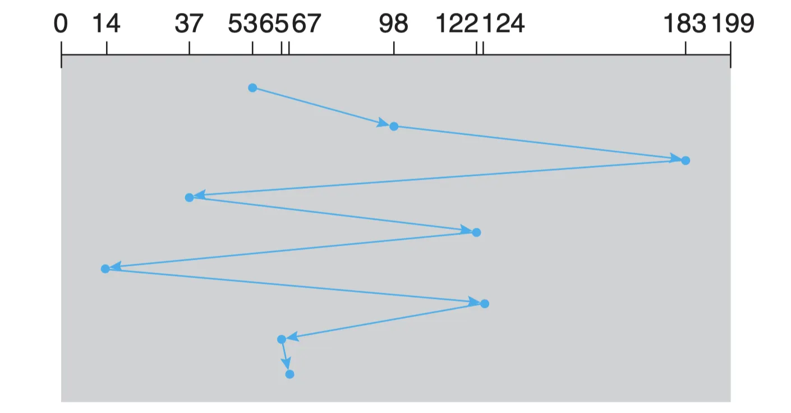
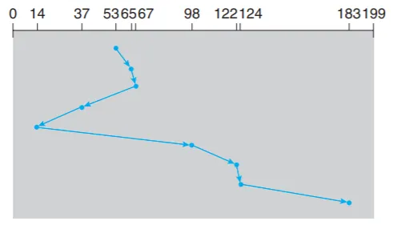
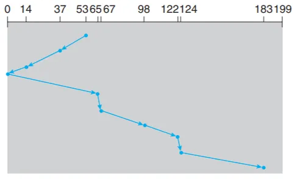
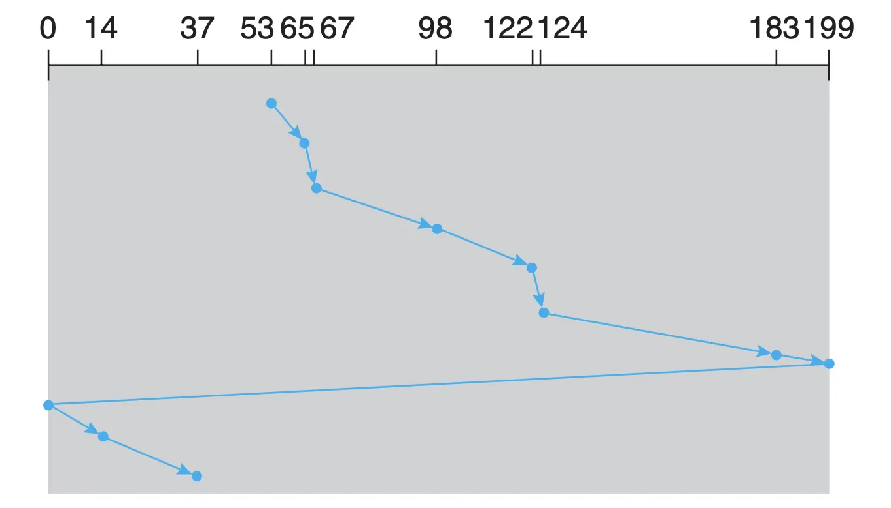
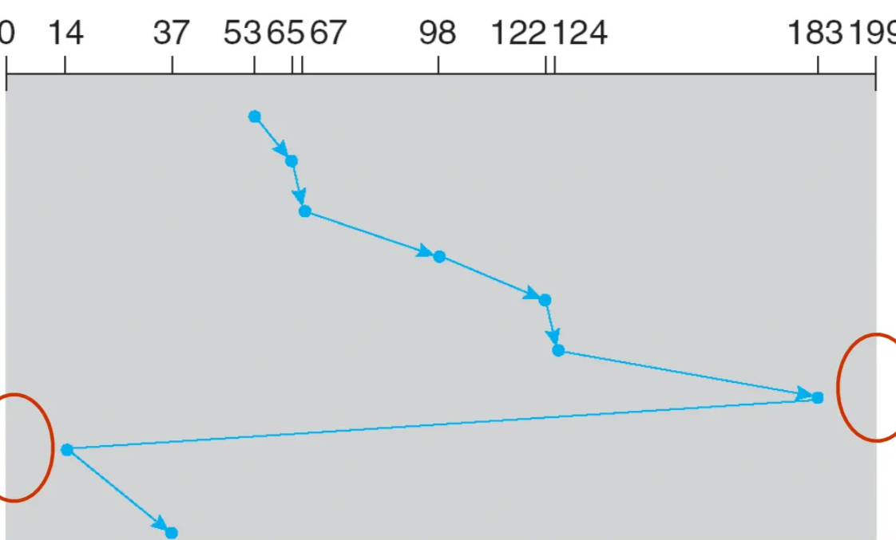

## 📖 입출력 시스템

### I/O 구조

> CPU, 메모리, 입출력 장치 사이의 데이터 흐름을 관리하는 구조 

#### I/O 장치 (I/O Device)

- 컴퓨터 외부와 데이터를 주고받는 모든 장치
- 키보드, 마우스, 프린터, 디스크, 네트워크 카드 등
- 속도와 데이터 전송 단위가 다양하므로 제어 필요

#### 장치 컨트롤러 (Device Controller), 장치 드라이버 (Device Driver)

- **장치 컨트롤러 (Device Controller)**
    - = 입출력 제어기 (I/O Controller), 입출력 모듈 (I/O Module)
    - 입출력 장치와 컴퓨터를 연결하는 **하드웨어**
- 장치 컨트롤러의 역할
    - CPU ↔ 입출력장치 간 통신 중개
    - 오류 검출
    - 데이터 버퍼링 (→ CPU ↔ 입출력장치 간 전송률 차이 완화)
- **장치 드라이버(Device Driver)**
    - OS가 장치 컨트롤러를 제어하기 위해 사용하는 **소프트웨어**
    - 장치 컨트롤러가 컴퓨터 내부와 정보를 주고받을 수 있게 하는 프로그램
    - 입출력장치를 연결하기 위한 소프트웨어적 통로

#### 버퍼 (Buffer)

- 데이터를 임시 저장하는 메모리 영역
- I/O 장치의 속도 차이를 보완

 

### I/O 동작 과정

#### Programmed I/O

- 폴링 방식
- CPU가 직접 I/O 완료를 기다림
- 단순하지만 비효율적

#### Interrupt-driven I/O

- CPU가 입출력장치에 작업 요청 → 인터럽트 있을 때만 확인
- CPU는 그동안 다른 작업 수행할 수 있어 효율적
- 인터럽트가 많으면 오버헤드 가능성

#### DMA (Direct Memory Access) -driven I/O

- 장치 ↔ 메모리 간 데이터 전송을 CPU 개입 없이 수행
- 장치 컨트롤러의 처리 동안 CPU는 다른 일을 처리할 수 있어 효율적
- 대량 데이터 전송 (블록 단위 데이터 전송)에  효과적
- 버스 충돌 (메모리 접근 경합) 문제 고려 필요

 

## 📖 디스크 스케줄링

### 디스크 구조

#### 구조

|  |  |
| --- | --- |
| **플래터(Platter)** | 자기 물질로 코팅된 원판, 양면 사용 가능 |
| **트랙(Track)** | 플래터의 동심원 경로 |
| **섹터(Sector)** | 트랙을 나눈 최소 저장 단위 (보통 512B) |
| **실린더(Cylinder)** | 여러 플래터에서 같은 위치의 트랙 집합 |
| **헤드(Head)** | 데이터를 읽고 쓰는 장치 |
| **암(Arm)** | 헤드를 이동시키는 기계 구조 |
- 헤드가 임의의 섹터를 랜덤하게 참조해 빠르게 데이터를 읽을 수 있음
- 가장 많이 사용하는 보조기억장치 중 하나
- 주기억장치보다 많은 양의 데이터를 저장 가능

#### 디스크 접근 시간

> **Access Time = Seek Time + Rotational Delay + Transfer Time**

- **탐색 시간 (Seek Time)**
    - 헤드가 특정 트랙으로 이동하는 데 걸리는 시간
    - 약 2~20ms
    - 전체 Access Time에서 가장 큰 비중을 차지
    - 디스크 스케줄링의 핵심 목표는 **Seek Time을 최소화**하는 것
- **회전 지연 시간 (Rotational Delay Time)**
    - 디스크 회전으로 원하는 섹터가 도달할 때까지 걸리는 시간
    - 약 4~11ms
- **데이터 전송 시간 (Transfer Time)**
    - 데이터 전송에 걸리는 시간
    - 초당 50~200MB 전송 가능

#### SSD vs. HDD

|  | HDD | SSD |
| --- | --- | --- |
| 구조 | 자기 디스크 회전 + head 이동  | 반도체 기반 (비휘발성 메모리)|
| 내부 구조 | 기계식 (회전판, 모터) | 전자식 (반도체 칩) |
| 접근 방식 | 순차 접근 | 완전 랜덤 접근 |
| 속도 | 상대적으로 느림 (∵ 기계적 지연) | 빠름 (∵전기적 접근) |
| 비용 | 저렴함, 대용량에 유리 | 비쌈, 용량당 단가 높음 |
| 단점 | 충격에 약함, 소음 발생 | 수명 (쓰기 횟수) 제한 |
| OS 인식 | SSD도 디스크처럼 논리적 섹터 단위로 인식됨 |  |

 

### 디스크 스케줄링 알고리즘

- 여러 입출력 요청이 있을 때, 헤드 이동 거리 (Seek Distance)를 최소화하는 순서로 요청을 처리하기 위한 알고리즘
- 목표:
    - 평균 Seek Time 최소화
    - 응답 시간 향상
    - 공정성 확보

 

#### FCFS (First Come First Served)

- 가장 먼저 도착한 요청을 우선적으로 처리
- 개발 간단함, 공평성 유지
- 헤드 이동 경로가 길어질 수 있음
- 예제
    - Disk Queue: `98, 183, 37, 122, 14, 124, 65, 67`
    - head starts at `53`
    - 헤드가 움직인 총 거리: `(98 - 53) + (183 - 98) + (183 - 37) + (122 - 37) + (122 - 14) + (124 - 14) + (124 - 65) + (67 - 65)` = **`640 cylinders`**

 

#### SSTF (Shortest Seek Time First)

- 탐색 거리가 가장 짧은 트랙에 대한 요청을 먼저 서비스함
- 현재 head 위치에서 가까운 요청을 우선적으로 처리
- 전반적인 seek time 감소 — 그리디한 접근 but 최적의 알고리즘은 아님
- starvation 현상 발생 가능 (멀리 있는 요청이 무한히 지연됨)
- 예제
    - Disk Queue: `98, 183, 37, 122, 14, 124, 65, 67`
    - head starts at `53`
    - 헤드가 움직인 총 거리: `(65 - 53) + (67 - 65) + (67 - 37) + (37 - 14) + (98 - 14) + (122 - 98) + (124 - 122) + (183 - 124)` = **`236 cylinders`**

 

#### SCAN 

- SSTF가 갖는 탐색 시간의 편차를 해소하기 위한 기법
- head가 이동하는 방향의 모든 요청을 서비스하고, 끝까지 이동하고 나면 반대 방향으로 돌아 서비스
- 이동 경로 예측 가능, starcation 방지
- 중앙보다 끝부분의 요청이 더 늦게 처리될 수 있음

 

#### C-SCAN (Circular SCAN)

- 헤드가 한 방향으로만 (ex. 안→밖) 이동
- 끝에 도달하면 반대 방향으로 가는 게 아니라 한바퀴를 돌려 가장 바깥쪽으로 복귀
    - 이때는 데이터를 읽지 않으므로 더 빠른 속도로 움직일 수 있음
- 요청 처리의 균형성 개선

 

#### C-LOOK (Circular LOOK)

- **LOOK**: C-SCAN에서는 0번 실린더가 없지만 0번까지 감. 이런 비효율적인 움직임을 없애기 위해 실린더의 최소~최대 범위 내에서만 움직이는 것
- C-SCAN을 보완, Circular한 LOOK
- 기본적으로 Circular처럼 한 방향으로만 움직이지만 끝까지 가는 것이 아니라 실제 디스크 요청이 있는 **최소, 최대 범위 내에서만** 움직임
- 불필요한 끝단 이동을 제거해 효율 향상

 

#### ⇒ 디스크 스케줄링 알고리즘 비교

| 구분 | FCFS | SSTF | SCAN | C-SCAN | C-LOOK |
| --- | --- | --- | --- | --- | --- |
| **이동 방향** | 도착 순서 | 가장 가까운 요청 | 왕복(양방향) | 한 방향 | 한 방향(요청 범위 내) |
| **장점** | 공평성 | 평균 탐색시간 ↓ | 공정성 ↑ | 균등 응답 시간 | 불필요 이동 제거 |
| **단점** | 탐색 시간 비효율 | Starvation 가능 | 끝단 대기시간 ↑ | 왕복 구간 비효율 | 구현 복잡도 ↑ |

 

### 현대 OS에서 디스크 스케줄링

- SSD 등장으로 Seek Time 자체가 의미 없으므로, **HDD 스케줄링은 점점 중요성 ↓**
- 디스크 스케줄링은 **I/O 요청 큐를 최적화**하는 일반적인 알고리즘 설계 원리로 작동
- **서버 백업용 대용량 스토리지, 네트워크 공유형 저장장치(NAS)** 등에서는 HDD 사용하므로 디스크 스케줄링이 성능에 중요
- SSD에서는 물리적인 회전은 없으나, 플래시 블록 쓰기/삭제 제약으로 인해 **논리적인 스케줄링**이 중요