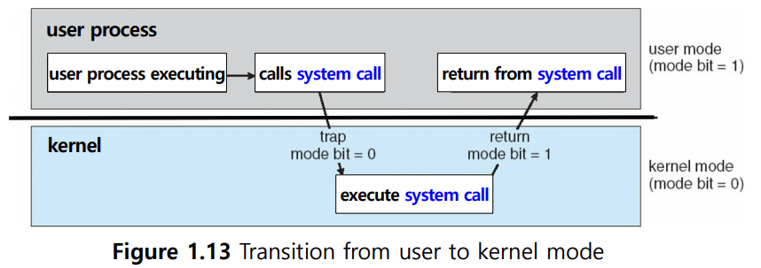
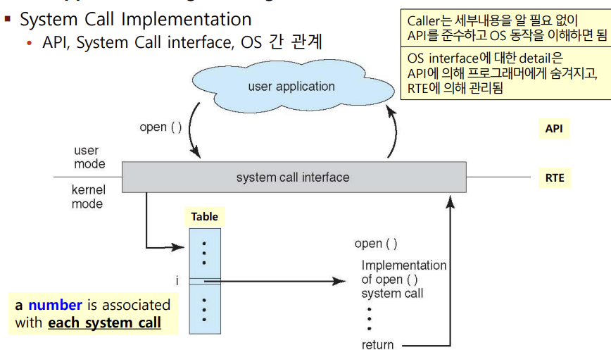
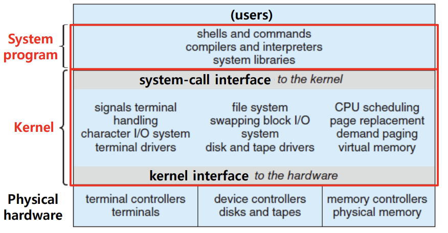
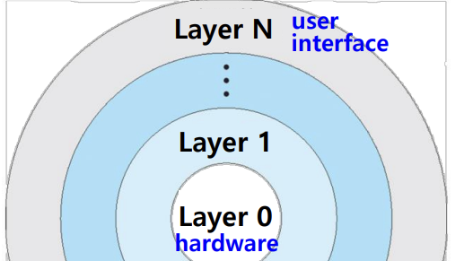
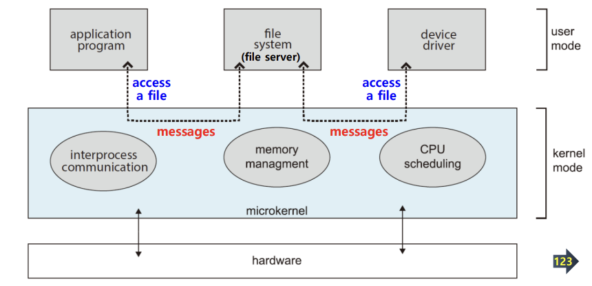

## 📖 유저 모드 (User Mode) & 커널 모드 (Kernel Mode)

### Kernel

- 운영체제의 중심 부분
- 하드웨어와 응용 프로그램 (사용자 프로그램) 사이에서 자원과 시스템을 관리하는 역할

#### 커널의 역할

- 프로세스 관리 — 프로세스 생성, 스케줄링, 종료 관리
- 메모리 관리 — 프로세스 간 메모리 공간 분리, 가상 메모리 관리
- 파일 시스템 관리 — 파일 읽기/쓰기, 저장공간 관리
- 장치 관리 — I/O 장치 제어
- 시스템 콜 처리 — 사용자 요청을 받아 하드웨어에 전달하고 결과 반환

#### 커널 vs. 운영체제 vs. 시스템 프로그램

| 구분 | 구성 요소 | 주요 역할 |
| --- | --- | --- |
| **운영체제 (OS)** | 커널 + 시스템 프로그램 | 전체 시스템 관리 |
| **커널 (Kernel)** | OS의 핵심 부분 | 자원 관리, 하드웨어 제어 |
| **시스템 프로그램 (System Program)** | 쉘, 파일 탐색기, 드라이버, 서비스 등 | 사용자와 OS를 이어줌 |
| **응용 프로그램 (Application)** | 게임, 브라우저, IDE 등 | 사용자 목적 수행 |

 

### Dual Mode

> 운영체제는 **프로그램 보호**와 **자원 안정성**을 위해 두 가지 실행 모드를 둠
> 

#### User Mode vs. Kernel Mode

|  | User Mode | Kernel Mode |
| --- | --- | --- |
| 실행 주체 | 사용자 프로그램 | 운영체제 핵심 코드 |
| 권한 수준 | 제한적 (비특권 명령만 실행 가능) | 모든 명령 실행 가능 |
| 접근 가능한 자원 | 사용자 메모리 영역 | 모든 메모리 및 하드웨어 자원 |
| 전환 방법 | System Call, Trap, Interrupt | System Call 완료 후 복귀 |

#### Dual Mode Operation

- **mode bit** 사용해 구분 (ex. `0`: kernel, `1`: user)
- 악의적/오류 프로그램이 커널 영역에 침범하지 못하게 함
- 하드웨어 제어는 커널 모드에서만 수행 가능하도록 함
- 시스템 콜을 통해 OS 서비스 요청되면 → 유저 모드에서 커널 모드로 전환 → 요청 수행

#### 특권 명령어 (Previleged Instructions)

- 커널 모드에서만 실행 가능한 명령어
- I/O 제어, 인터럽트 제어, 타이머 설정 등
- 유저 모드에서 실행하려 하면 하드웨어에서 거부

#### System Call & Trap

- 유저 모드에서 System call / Trap을 통해 **커널 모드로 전환**
- 사용자 프로그램이 커널 서비스 요청 시 **System Call**을 호출 (의도적)
- 프로그램 실행 중 예외나 오류로 인해 커널로 제어가 넘어가는 것이 **Trap** (비의도적)

#### Multi Mode

- 일부 CPU는 2단계보다 세분화된 보호 모드를 제공하기도 함
- ex:
    - **Intel**: 4 seperate protection rings
        - `ring 0`: Kernel
        - `ring 1`, `ring 2`: 다른 OS 서비스에 사용
        - `ring 3`: User mode
    - **ARM**: 7개의 권한 수준 모드
- 현실적으로 **대부분 OS는 2단계 구조 (Dual Model)** 사용

 

## 📖 시스템 콜 (System Call)

### 시스템 콜 개요

- 사용자 프로그램이 운영체제 커널의 기능을 요청하기 위한 인터페이스
- 응용 프로그램은 직접 하드웨어에 접근할 수 없으므로, **시스템 콜을 통해 커널 서비스 요청**
- 보통 **API → Library → System Call → Kernel** 순으로 호출 진행

 

### 주요 시스템 콜 분류

| 구분 | 기능 | 대표 예시 |
| --- | --- | --- |
| **프로세스 제어** | 프로세스 생성·종료·속성 변경 | `fork()`, `exec()`, `exit()`, `wait()` |
| **파일 관리** | 파일 생성·읽기·쓰기·닫기 | `open()`, `read()`, `write()`, `close()` |
| **장치 관리** | 장치 요청·해제·읽기·쓰기 | `ioctl()`, `read()`, `write()` |
| **정보 유지** | 시간/날짜, 시스템 정보 | `gettimeofday()`, `uname()` |
| **통신** | 프로세스 간 통신, 네트워크 | `send()`, `recv()`, `pipe()`, `socket()` |
| **보안/권한** | 접근 제어, 권한 설정 | `chmod()`, `chown()`, `setuid()` |

 

### 시스템 콜 수행 과정

1. 사용자 프로그램이 API 호출
2. 라이브러리가 System Call 번호와 함께 Trap 명령어 실행
3. 하드웨어가 커널 모드로 전환
4. 커널에서 요청 처리
5. 결과 반환, 유저 모드로 복귀

 

### Application Programming Interface (API)

- 프로그래머가 직접 시스템 콜을 다루지 않고, 라이브러리를 통해 OS 기능을 사용하는 고수준 인터페이스
- ex) Windows API, POSIX API (UNIX/Linux), Java API
- 이식성 (portability) 향상 → 동일한 API를 사용하는 어떤 시스템에서도 컴파일 & 실행 가능
- 프로그래머가 커널 내부 동작을 몰라도 개발 가능

 

## 📖 OS 구조

> 복잡한 OS를 구조적으로 나누는 방식에 따라 여러 형태 있음 

### Monolithic Structure

- **OS 전체가 하나의 커널 공간**에서 실행
- 모든 핵심 기능(파일, 프로세스, I/O, 메모리 등)이 하나의 커널에 포함
- 함수 호출 형태로 내부 모듈 간 통신
- (+) 빠르게 동작함 ∵ 함수 호출 기반
- (-) 코드 간 의존성 높음, 수정/디버깅 어려움
- (ex) 초기 UNIX, Linux

 

### Layered Approach

- OS를 계층(layer)별로 분리
- 상위 계층이 하위 계층의 기능을 호출
    - 상위 계층: 사용자 인터페이스
    - 하위 계층: 하드웨어 접근
- (+) 구조 명확, 유지보수 쉬움
- (-) 계층 간 호출로 인한 오버헤드 가능성
- (ex) THE OS (최초의 계층형 설계 OS)

 

### Microkernel

- 최소한의 기능만 커널에 남기고, 나머지는 User Space로 분리
- 커널에는 CPU, 메몰, IPC 등 최소 기능만
- 나머지는 User-level 프로그램으로 구현
- Message Passing을 통해 client ↔ user program 간 통신 기능
- (+) 커널이 작아서 안정성, 새 서비스 추가 용이 (user space에 추가)
- (-) 통신으로 인한 오버헤드 가능성, IPC 처리 복잡

 

### Module

- 필요한 기능만 동적으로 커널에 로드/언로드 가능한 구조
- Loadable Kernel Module (LKM) 개념
- 커널에 핵심 요소들이 고정으로 있고, 추가 서비스들은 필요하면 모듈로 연결
- (+) 동적 확장 가능 (드라이버, 파일 시스템 등)
- (+) 재부팅 없이 기능 추가 가능
- microkernel 구조와 비교
    - 주 모듈이 핵심 기능을 갖고, 나머지는 따로 연결한다는 점에서 유사함
    - 하지만 message passing 사용하지 않으므로 성능에서 더 나음

 

### Hybrid System

- 여러 구조의 장점을 결합
- 실질적인 현대 OS 형태
- (ex)
    - Linux: Monolithic + Modular
    - Windows: Monolithic + 일부 Microkernel 요소
    - macOS, iOS: Microkernel 기반 + Monolithic 계층
    - Android: Linux 기반 하이브리드
  
 

### OS 구조 비교

|  | 핵심 개념 | 장점 | 단점 | 예시 |
| --- | --- | --- | --- | --- |
| **Monolithic** | OS 전체가 하나의 커널 | 빠름 | 유지보수 어려움 | 초기 UNIX, Linux |
| **Layered** | 계층별 분리 구조 | 구조 명확 | 오버헤드 발생 | THE OS |
| **Microkernel** | 최소 커널, 나머지는 User-space | 안정성↑ | 성능↓ | MINIX, macOS |
| **Module** | 동적 커널 모듈 연결 | 유연성↑ | 구조 복잡 | Linux |
| **Hybrid** | 혼합형 구조 | 현실적 균형 | 구현 복잡 | Windows, Android |