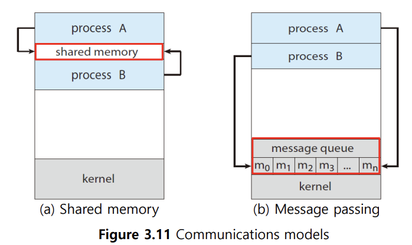
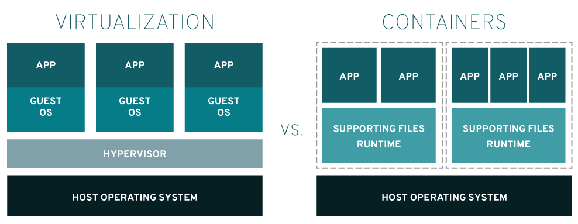
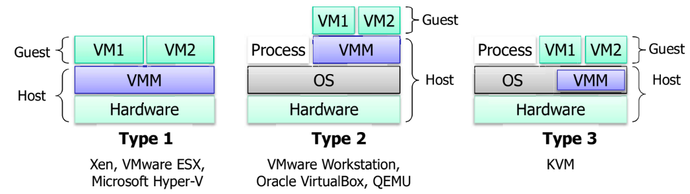

## 📖 IPC (Inter-Process Communication)

> 프로세스 간 데이터를 주고받거나 동기화하기 위한 통신 메커니즘

### IPC 개요

#### IPC 필요성

- **정보 공유 (Information sharing)**
    
    : 여러 프로세스가 같은 데이터를 함께 사용할 수 있게 함
    
- **계산 속도 향상 (Computation speedup)**
    
    : 병렬 처리로 한 작업의 실행 시간 단축
    
- **모듈화 (Modularity)**
    
    : 기능을 나누어 설계해 유지보수를 용이하게 함
    

#### 대표적인 IPC 기술 

- File
- Shared Memory
- Message Queue
- Semaphores
- Pipe
- Signal
- Socket

 

### 2가지 IPC 모델

|  | Shared Memory | Message Passing |
| --- | --- | --- |
| **핵심 개념** | 메모리 공간을 공유 | 메시지를 주고받음 |
| **속도** | 빠름 (커널 관여 X) | 느림 (커널 관여 O) |
| **커널 개입** | 공유 메모리 생성 시 1회 | 송수신마다 커널 호출 |
| **적합 환경** | 단일 시스템 내 통신 | 분산 시스템(네트워크 기반) |
| **예시** | DB 캐시, 이미지 버퍼 | 채팅, 네트워크 요청 등 |
| **대표 IPC 수단** | `Shared Memory`,  `Semaphore`, `File` | `Pipe`, `Message Queue`, `Socket`, `Signal` |

#### 공유 메모리 (Shared Memory)

- 여러 프로세스가 공유 메모리 영역(segment)를 함께 접근해 데이터 교환
- 공유 메모리 생성은 OS가 수행 (system call)
- 이후 해당 영역 접근 (read/write)는 사용자 프로그램이 일상적인 메모리 접근처럼 수행 → 속도 빠름
- 동기화는 사용자 프로세스 책임 (mutex, semaphore 등의 수단 필요)

#### 메시지 전달 (Message Passing)

- 프로세스 간 메시지를 주고받음
- 커널이 메시지 송/수신 중재 (system call) → 속도 느림
- 작은 데이터 전송에 적합
- 분산 시스템 (네트워크 환경)에서도 구현 용이함
- direct / indirect 통신
    - direct: 프로세스 간 직접 연결
    - indirect: 메시지 큐 (mailbox) 통해 중개

 

### Synchronization

#### 프로세스 간 통신에서 동기화

- 여러 프로세스가 동시에 같은 자원에 접근할 때 데이터 불일치 가능성
- 임계구역 (Critical Section) 보호하기 위해 동기화 도구 사용

#### 동기화 기법

- Mutex lock: 한 번에 하나의 프로세스만 접근하도록 잠금
- Semaphore: 정수형
- Monitor: 고급 수준에서 동기화

 

## 📖 가상화 (Virtualization)

### 가상화 개요

- 컴퓨터나 네트워크의 물리적 자원을 논리적으로 분리해 여러 개의 독립된 가상 자원으로 나누는 기술
- 자원 활용도 향상, 비용 절감, 관리 용이
- 장애 발생 시 복구 쉬움
- 개발/테스트 환경 격리 가능

#### 가상화 수준에 따른 분류 

| 구분 | 설명 | 예시 |
| --- | --- | --- |
| **하드웨어 가상화** | 물리적 하드웨어 위에 **하이퍼바이저**를 두고 여러 **가상머신(VM)** 실행 | VMware, KVM, Hyper-V |
| **OS 수준 가상화** | 하나의 커널이 여러 **컨테이너**를 분리된 공간처럼 실행 | Docker, LXC |
| **애플리케이션 가상화** | 애플리케이션 단위 격리 | Wine, JVM |

 

### 하드웨어 수준 가상화

> = Hardware Virtualization, Platform Virtualization
> 
- 하드웨어를 추상화하여 여러 가상 머신(= VM, Guest OS)이 독립적으로 실행되도록 함
- Host Machine(실제 물리적 컴퓨터)와 Guest Machine(가상으로 만들어진 OS 환경)이 분리됨

#### 가상 머신 (Virtual Machine)

- 물리적인 컴퓨터 상에 소프트웨어를 사용해 논리적으로 만든 컴퓨터
- Hypervisor를 이용해 물리적 자원을 가상 자원으로 분할해 만들어짐
- 자기만의 CPU, 메모리, OS를 가진 것처럼 보임 (실제로는 아님)

#### Hypervisor

- 물리적 머신에 설치하는 가상화 소프트웨어
- 가상 머신과 기반 하드웨어 또는 호스트 운영체제 간의 중개인 역할
- type 1, type 2, type 3
  
    
        
    |  |  |  |
    | --- | --- | --- |
    | **Type 1 (Bare-metal)** | HW 위에 바로 설치 | 하드웨어 자원을 직접 관리 → 성능, 안정성 우수  |
    | **Type 2 (Hosted)** | Host OS 위에서 실행 | OS가 하드웨어 제어, Hypervisor는 응용 형태 → 설치, 운용 간편 |
    | **Type 3 (Hybrid)** | OS 내부에 통합 | Type 1, 2 통합 → 하드웨어 접근 최적화된 형태 |

 

### OS 수준 가상화

- 하나의 커널이 여러 개의 분리된 사용자 공간(= Container) 제공
- Guest, OS, Hypervisor 필요 없음 → 오버헤드 작음
- 컨테이너들은 커널을 공유하지만 서로 독립된 공간처럼 동작
- 하드웨어 가상화는 isolation이 100% 확실하지만, OS 가상화는 그만큼 단단하지는 않음

#### 컨테이너 (Container)

- 소프트웨어 서비스를 실행하는 데 필요한 프로그래밍 언어 런타임, 라이브러리 같은 항목과 애플리케이션 코드를 함께 포함하는 경량 패키지
- 운영체제 수준에서 cpu, 메모리, 스토리지, 네트워크 리소스를 쉽게 공유할 수 있게 함
- 각 컨테이어들은 OS kernel 공유

### VM (하드웨어 가상화) vs. Container (OS 가상화)

|  | VM | Container |
| --- | --- | --- |
| **격리 수준** | 완전 격리 (Guest OS) | OS 커널 공유 |
| **속도/오버헤드** | 느림 / 큼 | 빠름 / 작음 |
| **실행 단위** | OS 단위 | 애플리케이션 단위 |
| **예시**  | VMware, KVM | Docker, LXC |

 

## 📖 OS 보안

### 보안 필요성

- 다중 사용자 환경에서 시스템 자원을 보호해야 함
- 악의적 접근, 데이터 변조, 서비스 거부 공격으로부터 보호 필요

 

### 보안 3원칙

> Confidentiality, Integrity, Availability
> 
> = 보안의 목표

#### Confidentiality (기밀성)

- 허가된 사용자만 정보에 접근 가능하게 함
- 사용자 권한 관리, 파일 접근 제어, 암호화 저장

#### Integrity (무결성)

- 데이터가 불법적으로 변경/손상되지 않도록 보장함
- 권한이 있는 사용자만 데이터를 수정하도록 함
- 로그 감사, 해시 검증, 접근 기록 관리

#### Availiability (가용성)

- 권한이 있는 사용자는 필요한 자원에 언제든 접근 가능한 것이 보장됨
- 백업, 중복 서버, Dos/DDos 방어, 리소스 관리

 

### 보호 기법

|  | 설명 | 예시 |
| --- | --- | --- |
| **인증(Authentication)** | 사용자 신원 확인 | ID/PW, 인증서, 생체인식 |
| **인가(Authorization)** | 접근 권한 검증 | 파일 권한(`chmod`, `chown`) |
| **암호화(Encryption)** | 데이터 기밀성 보장 | SSL/TLS, AES |
| **감사(Auditing)** | 시스템 활동 기록 | syslog, auditd |
| **격리(Isolation)** | 프로세스/VM 간 자원 분리 | Sandbox, Container |