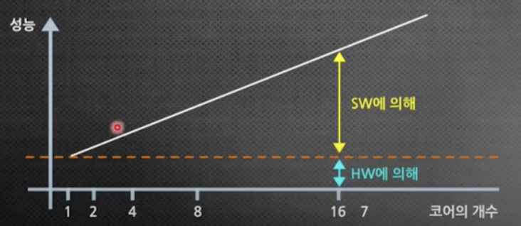

# 병렬 처리 & 멀티코어

### 📌 한줄 요약

CPU의 성능 향상이 클럭 속도가 아닌 **코어 개수**에 의존하게 되면서, **여러 개의 코어를 효율적으로 활용하는 병렬 처리**가 현대 소프트웨어의 핵심 과제가 되었다.

-----

### 1. 왜 병렬 처리가 중요해졌는가? (배경)

과거에는 CPU의 **클럭 속도**를 높여 성능을 향상시켰다. 하지만 발열과 전력 소모의 물리적 한계에 부딪히면서 클럭 속도 경쟁은 끝났다.

그 대안으로, 하나의 CPU에 여러 개의 '뇌'에 해당하는 **코어(Core)** 를 넣는 **멀티코어** 시대가 열렸다.

  * **과거**: 1명의 천재(싱글코어)가 혼자 모든 일을 처리
  * **현재**: 8명의 전문가(옥타코어)가 일을 나눠서 함께 처리

이제 하드웨어는 여러 명의 일꾼(멀티코어)을 제공한다. 이들을 어떻게 효율적으로 일하게 만드느냐, 즉 **소프트웨어의 병렬화 능력** 이 프로그램의 성능을 결정하게 되었다.

### 코어 개수에 따라 달라지는 CPU의 명칭
|코어 개수|명칭|
|-|-|
|1|싱글코어(single-core)|
|2|듀얼코어(dual-core)|
|3|트리플코어(triple-core)|
|4|쿼드코어(quad-core)|
|6|헥사코어(hexa-core)|
|8|옥타코어(octa-core)|
|10|데카코어(deca-core)|
|12|도데카코어(dodeca-core)|

### 2. 핵심 개념: 동시성 vs 병렬성

두 용어는 비슷해 보이지만 중요한 차이가 있다.

  * **동시성 (Concurrency)**: **한 번에 여러 일을 다루는 것.** 하나의 코어(일꾼 1명)가 여러 작업을 번갈아 가며 처리하여 동시에 실행되는 것처럼 보이게 한다. (예: 요리사가 채소를 썰다가 찌개를 젓는 행위)
  * **병렬성 (Parallelism)**: **한 번에 여러 일을 실제로 처리하는 것.** 여러 개의 코어(일꾼 여러 명)가 각자 작업을 맡아 물리적으로 동시에 실행한다. **멀티코어 환경에서만 가능하다.** (예: 요리사 여러 명이 각자 다른 요리를 동시에 만드는 행위)

-----

### 3. 병렬 처리 구현의 3가지 주요 방식

병렬 처리를 수행할 때 어떤 방식을 선택할지는 **작업의 종류(I/O 바운드 vs CPU 바운드)** 에 따라 결정된다.

| 특징 | **비동기 I/O** | **멀티스레드** | **멀티프로세스** |
| :--- | :--- | :--- | :--- |
| **핵심 아이디어** | 작업이 '쉬는 시간'에 다른 일 하기 | '하나의 일'을 여러 조각으로 나눠 처리 | '여러 개의 일'을 각자 독립적으로 처리 |
| **메모리** | 단일 프로세스 메모리 사용 | **공유 (장점이자 단점)** | **독립 (안정적이지만 무거움)** |
| **Python GIL** | 영향 없음 | **영향 있음** (CPU 작업 시 비효율) | 영향 없음 (진정한 병렬 처리) |
| **주요 Python 모듈** | `asyncio`, `aiohttp` | `threading` | `multiprocessing`, `concurrent.futures` |
| **적합한 작업** | **I/O 바운드** (네트워크, 파일 읽기/쓰기) | **I/O 바운드**(데이터 공유가 필요할 때)|**CPU 바운드**(복잡한 계산, 데이터 분석) |

-----

### 4. 병렬 처리의 한계와 종류

Speed-up의 한계와 병렬 프로그래밍의 종류

#### Speed-up의 한계: 암달의 법칙 (Amdahl's Law)

> "코어를 무한히 늘린다고 해서 프로그램이 무한히 빨라지지는 않는다."

> 병렬확장성(Parallel Scalavility): 코어를 더 추가했을 때, 프로그램의 성능이 얼마나 잘 향상되는지를 나타내는 척도

프로그램의 전체 코드 중에는 병렬화가 **가능한 부분**과 **불가능한 부분**(순차적으로 처리해야만 하는 부분)이 섞여있다. 성능 향상(Speed-up)은 **병렬화가 불가능한 부분의 비율**에 의해 제한된다.

#### 병렬 프로그래밍의 종류: 플린의 분류 (Flynn's Taxonomy)

병렬 프로그래밍을 구현하는 컴퓨터 구조는 크게 4가지로 나뉘며, 현대에는 주로 두 가지가 사용된다.

1.  **SISD**: 1개의 명령어, 1개의 데이터 (전통적인 싱글코어 컴퓨터)
2.  **SIMD (Single Instruction, Multiple Data)**: **하나의 명령**으로 **여러 개의 데이터**를 동시에 처리. 그래픽 카드의 GPU가 대표적인 예이다. (예: 이미지의 모든 픽셀 밝기를 10%씩 올리는 작업)
3.  **MISD**: 여러 개의 명령어, 1개의 데이터 (거의 사용되지 않음)
4.  **MIMD (Multiple Instruction, Multiple Data)**: **여러 개의 명령**을 **여러 개의 데이터**에 대해 동시에 처리. 우리가 사용하는 **멀티코어 CPU**가 대표적인 예이다.

유동 해석과 같은 복잡한 과학 계산 시뮬레이션은 주로 **MIMD** 구조의 슈퍼컴퓨터나 클러스터에서 수행된다.

-----

### 결론

멀티코어 하드웨어가 보현화되어 프로그램의 성능은 **주어진 하드웨어를 얼마나 잘 활용하도록 소프트웨어를 설계하는가**에 달려있다. 

문제의 특성을 정확히 파악하여 비동기, 멀티스레드, 멀티프로세스 중 가장 적합한 도구를 선택하는 것이 현대 개발자의 핵심 역량이다.

