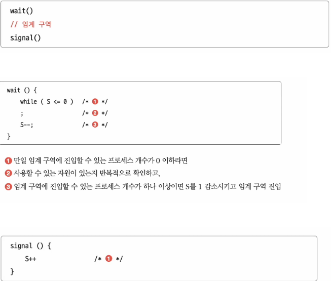

### 📌 한줄 요약
**동기화 기법** 은 여러 스레드가 공유 자원에 동시에 접근할 때 발생할 수 있는 데이터의 불일치 문제를 해결하여, 프로그램의 실행 순서를 제어하고 데이터의 무결성을 보장하는 메커니즘이다.

---

### **1. 왜 동기화가 필요한가? - 경쟁 상태와 임계 구역**

멀티스레드 환경에서는 여러 스레드가 동시에 공유 데이터에 접근하여 값을 변경하려고 할 때, 최종 결과가 예측 불가능하게 달라지는 **경쟁 상태(Race Condition)** 가 발생할 수 있다.

이러한 문제를 막기 위해, 공유 자원에 접근하는 코드 영역을 **임계 구역(Critical Section)** 으로 지정하고, 한 번에 하나의 스레드만 이 구역에 들어갈 수 있도록 통제해야 한다. 이것을 **상호 배제(Mutual Exclusion)** 라고 한다.

#### 1.1. 임계구역 문제의 해결책이 되기 위한 조건

- 상호배제(mutual exclusion): 한 프로세스가 임계 구역에 진입했다면 다른 프로세스는 들어올 수 없다.
- 진행(progress): 임계 구역에 어떤 프로세스도 진입하지 않았다면 진입하고자 하는 프로세스는 들어갈 수 있어야 한다.
- 한정된 대기(bounded waiting): 한 프로세스가 임계 구역에 진입하고 싶다면 언젠가는 임계 구역에 들어올 수 있어야 한다. 
---

### **2. 동기화 기법의 종류와 목적**

#### **① 상호 배제를 위한 기법: 뮤텍스 (Mutex)**
> **목표**: 특정 시점에 오직 하나의 프로세스(또는 스레드)만이 공유 자원이나 코드 영역에 접근할 수 있도록 강제한다.

락을 가질 수 있을 때까지 휴식을 취하는 방식.
뮤텍스는 임계 구역을 오직 하나의 스레드만 실행할 수 있도록 보장하는 가장 기본적인 '잠금' 기법이다. 스레드는 임계 구역 진입 전 `lock()`을, 진입 후 `unlock()`을 호출해야 한다. 이진 세마포도 동일한 목적으로 사용될 수 있다.

#### **② 실행 순서 제어를 위한 기법: 세마포 & 조건 변수**
> **목표**: 한 프로세스가 특정 지점에 도달해야만 다른 프로세스가 다음 작업을 시작할 수 있도록, 프로세스들 사이에 정의된 선후 관계를 강제한다.

멀티스레드 환경에서 공유 자원에 대한 접근을 제어하기 위해 사용하는 동기화 도구.
특정 작업이 다른 작업보다 반드시 먼저 실행되도록 순서를 보장할 때 사용한다.
* **세마포(Semaphore)**: 초기 값을 0으로 설정하여, 특정 스레드가 `signal()`을 호출하기 전까지 다른 스레드가 `wait()`에서 대기하도록 만들어 순서를 제어할 수 있다.
* **조건 변수(Condition Variables)**: 특정 조건을 만족할 때까지 스레드를 대기(`wait`)시키고, 다른 스레드가 조건을 만족시킨 후 신호(`signal`)를 보내 작업을 재개시키는 방식이다.
  
  - `S`: 임계 구역에 진입할 수 있는 프로세스의 개수(사용 가능한 공유 자원의 개수)를 나타내는 전역변수
  - `wait()`: 임계 구역에 진입할 수 있는지, 기다려야 할지를 알려주는 함수
  - `signal()`: 임계 구역 앞에서 기다리는 프로세스에 이제 가도 좋다고 신호를 주는 함수

특징
- 하나 이상의 프로세스/쓰레드가 임계 구역에 접근 가능할 수 있다.
- 세마포는 카운터를 기반으로 작동하며, 일정 개수의 쓰레드만 공유 자원에 동시에 접근할 수 있도록 제어한다.
- 일반적으로 세마포의 카운터 값은 허용 가능한 접근 가능 자원의 수를 나타낸다.
- 세마포는 상호 배제를 위한 동기화 뿐만 아니라 실행 순서 보장도 가능하다.
네, 보내주신 내용을 더 읽기 쉽게 표와 문단으로 정리해 드릴게요.

---
##### 뮤텍스(Mutex) vs 세마포(Semaphore) 비교

| 특징 | 뮤텍스 (Mutex) | 세마포 (Semaphore) |
| :--- | :--- | :--- |
| **카운터** | 없음 (0 또는 1의 상태만 가짐) | 카운터 값 존재 (0 이상) |
| **자원 허용량** | **1개**의 스레드만 접근 가능 | **N개**의 스레드 접근 가능 |
| **소유권** | 락(lock)을 소유한 스레드만 해제 가능 | 누구나 해제 가능 |
| **주 사용 목적**| 단일 스레드 접근 제어 (상호 배제) | 다중 스레드 접근 제어 (실행 순서 동기화) |

결론적으로, 단순히 공유 자원에 대한 **상호 배제**만 필요하다면 **뮤텍스**를, 여러 자원에 대한 접근을 제어하거나 작업 간의 **실행 순서 동기화**가 필요하다면 **세마포**를 사용하는 것이 좋다.

#### **③ 고수준 통합 기법: 모니터 (Monitor)**
> **목표**: 상호 배제와 실행 순서 제어를 **더 안전하고 간편하게** 사용한다.

모니터는 프로그래밍 언어 차원에서 제공하는 고수준 동기화 구조이다.
* **자동 상호 배제**: 공유 자원과 관련 함수를 하나로 묶고, 이 함수를 호출할 때 자동으로 잠금이 처리되어 **상호 배제**가 보장된다. (예: Java의 `synchronized`)
* **실행 순서 제어**: 내부에 **조건 변수**를 포함하고 있어, 정교한 **실행 순서 제어**까지 가능하다.

"매번 임계 구역 앞뒤로 `wait`와 `signal` 함수를 호출하다가 실수하면 어떡하지?" 라는 고민에서 등장한, **더 사용하기 편하고 안전한 동기화 도구**이다. 

모니터는 여러 스레드가 공유 자원을 안전하게 사용할 수 있도록 **상호 배제**는 물론, **실행 순서 제어**까지 하나의 패키지처럼 제공한다. 핵심 규칙은 **모니터 안에는 언제나 하나의 스레드만 들어갈 수 있다**는 것이다.

---
### 주요 특징

#### 1. 상호 배제 (Mutual Exclusion)
모니터는 내부적으로 **락(Lock)**을 사용하여, 특정 공유 자원에 대해 **오직 하나의 스레드만 접근**할 수 있도록 보장한다.

#### 2. 조건 변수 (Condition Variables)
스레드의 **실행 순서를 제어**하기 위해 사용하는 특별한 변수입니다. 특정 조건이 충족될 때까지 스레드가 **대기하거나, 다시 실행되도록** 만들 수 있다.

* **wating queue**: 조건이 충족되기를 기다리는 스레드들이 머무는 대기 장소입니다.
* **주요 동작 (메서드)**:
    * **`wait`**: 스레드가 스스로 "조건이 아직 안됐네"라고 판단하고 대기실(`wating queue`)로 들어가 잠시 쉰다.
    - **`signal` / `notify`**: 대기실에서 기다리는 스레드 중 **하나**를 깨워서 다시 작업을 시작하도록 알린다.
    - **`broadcast` / `notifyAll`**: 대기실에서 기다리는 **모든** 스레드를 깨워서 작업을 시작하도록 알린다.
---

### **결론**
동기화는 멀티스레드 프로그래밍의 정확성을 보장하는 필수 기법이다. 하지만 잘못 사용하면 **교착 상태(Deadlock)**와 같은 문제를 야기할 수 있으므로, 문제 상황에 맞는 기법을 신중하게 선택해야 한다.