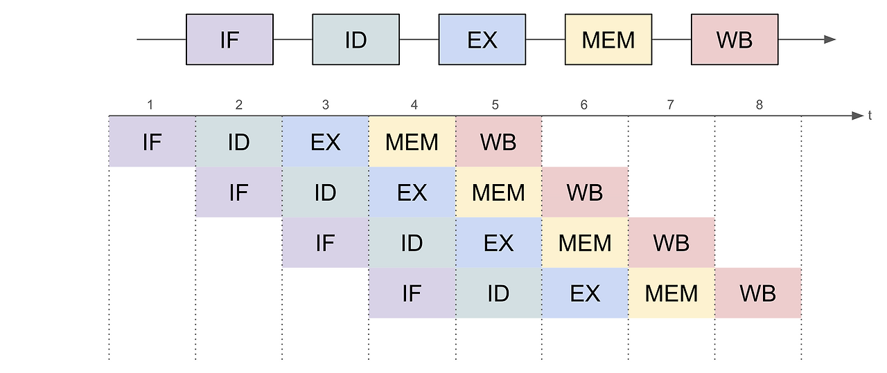

# 명령어 사이클 & 파이프라이닝

## 명령어 사이클 (Instruction Cycle)

### 명령어 사이클이란?

---

> CPU는 프로그램을 실행하기 위해 명령어를 **인출(Fetch) → 해독(Decode) → 실행(Execute)** 하는 과정을 반복하고 이를 **명령어 사이클**이라고 한다.
즉, 주기억장치에서 명령어를 가져와 해석하고 실행한 뒤, 결과를 저장하는 일련의 과정
> 

### **명령어 사이클의 구성 단계**

---

1. 인출 사이클 (Fetch Cycle)
    - PC(프로그램 카운터)가 가리키는 명령어를 주기억장치에서 읽어옴
    - IR(명령어 레지스터)에 저장
    - PC를 1 증가시켜 다음 명령어를 가리키도록 함
2. 해독 사이클 (Decode Cycle)
    - CU(제어장치)가 IR에 저장된 명령어를 해석
    - 연산 코드(Operation Code)와 피연산자(Operand)를 분리
    - 필요한 연산 종류 및 피연산자 위치 결정
3. 실행 사이클 (Execute Cycle)
    - ALU가 산술/논리 연산 수행
    - 결과를 레지스터나 메모리에 저장
    - 경우에 따라 출력장치로 전달
4. 간접 사이클 (Indirect Cycle)
    - 피연산자가 실제 데이터가 아닌 주소(포인터)일 경우, 유효 주소를 한 번 더 메모리에서 읽어옴
5. 인터럽트 사이클 (Interrupt Cycle)
    - 인터럽트 요청이 발생하면 현재 상태(PC, PSW)를 저장하고 인터럽트 처리 루틴으로 분기

## 파이프라이닝 (Pipelining)

### 파이프라이닝이란?

---

> CPU에서 여러 명령어를 겹쳐 실행하는 기술
명령어 사이클을 잘게 나누어, 각 단계가 동시에 수행되도록 하여  **처리율(Throughput)** 을 높임
> 

### **파이프라인 기본 단계**

---

1. IF(Instruction Fetch)
    - PC가 가리키는 명령어를 메모리에서 읽어와 IR에 저장
2. ID(Instruction Decode & Register Fetch)
    - 제어장치(CU)가 명령어 해석
    - 필요한 레지스터 값을 읽어옴.
3. EX(Execute)
    - ALU에서 연산 수행
    - Load/Store 명령어일 경우 유효 주소 계산
4. MEM(Memory Access)
    - 메모리에 접근하여 데이터 읽기/쓰기 수행
5. WB(Write Back)
    - 연산 결과를 레지스터 파일에 기록

### 파이프라이닝 동작 원리 및 장점

---

**파이프라이닝 동작 원리**

- 한 명령어가 EX 단계에 있을 때, 동시에 다른 명령어는 IF, 또 다른 명령어는 ID 단계에 있을 수 있음
    
    → **병렬성(Parallelism)** 을 활용하여 CPU 유효 시간을 줄임
    

**파이프라이닝 장점**

- 명령어 처리율(Throughput) 향상
- CPU 자원 활용 극대화
- 프로그램 실행 속도 전반적으로 개선

### 파이프라이닝의 한계

---

> 여러 명령어를 겹쳐 실행하다 보니 문제가 생김 → Hazard(위험 요소)라고 함
> 
- 구조적 Hazard (Structural Hazard)
    - 두 명령어가 동시에 같은 하드웨어 자원 사용 시, 충돌 발생
    - 해결방법 : 하드웨어 자원 중복 배치
- 데이터 Hazard (Data Hazard)
    - 이전 명령어의 결과가 아직 나오지 않았는데 다음 명령어가 그 결과를 필요로 하는 경우
    - 해결방법 : Forwarding, Stall (버블 삽입)
- 제어 Hazard (Control Hazard)
    - 분기(Fetch) 명령 때문에 프로그램 흐름이 달라질 때, 잘못된 명령어를 인출하는 경우
    - 해결방법 : 분기 예측(Branch Prediction), 지연 분기(Delayed Branch)

## 관련 면접 질문

- 파이프라이닝의 장점과 한계(Hazard)는 무엇인가요?
    - 장점
        - 명령어를 겹쳐 실행하므로 **처리율(Throughput)** 이 향상된다.
        - CPU 자원 활용률이 높아져 프로그램 실행 속도가 빨라진다.
        - 명령어 전체 실행 시간이 줄지 않더라도, 단위 시간당 더 많은 명령어를 완료할 수 있다.
    - 한계
        - 구조적 Hazard (Structural Hazard)
            - 두 명령어가 동시에 동일한 하드웨어 자원을 사용하려 할 때 발생
            - 예: 명령어와 데이터 접근이 모두 메모리를 필요로 할 때
        - 데이터 Hazard (Data Hazard)
            - 이전 명령어의 결과가 아직 나오지 않았는데, 다음 명령어가 그 값을 필요로 할 때 발생
            - 예: `I1: R1 ← R2 + R3` 바로 뒤에 `I2: R4 ← R1 + R5`
        - 제어 Hazard (Control Hazard)
            - 분기(Branch)나 점프 명령으로 인해 다음에 실행할 명령어가 확정되지 않아 잘못된 명령을 인출할 때 발생
- 제어 Hazard를 해결하는 방법에는 무엇이 있나요?
    - 분기 예측 (Branch Prediction)
        - 분기 결과를 미리 예측하여 명령어를 인출
        - 맞으면 성능 향상, 틀리면 되돌리고 패널티 발생
        - 정적 분기 예측(항상 taken/not-taken) vs 동적 분기 예측(히스토리 기반)
    - 지연 분기 (Delayed Branch)
        - 분기 명령 바로 뒤의 1~2개 명령어를 무조건 실행되도록 설계
        - 분기 지연 슬롯(Branch Delay Slot)에 유용한 명령어를 배치하여 손실 최소화
    - 파이프라인 플러시(Flush) & 스톨(Stall)
        - 분기 결과가 확정될 때까지 파이프라인을 잠시 멈추거나 잘못 가져온 명령어를 폐기
        - 성능은 떨어지지만 정확성 보장