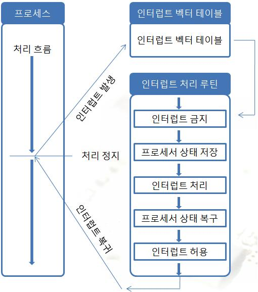

# 인터럽트

## 인터럽트(Interrupt)

### 인터럽트(Interrupt)란?

---

> CPU가 프로그램을 실행하던 도중, **예상치 못한 상황이나 입출력 요청**이 발생하면 현재 작업을 잠시 멈추고 해당 처리를 먼저 수행한 뒤 다시 돌아오는 것
즉, CPU 외부/내부에서 발생하는 이벤트에 즉각적으로 반응하는 메커니즘
> 

### 인터럽트가 필요한 이유

---

- CPU는 매우 빠르지만, I/O 장치는 상대적으로 느림
- CPU가 I/O 작업을 기다리는 대신, 필요할 때만 인터럽트를 걸어 효율적으로 동작
- ex) 키보드 입력 → CPU가 계속 키 입력을 감시하지 않고, 입력이 들어올 때만 인터럽트 발생

### 인터럽트 동작 과정

---

1. 인터럽트 발생
    - I/O 장치나 내부 오류, 외부 신호 등으로 인터럽트 요청(IRQ) 발생
2. 현재 상태 저장
    - CPU는 현재 실행 중이던 명령어 완료한 뒤,
    PC(프로그램 카운터), PSW(상태 레지스터) 등 현재 상태를 스택에 저장
3. 인터럽트 서비스 루틴(ISR, Interrupt Service Routine) 실행
    - 인터럽트 벡터(Interrupt Vector)를 통해 해당 인터럽트 처리 루틴 주소로 점프
    - ISR 수행
4. 상태 복원
    - ISR 종류 후, 저장해둔 PC와 PSW 복구
    - 중단된 지점부터 프로그램 실행 재개

### 인터럽트의 종류

---

**하드웨어 인터럽트**

- 외부 장치에 의해 발생
- ex) 키보드 입력, 마우스 이벤트, 디스크 I/O 완료

**소프트웨어 인터럽트**

- 프로그램 내부 명령어에 의해 발생
- ex) 시스템 콜(System Call), 예외(Exception), Divide by Zero

**동기 VS 비동기**

- 동기 인터럽트(Exception) : 현재 실행 중인 명령어 때문에 발생 (ex: 0으로 나눔)
- 비동기 인터럽트(IRQ) : 명령어 실행과 무관하게 발생 (ex: 키보드 입력)

### 인터럽트의 장단점

---

- 장점
    - CPU 자원 낭비 최소화(폴링 방식 대비 효율적)
    - 다양한 입출력 장치를 동시에 처리 가능
- 단점
    - 인터럽트가 과도하게 발생하면 오버헤드 증가
    - 우선순위 관리가 필요

### 인터럽트 우선순위

---

- 여러 인터럽트가 동시에 발생하면 우선순위에 따라 처리
- ex) 긴급 오류(전원 이상) > 디스크 I/O > 키보드 입력

## 관련 면접 질문

- 인터럽트와 폴링(Polling)의 차이는 무엇인가요?
    - **폴링 (Polling)**
        - CPU가 주기적으로 I/O 장치의 상태를 확인해서 작업이 끝났는지 체크하는 방식
        - 장점: 구현이 단순
        - 단점: CPU가 불필요하게 기다리며 자원을 낭비
    - **인터럽트 (Interrupt)**
        - 장치에서 작업이 완료되거나 예외 상황이 발생하면 CPU에 **신호를 보내 즉시 처리**
        - 장점: CPU 효율적 활용, 불필요한 대기 없음
        - 단점: 인터럽트 빈도가 너무 높으면 오버헤드 증가
- 인터럽트 처리 과정(동작 순서)은 cpu의 컨텍스트 스위칭과 같은 로직을 갖고 있나요?
    - **유사점**
        - **현재 실행 상태 저장**: PC, PSW, 일부 레지스터 값을 스택이나 PCB 같은 공간에 저장
        - **다른 코드 실행**: ISR(인터럽트 서비스 루틴) 혹은 다른 프로세스 실행
        - **상태 복원**: 저장된 값 다시 불러와 원래 코드부터 실행 재개
    - **차이점**
        - **누가 주도하나?**
            - **인터럽트 처리**: 하드웨어가 주도 → CPU가 ISR로 점프
            - **컨텍스트 스위칭**: 운영체제(OS) 스케줄러가 주도 → 커널 코드가 PCB를 교체
        - **저장 범위**
            - **인터럽트**: 보통 최소한의 레지스터(PC, PSW 등)만 저장
            - **컨텍스트 스위칭**: 프로세스 전체 실행 문맥(모든 레지스터, 메모리 맵 등)을 PCB에 저장
        - **코드 위치**
            - 인터럽트 처리는 **하드웨어와 밀접한 루틴(ISR)**
            - 컨텍스트 스위칭은 **운영체제 커널 코드**
- 인터럽트 우선순위는 어떻게 되나요?
    
    **일반적인 우선순위 예시**
    
    1. 전원 이상, 긴급 오류 (가장 높은 우선순위)
    2. 타이머 인터럽트 (시스템 안정성 유지용)
    3. I/O 장치 인터럽트 (디스크, 네트워크 등)
    4. 키보드/마우스 입력 (상대적으로 낮음)
    5. 소프트웨어 인터럽트 (시스템 콜 등, 보통 가장 낮음)