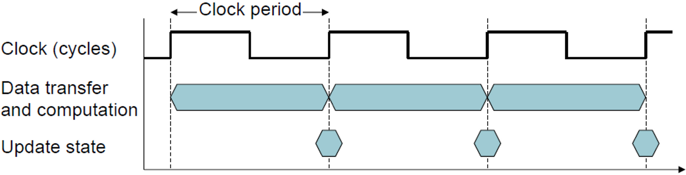
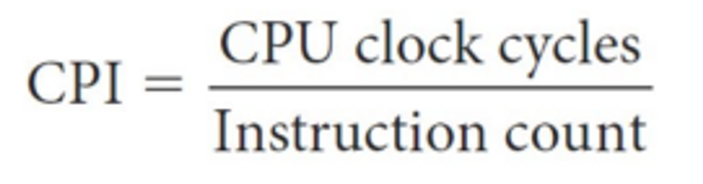

# 클럭 & CPI

## 클럭 (Clock)

- 클럭 신호 (Clock Signal): CPU와 메모리 등 디지털 회로가 동작할 때, 기준이 되는 주기적 신호
- 클럭 주기 (Clock Cycle Time, T)
  - 클럭 1번이 걸리는 시간
  - 단위 : ns (나노초)
- 클럭 속도 (Clock Rate, f)
  - 1초 동안 발생하는 클럭 주기의 횟수
  - 단위 : Hz (보통 GHz 사용)
  - 관계식
    $$
    f = \frac{1}{T}
    $$

## CPI (Cycles Per Instruction)

- 명령어 하나를 실행하는 데 필요한 평균 클럭 사이클 수
- 명령어마다 필요한 사이클 수가 다르기 때문에, 프로그램 전체에 대한 평균을 사용

## CPU 성능 공식

$$
\text{CPU Time} = \text{명령어 수} \times \text{CPI} \times \text{클럭 주기}
$$

또는

$$
\text{CPU Time} = \frac{\text{명령어 수} \times \text{CPI}}{\text{클럭 속도}}
$$

**예시**

- 클럭 속도 : 2 GHz (클럭 주기 = 0.5ns)
- 명령어 수 : 10억 개 (1 × 10^9)
- CPI : 2
- 실행 시간
  $$
  \text{CPU Time} = \frac{10^9 \times 2}{2 \times 10^9} = 1 \ \text{초}
  $$

## 관련 면접 질문

- 클럭 속도가 높으면 무조건 CPU가 빠른가요?
  - 아니요. CPI와 명령어 수에도 영향을 받음
- CPI란 무엇이며 왜 평균값을 쓰나요?
  - 명령어마다 사이클 수가 다르므로 평균으로 성능을 표현
- CPU 성능에 영향을 미치는 세 가지 요소는 무엇인가요?
  - **명령어 수, CPI, 클럭 속도**
