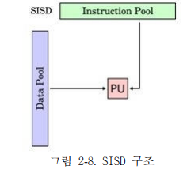
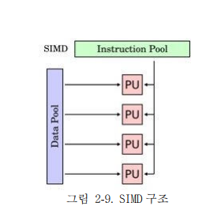
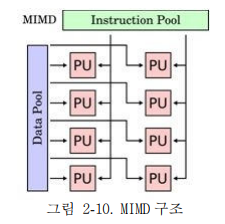

# 병렬 처리 & 멀티코어

## 병렬처리 (Parallel Processing)

### 정의

---

- 하나의 작업을 **여러 개의 처리 장치(CPU/코어)** 가 나누어 동시에 수행하는 방식
- 목표 : 성능 향상, 처리 속도 증가, 대규모 연산 문제 해결

### 분류

---

1. SISD (Single Instruction, Single Data)

   

   - 단일 명령어, 단일 데이터 → 전통적 단일 CPU 구조
   - 실행과정을 여러 단계로 나누어 중첩시켜서 실행속도를 높이는 Pipelining 기법 사용

2. SIMD (Single Instruction, Multiple Data)

   

   - 하나의 명령어로 여러 데이터 동시에 처리
   - 다수의 ALU로 구성되고 모두 하나의 제어장치로 통제
   - ex) 벡터 처리기, GPU 연산

3. MISD (Multiple Instruction, Single Data)
   - 여러 명령어가 하나의 데이터를 동시에 처리 (거의 사용 안 됨)
4. MIMD (Multiple Instruction, Multiple Data)

   

   - 여러 명령어, 여러 데이터를 병렬 처리
   - ex) 멀티코어, 멀티프로세서, 분산 시스템

## 멀티코어 (Multi-core Processor)

### 정의

---

- 하나의 CPU 칩(프로세서) 안에 여러 개의 독립적인 코어(연산 장치)를 집적한 구조
- 각 코어가 독립적으로 명령어를 해석하고 실행할 수 있음

### 등장배경

---

- 클럭 속도 증가에 따른 발열, 전력 소모 문제 → 클럭만 높이는 방식의 한계
- 하나의 CPU 안에 여러 코어를 넣어 **병렬 처리** 를 가능하게 함.

### 병렬 처리의 한계 - Amdahl의 법칙

---

- 프로그램의 일부분만 병렬화 가능하다면, 전체 성능 향상은 제한됨.

$$
Speedup = \frac{1}{(1-P) + \frac{P}{N}}
$$

- P : 병렬화 가능한 비율, N : 코어 갯수
- 병렬화 비율이 낮으면, 코어를 아무리 늘려도 성능 개선이 제한적

## 관련 면접 질문

- pipelining과 무슨 차이가 있나요?
  | 구분 | 파이프라이닝 (Pipelining) | 병렬 처리 (Parallel Processing) |
  | ------------ | ------------------------------------- | ------------------------------------ |
  | **관점** | 명령어 내부 단계를 분리하여 겹쳐 실행 | 여러 명령어나 프로세스를 동시에 실행 |
  | **목표** | 처리율(Throughput) 향상 | 처리 속도와 연산량 증가 |
  | **하드웨어** | 단일 코어 내 파이프라인 단계 활용 | 멀티코어, 멀티프로세서, GPU |
  | **예시** | IF → ID → EX → MEM → WB | 4코어 CPU, GPU CUDA 연산 |
  | **한계** | Hazard 문제 | Amdahl의 법칙, 캐시 일관성 문제 |
- Amdahl의 법칙은 무엇이며, 병렬 처리의 한계를 어떻게 설명하나요?
  - Amdahl의 법칙은 프로그램의 일부분만 병렬화 가능하다면, 전체 성능 향상은 제한된다는 법칙
  - 병렬화 가능한 비율을 P, 프로세서 수를 N이라고 할 때 Speedup = 1 / ((1-P) + P/N) 으로 표현된다. 따라서 직렬 실행 부분 때문에 코어를 무한정 늘려도 성능 향상에는 상한이 있으며, 병렬 처리의 본질적인 한계를 설명한다.
