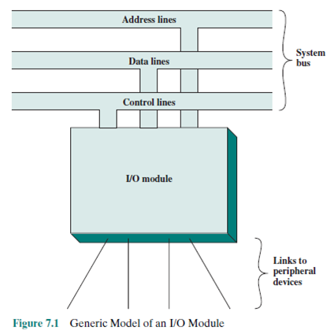

# 버스 구조 & I/O

## 버스 구조 (Bus Architecture)

### 정의

---

- CPU, 메모리, I/O 장치를 연결하는 데이터 전달 통로
- 여러 장치들이 **같은 버스**를 공유하여 통신

### 버스 종류

---

1. **데이터 버스 (Data Bus)**
   - 실제 데이터가 전송되는 통로
   - 양방향 (CPU ↔ 메모리, I/O)
   - ex) CPU가 메모리에서 값을 읽거나(I/O 입력), 결과를 메모리에 쓰는(I/O 출력) 과정
2. **주소 버스 (Address Bus)**
   - CPU가 접근할 메모리 주소나 I/O 포트 번호 전달
   - 단방향 (CPU → 메모리, I/O)
   - ex) CPU가 "메모리 0x100번지의 데이터를 읽어라"라고 지시할 때 해당 주소가 주소 버스를 통해 전달
3. **제어 버스 (Control Bus)**
   - 읽기(Read), 쓰기(Write), 인터럽트, 클럭 등 제어 신호 전달
   - 양방향 (CPU ↔ 메모리, I/O)
   - ex)
     - Read/Write 신호: 메모리 읽기/쓰기 동작 제어
     - 클럭 신호(Clock): 모든 동작의 기준 타이밍 제공
     - 인터럽트 신호: I/O 장치가 CPU에 작업 완료를 알림

### 버스 구조의 특징

---

- 단일 버스 구조 : 모든 장치가 하나의 버스를 공유 → 구조 단순, 비용 낮음, 하지만 병목 발생, 초창기 마이크로 컴퓨터, 구형 PC
- 이중 버스 구조 : CPU-메모리 버스와 I/O 버스 분리 → 성능 향상, DMA 지원 컴퓨터
- 고속 버스 : 고속 캐시/CPU 전용 버스를 별도로 둠. 현대 PC 구조

## I/O (Input/Output)

### 정의

---

- CPU와 외부 장치(키보드, 디스크, 네트워크 등) 간 **데이터 교환 방법**

### I/O 방식

---

1. **프로그램 I/O (Polling, Busy Waiting)**
   - CPU가 장치 상태를 계속 확인하며 I/O 수행
   - 단순하지만 CPU 낭비 심함
2. **인터럽트 기반 I/O**
   - 장치가 준비되면 CPU에 인터럽트 요청
   - CPU는 준비된 순간에만 I/O 수행 → 효율적
3. **DMA(Direct Memory Access)**
   - I/O 장치가 메모리에 직접 접근하여 데이터 전송
   - CPU는 I/O 제어만 담당, 데이터 이동은 DMA 컨트롤러가 수행
   - 대용량 데이터 전송에 유리

### 비교 요약

---

| 방식         | 개념                            | 장점              | 단점                          |
| ------------ | ------------------------------- | ----------------- | ----------------------------- |
| 프로그램 I/O | CPU가 직접 I/O 제어             | 단순              | CPU 낭비 심함                 |
| 인터럽트 I/O | 장치가 CPU에 신호 보내 I/O 처리 | CPU 효율↑         | 인터럽트 처리 오버헤드        |
| DMA          | 장치가 메모리에 직접 접근       | 대용량 전송 효율↑ | 하드웨어 복잡, 버스 경합 가능 |

## 관련 면접 질문

- 프로그램 I/O, 인터럽트 I/O, DMA 방식의 차이는 무엇인가요?
  - 프로그램 I/O: CPU가 직접 I/O 제어 (비효율적)
  - 인터럽트 I/O: 장치가 신호, CPU가 대응 (효율↑)
  - DMA: 장치가 메모리와 직접 통신 (대용량 효율↑, 하드웨어 복잡)
- DMA 방식에서 CPU와 I/O 장치가 메모리 접근을 동시에 시도하면 어떤 문제가 발생하나요? (→ 버스 경합, Arbitration 필요)
  - CPU와 DMA가 동시에 메모리에 접근하면 버스 경합이 발생한다.
  - 이를 해결하기 위해 우선순위, 사이클 스틸링, 버스트 모드와 같은 Arbitration 기법을 사용한다.
    - 우선순위 부여 - DMA 컨트롤러가 CPU보다 높은 우선순위를 가져서 먼저 버스 사용
    - 사이클 스틸링 - DMA가 CPU 클럭 사이클 일부를 ‘훔쳐’ 메모리 접근
    - 버스트 모드 - DMA가 일정 시간 동안 버스를 독점해 대량 전송
