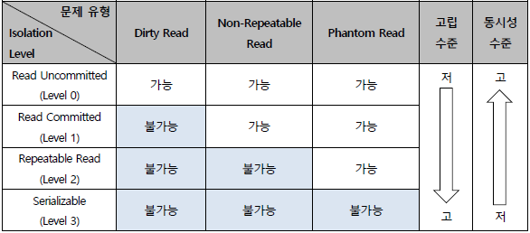

# 트랜잭션 격리 수준

## 트랜잭션 격리 수준 (Transaction Isolation Level)

---

**정의**

- 트랜잭션이 동시에 실행될 때, **서로의 작업이 데이터에 미치는 영향을 어느 정도까지 허용할지를 정하는 수준**
- **일관성(Consistency)** 과 **동시성(Concurrency)** 간의 균형을 조절하는 핵심 개념

**핵심 내용**

1. **필요성**
   - 다중 사용자 환경에서 동시에 데이터에 접근하면 **데이터 불일치**가 발생할 수 있음
   - 이를 방지하기 위해 트랜잭션 간 **격리(Isolation)** 를 보장하여 **무결성**을 유지
2. **대표적인 문제 유형**

   | 문제                    | 설명                                        | 예시                                                    |
   | ----------------------- | ------------------------------------------- | ------------------------------------------------------- |
   | **Dirty Read**          | 커밋되지 않은 데이터를 다른 트랜잭션이 읽음 | A가 수정 중, B가 그 값을 읽고 A가 롤백 시 데이터 불일치 |
   | **Non-repeatable Read** | 같은 쿼리 결과가 매번 다름                  | A가 조회 후, B가 수정 및 커밋                           |
   | **Phantom Read**        | 동일 조건 조회 시 새로운 행 발생            | 첫 조회 후, B가 새 데이터 INSERT                        |

3. **격리 수준의 4단계**

   

   | 수준                 | 설명                                           | 허용 문제                      | 일관성    | 성능      |
   | -------------------- | ---------------------------------------------- | ------------------------------ | --------- | --------- |
   | **READ UNCOMMITTED** | 커밋되지 않은 데이터 읽기 허용                 | Dirty, Non-repeatable, Phantom | 매우 낮음 | 매우 높음 |
   | **READ COMMITTED**   | 커밋된 데이터만 읽음 (Oracle 기본값)           | Non-repeatable, Phantom        | 보통      | 보통      |
   | **REPEATABLE READ**  | 트랜잭션 내 조회 결과 항상 동일 (MySQL 기본값) | Phantom                        | 높음      | 낮음      |
   | **SERIALIZABLE**     | 트랜잭션을 순차적으로 실행                     | 없음                           | 매우 높음 | 매우 낮음 |

4. **DBMS 기본값**

   | DBMS               | 기본 격리 수준  |
   | ------------------ | --------------- |
   | **Oracle**         | READ COMMITTED  |
   | **MySQL (InnoDB)** | REPEATABLE READ |
   | **PostgreSQL**     | READ COMMITTED  |

**특징**

- 격리 수준이 높을수록 데이터 정확성은 향상되지만, 동시성은 저하됨
- 대부분의 DBMS는 **READ COMMITTED**를 기본값으로 설정
- **MySQL(InnoDB)** 는 **MVCC**를 사용해 Phantom Read를 실질적으로 방지

**장단점**

- **장점**
  - 트랜잭션 간 간섭 최소화로 데이터 무결성 강화
  - 시스템 상황에 맞게 유연한 수준 조정 가능
- **단점** - 높은 격리 수준일수록 성능 저하 및 교착상태(Deadlock) 발생 가능 -

**참고**

- MySQL(InnoDB)
  - 읽기(SELECT)는 멀티버전(MVCC)로 처리
  - 쓰기(INSERT/UPDATE/DELETE)는 최신 버전을 기준으로 락을 걸어 처리
  - **MVCC**
    - **Non-Repeatable Read** → 같은 쿼리 == 같은 결과
      - Undo Log 기반으로 트랜잭션 동안 읽는 버전 고정
    - **Phantom Read** → 새로 insert된 row
      - 삽입 자체를 Gap/Next-key Lock으로 차단

## 관련 면접 질문

- 트랜잭션 격리 수준이란?
  - 동시에 실행되는 트랜잭션 간 데이터 간섭을 제어하는 설정으로, 데이터 일관성을 보장함
- READ COMMITTED의 특징은?
  - 커밋된 데이터만 읽으며, Dirty Read는 방지하지만 Non-repeatable Read는 발생할 수 있음
- SERIALIZABLE 수준의 단점은?
  - 완전한 일관성을 보장하지만 트랜잭션이 순차 실행되어 성능이 크게 저하됨
- MySQL의 REPEATABLE READ는 Phantom Read가 발생하지 않는 이유는?
  - 내부적으로 MVCC를 통해 동일 시점의 스냅샷 데이터를 제공하기 때문
