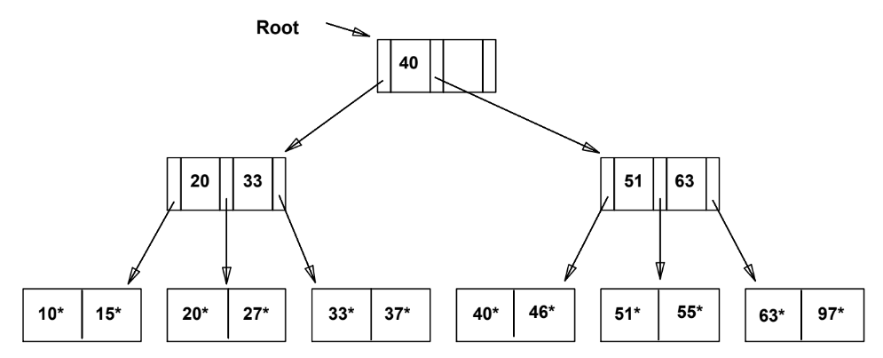

# 인덱스

### 인덱스(Index)

---

**정의**

- 데이터베이스에서 **검색 성능을 향상시키기 위해** 특정 컬럼에 생성하는 **자료 구조**
- 책의 목차처럼 원하는 데이터를 **빠르게 탐색**할 수 있도록 돕는 장치
- 일반적으로 **B+Tree** 또는 **Hash 구조**로 구현됨

---

**핵심 내용**

1. **필요성**
   - 인덱스가 없으면 DB는 모든 데이터를 순차적으로 탐색(Full Scan)해야 하므로 비효율적
   - 대용량 데이터에서 **조회 속도를 극적으로 향상**시키는 핵심 성능 요소
2. **인덱스의 구조와 종류**
   - **B+Tree 인덱스**
     
     - 대부분의 RDBMS에서 사용하는 기본 구조
     - 균형 트리 형태로 정렬된 데이터 유지 → **범위 검색(>, <)** 가능
   - **Hash 인덱스**
     - 키를 해싱하여 값 저장 → **동등 비교(=)** 에 빠름, 범위 검색에는 부적합
   - **클러스터드 인덱스 (Clustered Index)**
     - 실제 데이터가 인덱스 순서대로 저장됨 (테이블 자체가 인덱스 구조)
     - 한 테이블당 하나만 생성 가능 (주로 기본키)
   - **논클러스터드 인덱스 (Non-clustered Index)**
     - 인덱스와 데이터가 분리되어 있음 → 추가적인 포인터 탐색 필요
   - **복합 인덱스 (Composite Index)**
     - 여러 컬럼을 묶어 하나의 인덱스로 구성 (예: `(name, age)`)
3. **인덱스 사용 시 고려사항**
   - `WHERE`, `JOIN`, `ORDER BY`, `GROUP BY` 절에 자주 등장하는 컬럼에 인덱스를 설정하는 것이 효과적
   - 인덱스가 많아질수록 `INSERT`, `UPDATE`, `DELETE` 시 **추가적인 오버헤드** 발생
   - 데이터의 **카디널리티(값의 다양성)** 가 높은 컬럼일수록 인덱스 효과가 큼

---

**특징**

- 조회 속도는 향상되지만, 쓰기 성능은 저하될 수 있음
- 쿼리 실행 계획(EXPLAIN)을 통해 인덱스 사용 여부를 확인 가능
- **정렬 유지**, **범위 검색**, **빠른 접근**이 가능하지만, 관리 비용이 필요함

---

**장단점**

- **장점**
  - 대용량 데이터 조회 성능 향상
  - 정렬 및 검색 속도 개선
  - 중복 방지 및 키 기반 데이터 접근 용이
- **단점**
  - 데이터 변경 시 인덱스 갱신으로 인한 성능 저하
  - 인덱스가 많을수록 저장공간과 관리 비용 증가
  - 잘못된 인덱스 설계 시 오히려 성능 저하

---

## 관련 면접 질문

- ❓ **인덱스란 무엇인가요?**
  - 데이터를 빠르게 조회하기 위해 특정 컬럼에 생성하는 자료 구조로, 탐색 속도를 높이기 위해 사용됩니다.
- ❓ **B+Tree 인덱스와 Hash 인덱스의 차이는 무엇인가요?**
  - B+Tree는 정렬된 구조로 범위 검색이 가능하고, Hash 인덱스는 동등 비교에 빠르지만 범위 검색이 불가능합니다.
- ❓ **인덱스 사용 시 주의할 점은 무엇인가요?**
  - 인덱스는 조회 성능은 높이지만, 삽입·수정·삭제 시 오버헤드가 발생하므로 적절한 컬럼에만 설정해야 합니다.
- ❓ **클러스터드 인덱스와 논클러스터드 인덱스의 차이는?**
  - 클러스터드는 실제 데이터가 인덱스 순서로 저장되고, 논클러스터드는 인덱스가 별도로 존재해 데이터 위치를 참조합니다.
