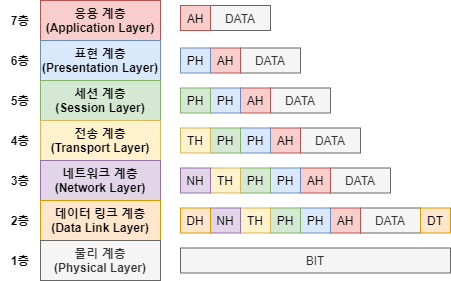
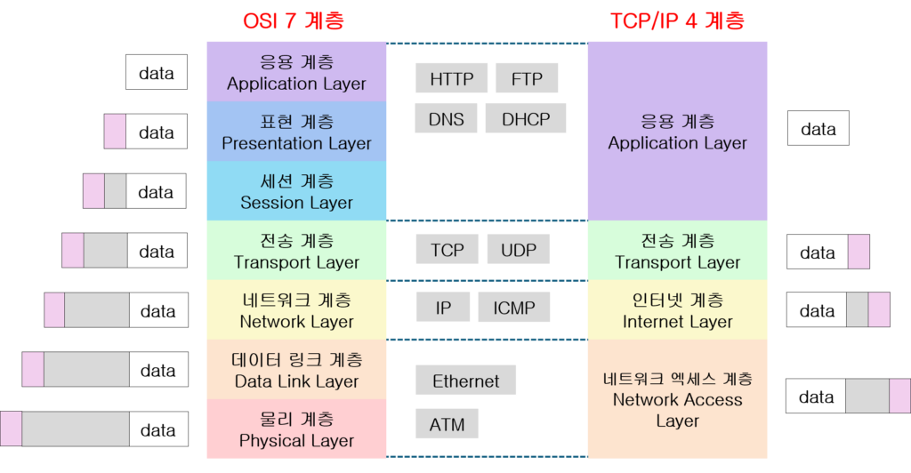

# OSI 7계층 & TCP/IP

### OSI 7계층 (OSI 7 Layers)

---

**개념**

- 국제표준화기구(ISO)에서 정의한 **네트워크 통신의 표준 모델**
- 네트워크 통신 과정을 7개의 계층으로 나누어, **각 계층이 독립적인 역할을 수행**
- 통신 과정의 복잡성을 줄이고 **호환성, 유지보수성, 모듈화**를 높이기 위한 설계

**구조**

| 계층  | 이름                            | 주요 역할                                   | 예시 프로토콜        |
| ----- | ------------------------------- | ------------------------------------------- | -------------------- |
| 7계층 | **응용 계층 (Application)**     | 사용자에게 네트워크 서비스를 직접 제공      | HTTP, FTP, SMTP, DNS |
| 6계층 | **표현 계층 (Presentation)**    | 데이터 변환, 압축, 암호화 수행              | JPEG, MPEG, SSL      |
| 5계층 | **세션 계층 (Session)**         | 연결의 설정, 유지, 종료 및 동기화           | NetBIOS, RPC         |
| 4계층 | **전송 계층 (Transport)**       | 신뢰성 있는 전송(TCP)과 빠른 전송(UDP) 제공 | TCP, UDP             |
| 3계층 | **네트워크 계층 (Network)**     | 최적 경로 결정 및 패킷 전달                 | IP, ICMP, ARP        |
| 2계층 | **데이터링크 계층 (Data Link)** | 오류 검출 및 MAC 주소 기반 전송             | Ethernet, PPP        |
| 1계층 | **물리 계층 (Physical)**        | 비트 단위의 신호 전송 (전기적, 기계적 특성) | 케이블, 허브         |

**특징**

- 각 계층은 상위 계층에 서비스 제공, 하위 계층으로부터 서비스 이용
- 계층 간 인터페이스가 명확하여 독립적인 수정 및 확장이 가능
- 네트워크 장비의 동작 위치도 이 계층 구조로 설명 가능
  - ex) 허브(1계층), 스위치(2계층), 라우터(3계층)

### TCP/IP

---

**개념**

- 인터넷에서 실제로 사용되는 **프로토콜 스택 기반 모델**
- OSI 모델의 개념을 **4계층(응용-전송-인터넷-네트워크 접근)** 으로 단순화
- OSI는 이론적 표준, TCP/IP는 실제 구현 중심 모델

**구조**

| 계층  | 이름                                    | 주요 역할                             | 예시 프로토콜        |
| ----- | --------------------------------------- | ------------------------------------- | -------------------- |
| 4계층 | **응용 계층 (Application)**             | 사용자 서비스, 데이터 표현 및 전송    | HTTP, FTP, SMTP, DNS |
| 3계층 | **전송 계층 (Transport)**               | 통신 세션 관리, 포트 기반 데이터 전송 | TCP, UDP             |
| 2계층 | **인터넷 계층 (Internet)**              | 라우팅, IP 주소 지정, 패킷 전달       | IP, ICMP, ARP        |
| 1계층 | **네트워크 접근 계층 (Network Access)** | 물리적 전송, MAC 주소 기반 통신       | Ethernet, PPP        |

**OSI 7 vs TCP/IP**

| 구분      | OSI 7계층                            | TCP/IP 4계층                   | 특징                                    |
| --------- | ------------------------------------ | ------------------------------ | --------------------------------------- |
| 계층 수   | 7개                                  | 4개                            | TCP/IP가 더 단순화되어 있음             |
| 목적      | 개념적 표준                          | 실제 인터넷 구현               | OSI는 모델, TCP/IP는 구현 중심          |
| 전송 단위 | 데이터, 세그먼트, 패킷, 프레임, 비트 | 데이터, 세그먼트, 패킷, 프레임 | 명칭 차이 존재                          |
| 계층 매핑 | 응용/표현/세션 → 응용                | 전송 동일                      | 네트워크+데이터링크+물리 → 네트워크접근 |

## 관련 면접 질문

- OSI 7계층과 TCP/IP 모델의 차이점은 무엇인가요?
  - OSI는 이론적 표준 모델로 계층이 7개, TCP/IP는 실제 구현 중심의 4계층 구조
- OSI 7계층으로 네트워크 장비를 구분하면 어떤 예시가 있나요?
  - 허브(1계층), 스위치(2계층), 라우터(3계층) 등으로 계층별 기능이 다름
- 계층 구조로 나누는 이유는 무엇인가요?
  - 계층 간 독립성으로 유지보수와 확장이 용이, 표준화된 통신 설계가 가능하기 때문에
