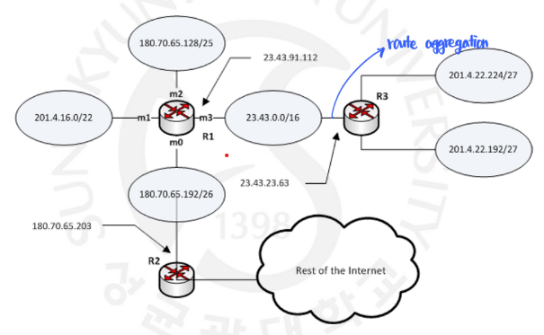
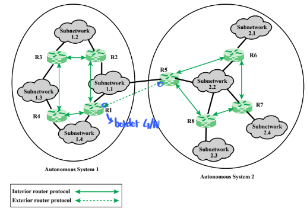
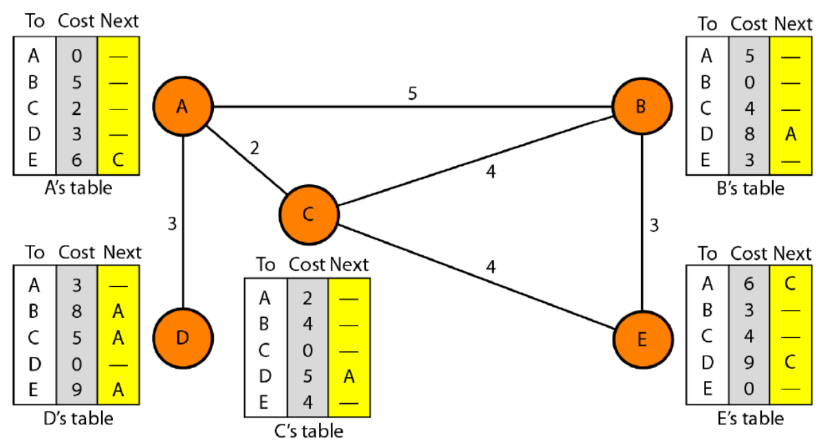
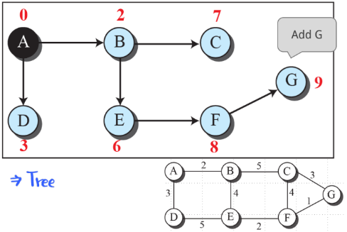
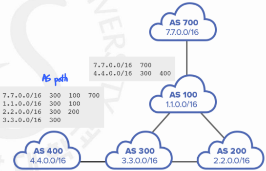
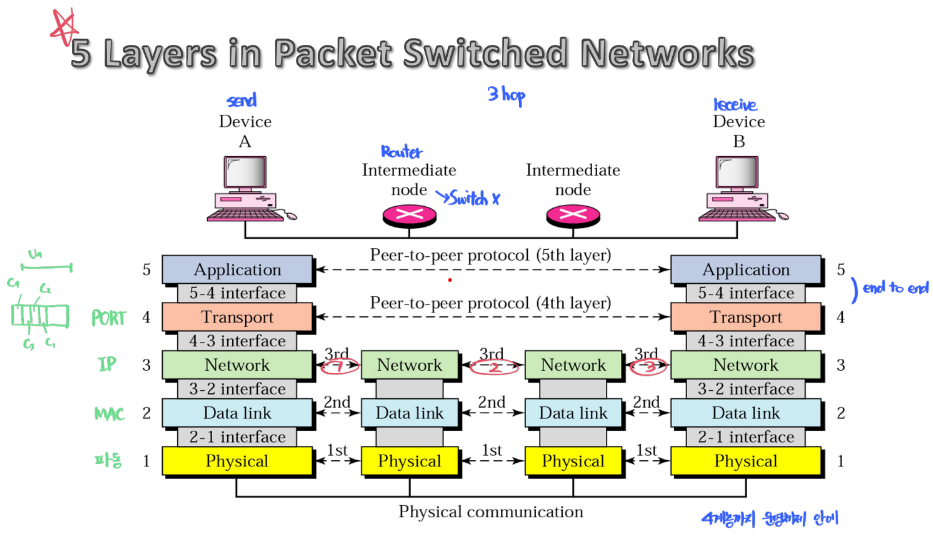

# 라우팅

### 라우팅(Routing)

---

**개념**

- **라우팅(Routing)** 은 네트워크 상에서 데이터 패킷이 출발지에서 목적지까지 도달하기 위한 최적의 경로를 결정하는 과정이다.
- 이 역할을 수행하는 장비가 **라우터(Router)** 로, OSI 7계층 중 **네트워크 계층(3계층)** 에 속한다.
- 라우팅은 단순히 데이터를 전달하는 것이 아니라, “어떤 경로로 보낼지”를 선택하는 의사결정 과정이다.
- 경로 선택 기준은 거리, 지연 시간, 비용, 정책 등 네트워크 상황과 목적에 따라 달라질 수 있다.

**라우팅의 기본 동작 과정**




- 라우터는 **라우팅 테이블(Routing Table)** 을 참고하여 패킷의 다음 홉(Next Hop)을 결정한다.
- 이 때, 패킷의 목적지 IP 주소를 확인하고, 테이블의 네트워크 주소와 **가장 길게 일치하는 경로(Longest Prefix Match)** 를 선택한다.
- 라우팅 테이블은 네트워크 경로, 서브넷 마스크, 게이트웨이, 인터페이스, 메트릭 등의 정보를 포함한다.
- ex)
  ```c
  Destination      Netmask          Gateway         Interface    Metric
  192.168.10.0     255.255.255.0    192.168.1.1     eth0         1
  10.0.0.0         255.0.0.0        192.168.2.1     eth1         5
  0.0.0.0          0.0.0.0          192.168.1.254   eth0         10
  ```
- `0.0.0.0/0` 은 **기본 경로(default route)** 로, 테이블에 없는 목적지일 때 사용하는 “최후의 경로”다.

**종류**

- 정적 라우팅 (Static Routing)
  - 관리자가 직접 경로를 수동으로 지정
  - 네트워크 변화에 자동 대응 불가
  - 단순 구조나 테스트 환경에서 사용
- 동적 라우팅 (Dynamic Routing)
  - 라우터 간 라우팅 프로토콜을 통해 경로 정보를 자동 교환
  - 네트워크 변화(장애, 부하)에 따라 경로를 자동 갱신
  - 대규모 네트워크 환경, ISP 환경에 적합

**주요 라우팅 프로토콜**



1. **Intra-domain Routing Protocol**

   하나의 자율 시스템(AS, Autonomous System) 내부에서 사용하는 내부 라우팅 프로토콜
   → **IGP(Interior Gateway Protocol)** 라고도 함.

   - **RIP(Routing Information Protocol)**

     - 거리 벡터(Distance Vector) 기반 - 이웃하고만 통신

       

     - 홉 수 (Hop Count)가 적은 경로를 선택 (최대 15홉 제한)
     - 단순하지만 확장성 낮음

   - **OSPF(Open Shortest Path First)**
     - 링크 상태(Link State) 기반 - AS 안의 모든 Router와 통신

       

     - Dijkstra 알고리즘으로 최단 경로 계산
     - 영역(Area) 단위로 나누어 대규모 네트워크에 효율적
   - **EIGRP(Enhanced Interior Gateway Routing Protocol)**
     - Cisco 독자 프로토콜
     - 거리 벡터 + 링크 상태의 하이브리드 방식
     - 빠른 수렴성과 대역폭 효율

1. Inter-domain Routinh Ptotocol

   서로 다른 자율 시스템 간의 라우팅을 담당하는 외부 라우팅 프로토콜
   → **EGP(Exterior Gateway Protocol)** 라고도 함.

   

   - **BGP(Border Gateway Protocol)**
     - 인터넷 전체의 “백본 라우팅”을 담당
     - AS 간 경로를 교환하며, 거리보다 정책(Policy) 기반으로 경로 선택
     - 각 경로는 AS Path, Next Hop, Local Preference 등의 속성으로 평가
     - 매우 안정적이며 전 세계 인터넷의 표준 Inter-domain 프로토콜

## 관련 면접 질문

- 정적 라우팅과 동적 라우팅의 차이점은 무엇인가요?
  - 정적은 수동 설정으로 단순하지만 변화에 대응 불가, 동적은 자동 학습으로 복원력과 확장성이 높습니다.
- OSPF와 RIP의 차이점을 설명해주세요.
  - RIP은 홉 수 기반 거리 벡터 방식, OSPF는 링크 상태 기반으로 Dijkstra 알고리즘을 사용해 최단 경로를 계산합니다.
- Intra-domain과 Inter-domain 라우팅의 차이점은 무엇인가요?
  - Intra-domain은 AS 내부 최적화를 위한 IGP(예: OSPF, RIP)이며, Inter-domain은 AS 간 연결을 위한 BGP(EGP)입니다.

### 참고 사진

- 네트워크 모델
  
