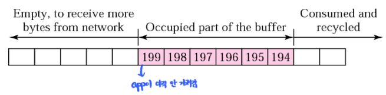
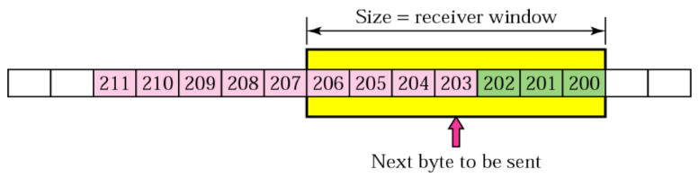

# 흐름 제어 & 혼잡 제어

### 흐름 제어 (Flow Control)

---

**정의**

- 송신 측이 **너무 빠르게 데이터를 전송해서 수신 측이 처리하지 못하는 상황**을 방지하기 위한 제어 메커니즘이다.
- 목적 : 송신 속도를 조절해 **수신 버퍼 오버플로우(overflow)** 를 막는것

**원리**

- TCP는 수신 측이 자신의 **수신 버퍼 크기(RWND, Receive Window)** 를 송신 측에 알려줌으로써 “이만큼까지만 보내라”는 신호를 전달한다.
- 송신 측은 RWND 값을 기준으로 전송 가능한 데이터 양을 제한한다.
- 수신 측 윈도우
  
- 송신 측 윈도우
  

**작동 과정**

1. 수신 측은 데이터 수신 후, 남은 버퍼 크기를 ACK 패킷의 윈도우 필드(Window field)에 포함시켜 보낸다.
   → “내 버퍼에 N바이트 여유가 있어.”
2. 송신 측은 그 크기만큼만 데이터를 보낸다.
3. 수신 측의 버퍼가 가득 차면 RWND = 0 으로 설정해 일시 정지 요청을 한다.
4. 송신 측은 주기적으로 “윈도우 프로브(Window Probe)” 패킷을 보내, 다시 전송 가능한지 확인한다.

**결과**

- 수신 측의 처리 속도에 맞춘 **전송량 조절**
- 네트워크 혼잡이 아닌, **수신자의 능력 기반 제어**

### 혼잡 제어 (Congestion Control)

---

**정의**

- 네트워크 내의 **라우터나 링크에 데이터가 너무 몰려 패킷 손실과 지연이 발생하는 현상**을 방지하는 기법이다.
- 목적: 네트워크 전체의 안정성 확보

**원리**

- 송신 측이 네트워크의 상태를 고려해 **전송 속도를 동적으로 조절**한다.
- 즉, 수신자 기준이 아닌 **네트워크 경로 전체의 부하 상태**를 기준으로 제어하는 메커니즘이다.

**대표 알고리즘**

1. **Slow Start (느린 시작)**
   - 처음에는 전송 속도를 매우 낮게 시작 (CWND = 1 MSS)
   - ACK이 오면 CWND(혼잡 윈도우)를 **지수적으로(2배씩)** 증가시킴
   - 혼잡이 감지되면 CWND를 절반으로 줄이고 다시 시작
2. **Congestion Avoidance (혼잡 회피)**
   - 일정 임계점(ssthresh)에 도달하면 CWND를 선형적으로 증가
   - 네트워크를 안정적으로 유지
3. **Fast Retransmit (빠른 재전송)**
   - 동일한 ACK(중복 ACK)를 3번 연속 수신하면
     → 타임아웃 기다리지 않고 손실로 판단하여 즉시 재전송
4. **Fast Recovery (빠른 회복)**
   - 패킷 손실이 감지된 후 CWND를 절반으로 줄이고
     → 혼잡 회피 단계로 바로 복귀 (느린 시작으로 돌아가지 않음)

**핵심 변수**

- **CWND (Congestion Window)** : 송신 측이 네트워크 상태에 따라 조절하는 전송량
- **SSThresh (Slow Start Threshold)** : 느린 시작 ↔ 혼잡 회피 모드 전환 기준
- **RWND (Receive Window)** : 수신 측 버퍼 크기 기반 흐름 제어용 윈도우

## 관련 면접 질문

- 흐름 제어의 목적은?
  - 수신 측 버퍼 오버플로우를 방지하고 송수신 속도를 일치시키기 위함.
- 혼잡 제어의 목적은?
  - 네트워크 내 패킷 손실과 지연을 줄이고 전체 효율을 높이기 위함.
- Slow Start와 Congestion Avoidance의 차이?
  - Slow Start는 초기 단계로 지수 증가
  - Congestion Avoidance는 안정 단계로 선형 증가
- 흐름 제어와 혼잡 제어의 가장 큰 차이점은?
  - 흐름 제어는 “수신자 기준”, 혼잡 제어는 “네트워크 기준”
