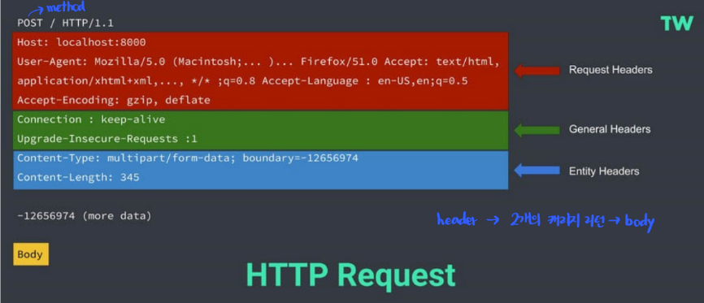
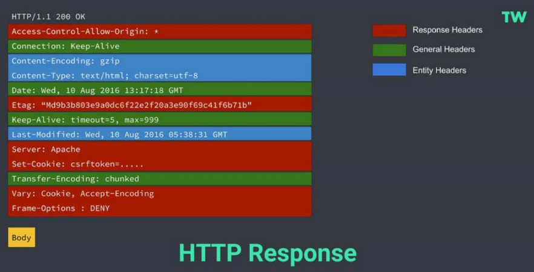
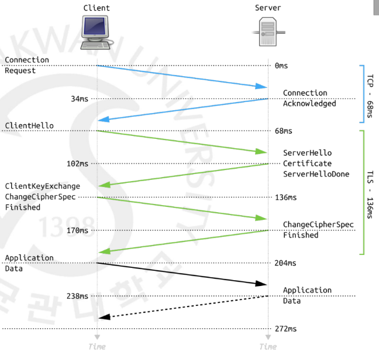

# HTTP / HTTPS

### HTTP (HyperText Transfer Protocol)

---

**정의**

- **HTTP**는 웹에서 데이터를 주고받기 위한 **애플리케이션 계층 프로토콜**이다.
- 브라우저(클라이언트)와 서버 간에 HTML, 이미지, JSON 등 다양한 자원을 전송하는 역할을 담당한다.
- OSI 7계층 중 **7계층(응용 계층)** 에 속한다.

**특징**

- **비연결성(Connectionless)** : 요청(Request)이 끝나면 연결을 바로 끊는다.
- **무상태성(Stateless)** : 서버는 이전 요청의 상태를 기억하지 않는다.
  → 때문에 로그인 유지나 세션 관리에는 쿠키, 세션, 토큰 등이 필요하다.
- 전송 포트 : **TCP 80번** 포트 사용
- 텍스트 기반 프로토콜로, 데이터가 평문(Plain Text)으로 전송된다.

**요청 (Request) 구조 예시**

**응답 (Response) 구조 예시**

### HTTPS (HTTP Secure)

---

**정의**

- **HTTPS**는 HTTP에 **SSL/TLS 암호화 계층을 추가한 보안 통신 프로토콜**이다.
- 데이터를 전송하기 전에 암호화하여 **도청, 위조, 변조를 방지**한다.
- 전송 포트: **TCP 443번 포트** 사용

**동작 원리 (핸드셰이크 과정)**

1. 클라이언트가 서버에 접속하며 “암호화 통신을 하자”고 요청
2. 서버는 **공개키(인증서)** 를 전달
3. 클라이언트는 인증서를 검증하고 세션 키를 생성 → 서버의 공개키로 암호화해 전송
4. 서버가 자신의 비밀키로 복호화 후 세션 키 공유 완료
5. 이후 데이터는 **세션 키(대칭키)** 로 암호화되어 통신

   → 즉,

   - 초기 통신은 공개키 방식(비대칭 암호화)
   - 이후 본 데이터 통신은 대칭키 방식으로 효율적 처리

**HTTPS의 주요 보안 기능**

- **기밀성(Confidentiality)**: 데이터 암호화로 도청 방지
- **무결성(Integrity)**: 데이터가 중간에서 변조되지 않도록 보장
- **인증(Authentication)**: 서버 인증서로 신뢰할 수 있는 서버임을 증명

**HTTPS 인증서 구조**

- **CA (Certificate Authority)**: 신뢰할 수 있는 기관이 발급한 서버 인증서
- **서버 공개키** + **서버 정보** + **CA 서명(Signature)** 으로 구성
- 브라우저는 인증서의 **CA 신뢰 여부 및 만료 기간** 등을 검증해 통신 시작 여부를 결정

## 관련 면접 질문

- HTTP의 단점은 무엇인가요?
  - 데이터가 평문으로 전송되어 도청·변조·위조에 취약하며, 인증 절차가 없다.
- HTTPS는 어떻게 보안을 보장하나요?
  - SSL/TLS를 통해 암호화, 무결성 검사, 서버 인증을 수행한다.
  - 초기에는 공개키 암호화로 세션 키를 교환하고, 이후 대칭키로 빠르게 암호화 통신한다.
- HTTPS의 단점은 무엇인가요?
  - 암호화·복호화로 인한 약간의 오버헤드와 인증서 발급·갱신 비용이 발생한다.
- HTTP 1.1, 2, 3의 차이를 설명해보세요.
  - HTTP/1.1은 요청당 하나의 연결,
  - HTTP/2는 멀티플렉싱 지원으로 다중 요청 병렬 처리,
  - HTTP/3는 UDP 기반 QUIC 프로토콜로 지연시간을 대폭 개선했다.
