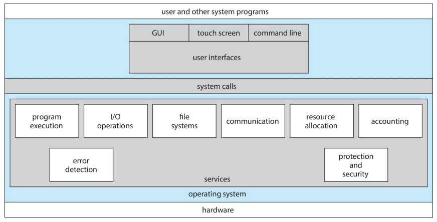
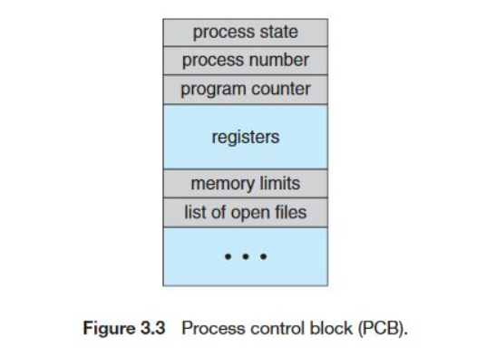

# 프로세스 개념 & 상태 전이

## 운영체제(Operating System)

**정의**

- 사용자와 하드웨어 사이에서 동작하며 하드웨어 자원(CPU, 메모리, I/O 등)을 관리하고 프로그램이 실행될 수 있는 환경을 제공하는 시스템 소프트웨어

**주요 역할**

- 프로세스 관리 : CPU 스케쥴링, 프로세스 동기화, 교착상태 처리
- 메모리 관리 : 물리·가상 메모리, 페이지 교체, 메모리 보호
- 파일·I/O 관리 : 파일 시스템 제공, 장치 드라이버, 버퍼링·스풀링
- 보안 및 자원 보호 : 접근 제어, 사용자 권한 관리

**구성**

- 커널(Kernel), 시스템 콜(System Call) 인터페이스, 사용자 인터페이스(Shell, GUI 등)

## 프로세스 (Process)

**정의**

- 실행 중인 프로그램(Program in execution)
- 단순히 디스크에 저장된 정적 프로그램과 달리, 실행을 위해 필요한 코드·데이터·스택·레지스터 상태까지 포함한 실행 단위
- 운영체제가 CPU와 메모리, I/O 자원을 관리하기 위해 사용하는 기본 단위

**프로세스의 주요 구성**

- 코드 영역(Code): 실행할 명령어 저장
- 데이터 영역(Data): 전역·정적 변수 저장
- 힙 영역(Heap): 동적 할당 메모리, 런타임 시 크기 결정
- 스택(Stack): 함수 호출 시 지역 변수, 리턴 주소 저장
- **PCB(Process Control Block)** : 프로세스 관리 정보(상태, 레지스터 값, 스케쥴링 정보 등)
  

## 프로세스 상태 & 상태 전이

**프로세스 상태 종류**

| 상태                      | 설명                                  |
| ------------------------- | ------------------------------------- |
| **New(생성)**             | 프로세스 생성 중, OS가 자원 할당 준비 |
| **Ready(준비)**           | CPU 할당을 기다리는 상태              |
| **Running(실행)**         | CPU에서 명령어 실행 중                |
| **Waiting/Blocked(대기)** | I/O 완료 등 특정 이벤트를 기다림      |
| **Terminated(종료)**      | 실행 완료 후 자원 해제                |

**상태 전이**

- 생성 → 준비 : 메모리에 적재되어 실행 대기
- 준비 → 실행 : 스케줄러가 CPU 할당
- 실행 → 준비 : 선점 스케줄링으로 CPU 회수
- 실행 → 대기 : I/O 요청 등으로 이벤트 대기
- 대기 → 준비 : I/O 완료 후 다시 CPU 대기
- 실행 → 종료 : 작업 완료 후 자원 해제

## 관련 면접 질문

- 운영체제의 핵심 역할은?
  - CPU·메모리·I/O 같은 하드웨어 자원을 관리하고 사용자·프로그램에게 실행 환경을 제공한다.
- 프로세스란 무엇이며 상태 전이는 어떻게 이루어지나요?
  - 실행 중인 프로그램으로, 생성→준비→실행→대기→종료 단계로 상태가 변한다.
