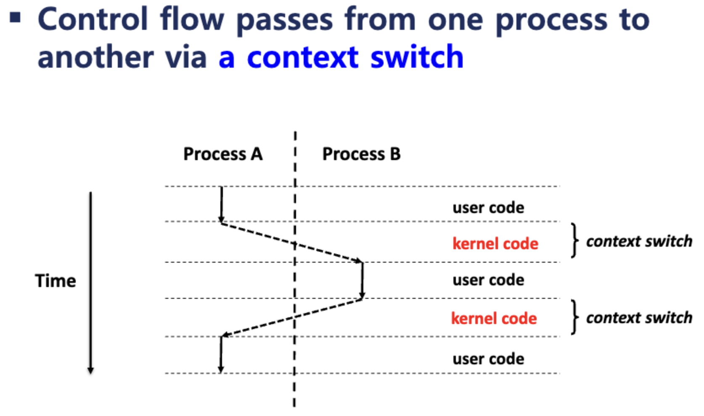
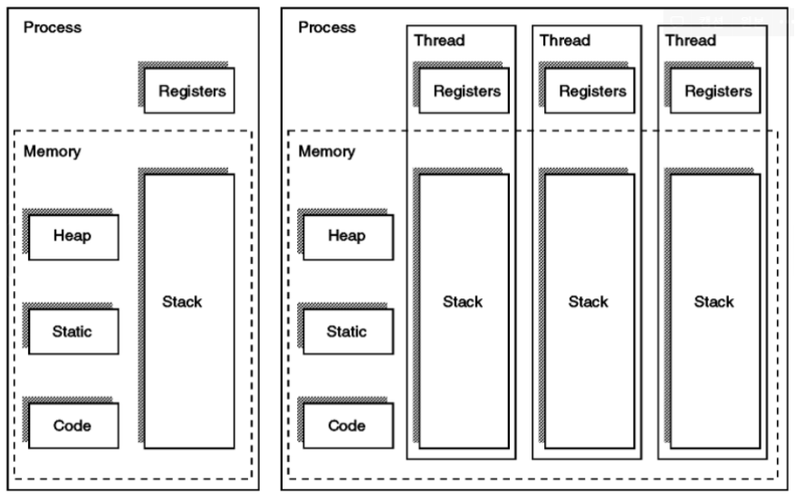

# 프로세스 & 스레드

## 프로세스

**정의**

- 실행 중인 프로그램으로, 자원(메모리 공간, 열린 파일, I/O 장치 등)을 독립적으로 소유하는 운영체제의 기본 실행 단위

**구성 요소**

- 코드 영역(Code): 실행할 명령어 저장
- 데이터 영역(Data): 전역·정적 변수 저장
- 힙 영역(Heap): 동적 할당 메모리, 런타임 시 크기 결정
- 스택(Stack): 함수 호출 시 지역 변수, 리턴 주소 저장
- **PCB(Process Control Block)** : 프로세스 관리 정보(상태, 레지스터 값, 스케쥴링 정보 등)

**특징**

- 각각의 프로세스는 독립적인 주소 공간을 가진다.
- 다른 프로세스와 데이터 교환을 하려면 **IPC(Inter-Process Communication)** 기법 필요 (파이프, 소켓, 공유 메모리 등)

## 스레드

**정의**

- 프로세스 내부에서 실행 흐름을 담당하는 단위

**구성 요소**

- 고유의 레지스터 집합(프로그램 카운터, 레지스터 값 등)
- 스택(함수 호출, 지역 변수)
- **TCB(Thread Control Block)** : 스레드 ID, 상태, 레지스터 정보 등

**특징**

- 같은 프로세스의 코드·데이터·힙·파일 디스크립터를 모든 스레드가 공유한다.
- 한 프로세스 안에서 여러 스레드가 동시에 실행될 수 있어 컨텍스트 스위칭 비용이 낮고 자원 공유가 용이하다.

### 참고자료

- 컨텍스트 스위치
  

## 프로세스 vs 스레드 비교

| 구분                     | 프로세스                                                 | 스레드                                                              |
| ------------------------ | -------------------------------------------------------- | ------------------------------------------------------------------- |
| **자원 소유**            | 독립적 메모리 공간(코드, 데이터, 힙, 스택)과 시스템 자원 | 동일 프로세스의 코드·데이터·힙·파일 공유, 각 스레드별 스택·레지스터 |
| **통신 방식**            | IPC 필요(파이프, 소켓 등)                                | 같은 주소 공간 공유 → 직접 데이터 교환 가능                         |
| **컨텍스트 스위칭 비용** | 높음 (주소 공간 전환, TLB flush 등)                      | 낮음 (같은 주소 공간 유지)                                          |
| **격리/안전성**          | 강함 (한 프로세스 오류가 다른 프로세스에 직접 영향 적음) | 약함 (하나의 스레드 오류가 프로세스 전체 중단 가능)                 |
| **생성/관리 비용**       | 큼                                                       | 작음                                                                |
| **활용 예시**            | 크롬 브라우저의 각 탭을 별도 프로세스로 실행             | 각 탭 내부에서 여러 렌더링·네트워크 작업을 스레드로 처리            |

## 관련 면접 질문

- 프로세스와 스레드의 차이점은 무엇인가요?
  - 프로세스는 운영체제가 자원을 독립적으로 할당·관리하는 실행 단위이고, 스레드는 프로세스 내부에서 실행 흐름을 담당하며 코드·데이터·힙을 공유하고 스택·레지스터만 개별적으로 가지는 단위다.
    따라서 프로세스 전환은 주소 공간 전환으로 비용이 크고 격리성이 높으며, 스레드 전환은 가볍지만 한 스레드 오류가 프로세스 전체에 영향을 줄 수 있다.
  - 프로세스가 다른 프로세스에 접근하려면 IPC(파이프, 파일, 소켓 등을 이용)를 사용해야 한다.
    스레드는 다른 스레드와 Stack 영역을 제외한 메모리 영역을 공유해 통신 과정을 거칠 필요가 없어 효율적이다.
- 컨텍스트 스위칭 비용이 낮은 이유는 무엇인가요?
  - 스레드 전환은 동일 프로세스의 주소 공간을 그대로 공유하므로 페이지 테이블 교체나 TLB flush가 필요 없다. 따라서 레지스터와 스택 포인터 등 최소한의 상태만 저장·복원하면 되어 컨텍스트 스위칭 비용이 낮다.
