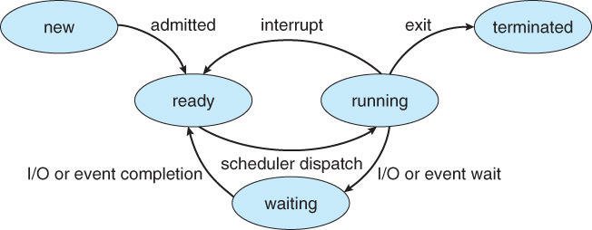
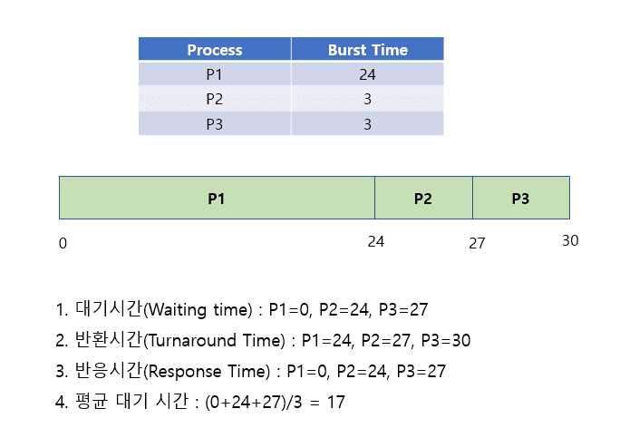
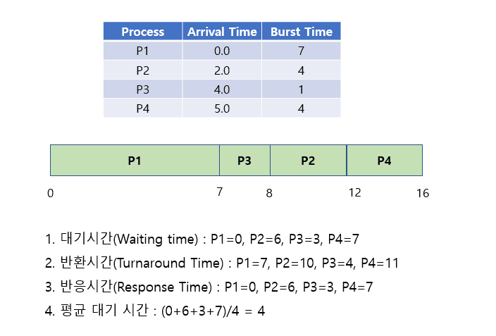
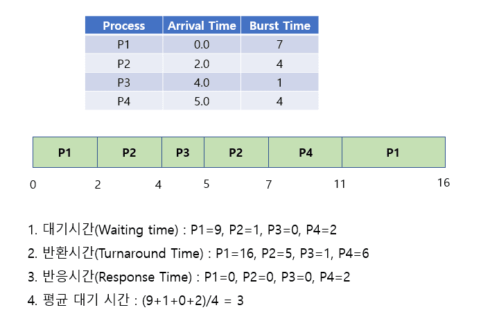
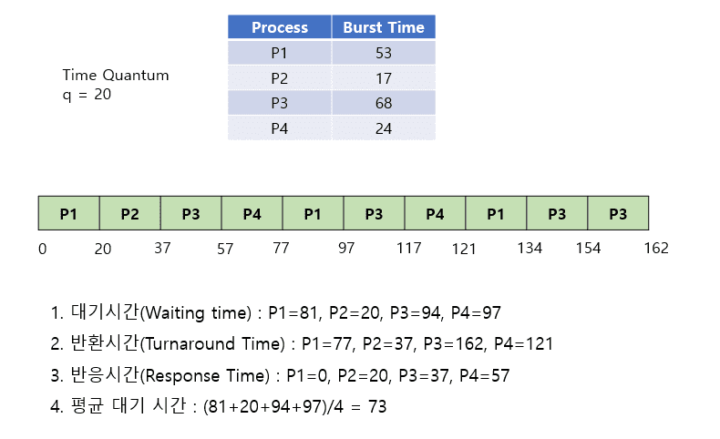
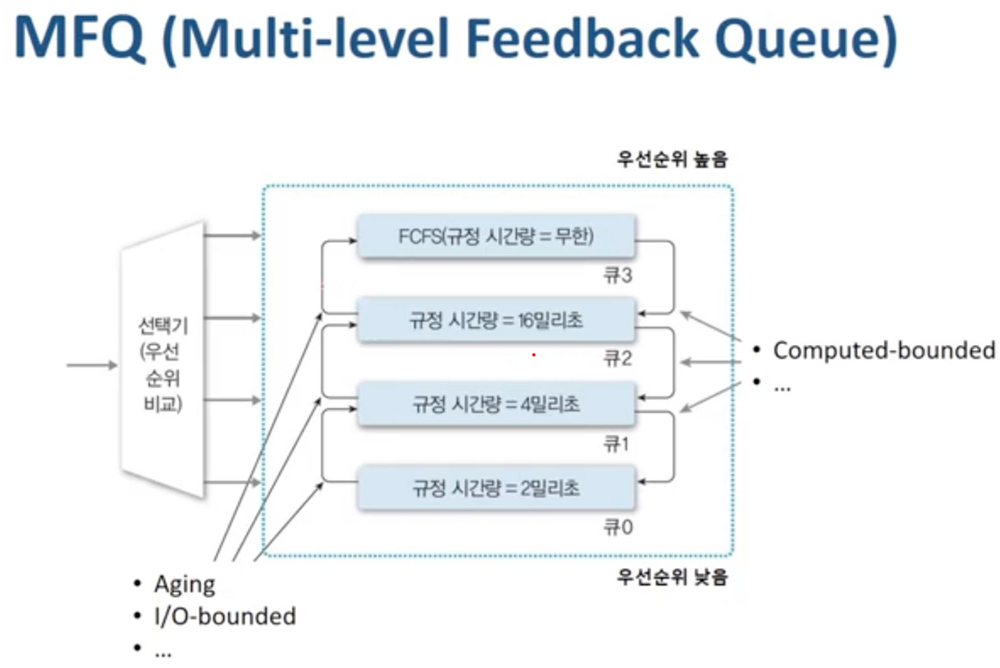

# 스케줄링 알고리즘

### CPU 스케줄링의 개념

**정의**

- CPU를 여러 프로세스가 경쟁할 때, 어떤 프로세스에게 CPU를 언제 할당할지 결정하는 운영체제의 정책

**필요성**

- CPU 자원은 한정적이고 여러 프로세스가 동시에 준비 상태에 있을 수 있기 때문에

**목표**

- **CPU 활용률 (Throughput)** 극대화
- **응답시간 (Response Time)** 최소화
- **대기시간 (Waiting Time)** 최소화
- **공평성 (Fairness)** 유지

## 스케줄링 종류

**선점 vs 비선점**

- **선점 스케줄링 (Preemptive)** - OS가 언제든 CPU를 강제로 회수해 다른 프로세스에 줄 수 있는 방식
  - interrupt : 타이머 인터럽트 등으로 정해진 시간이 지나면 OS가 CPU를 빼앗음.
  - I/O or event completion : 어떤 프로세스가 요청한 I/O 작업이 끝나 다른 프로세스가 Ready 상태가 되면, OS가 즉시 현재 프로세스를 중단하고 새로 Ready된 프로세스에게 CPU를 줄 수 있음.
  - I/O or event wait : 현재 프로세스가 스스로 I/O 요청 등으로 대기 상태로 들어갈 때
  - exit : 현재 프로세스가 실행을 마치고 종료될 때
    → 특징 : CPU를 OS가 적극적으로 선점할 수 있으므로 응답시간 향상·우선순위 제어 가능
- **비선점 스케줄링 (Non-preemptive)** - 실행 중인 프로세스가 스스로 CPU를 놓을 때까지 OS가 강제로 빼앗지 않는 방식
  - I/O or event wait : 프로세스가 입출력 요청 등으로 스스로 대기 상태로 전환될 때
  - exit : 프로세스가 작업을 끝내고 종료할 때
    → 특징 : 한 프로세스가 CPU를 차지하면 자발적으로 포기할 때까지 계속 실행. 구현이 단순하고 컨텍스트 스위칭 오버헤드가 적지만, 짧은 작업이 긴 작업 뒤에서 오래 기다리는 Convoy Effect가 생길 수 있음.

## 주요 스케줄링 알고리즘

1. **FCFS (First Come, First Served)**

   

   - **비선점형**, 준비 큐에 도착한 순서대로 CPU 할당
   - 장점 : 단순·공정
   - 단점 : 긴 작업이 먼저 오면 짧은 작업이 오래 대기 **(Convoy Effect)**

2. **SJF (Shortest Job First)**

   

   - **비선점형**, CPU 버스트(예상 실행 시간)가 가장 짧은 프로세스를 우선 실행
   - 장점 : 평균 대기시간 최소화(이론적으로 최적)
   - 단점 : CPU 버스트 예측 어려움, 긴 작업이 기아(Startvation) 가능

3. **SRTF (Shortest Remaining Time First)**

   

   - **선점형**, SJF의 변형
   - 남은 실행 시간이 더 짧은 새 프로세스가 도착하면 현재 프로세스를 선점
   - 단점 : 컨텍스트 스위칭 오버헤드, 기아 가능

4. **Priority Scheduling**

   

   - **선점/비선점 모두 가능**
   - 우선순위(Priority) 값이 높은 프로세스를 먼저 실행
   - 단점 : 낮은 우선순위 프로세스가 계속 밀려 기아 가능 → Aging 으로 해결

5. **RR (Round Robin)**

   

   - **선점형**, 시분할 시스템에서 사용
   - 고정된 타임 퀀텀(Time Quantum)마다 CPU를 차례로 할당
   - 타임 퀀텀 너무 크면 FCFS와 비슷, 너무 작으면 컨텍스트 스위칭 오버헤드 증가

6. **MLQ (Multi-Level Queue)**

   

   - **선점/비선점 모두 가능**
   - 프로세스를 특성별로 여러 큐로 나누고 각 큐에 다른 알고리즘 적용
   - 큐 간 우선순위 또는 시간 배분 규칙 필요

7. **MLFQ(Multi-Level Feedback Queue)**

   

   - **선점형**
   - MLQ + 큐 간 이동허용
   - CPU 사용량이 많은 프로세스를 낮은 우선순위 큐로 이동 → 대화형 작업에 빠른 응답
   - 가장 복잡하지만 실제 OS에서 많이 사용

   ## 관련 면접 질문

   - 선점형과 비선점형 스케줄링의 차이점은 무엇인가요?
     - 선점형 스케줄링은 OS가 타이머 인터럽트나 우선순위 변화 시 실행 중인 프로세스를 강제로 중단하고 다른 프로세스에 CPU를 할당할 수 있고, 비선점형은 프로세스가 I/O 대기나 종료 등으로 스스로 CPU를 놓을 때까지 계속 실행된다.
   - 기아(Starvation)는 무엇이고 이를 방지하기 위해 어떤 방법을 사용할 수 있나요?
     - 기아는 우선순위가 낮거나 긴 작업이 계속 뒤로 밀려 CPU를 거의 배정받지 못하는 현상이며, 이를 막기 위해 오래 대기한 프로세스의 우선순위를 점차 높여 주는 Aging 기법을 사용한다.
   - SRTF은 무엇이고 장점과 단점은 무엇인가요?
     - SRTF(Shortest Remaining Time First)는 남은 CPU 실행 시간이 가장 짧은 프로세스를 우선 실행하는 SJF의 선점형 버전으로, 평균 대기 시간을 최소화하는 장점이 있지만 CPU 버스트 시간 예측이 어렵고 긴 작업이 기아에 빠질 수 있는 단점이 있다.
   - 현대의 CPU에서 가장 널리 쓰이는 스케줄링 방식은 무엇인가요?
     - 공통된 핵심 아이디어
       - **선점형**: 타이머 인터럽트로 언제든 CPU를 빼앗아 공평성·응답성 확보
       - **우선순위 + 동적 피드백**: 대화형 작업은 즉시 반응하도록 우선순위 상승, CPU 집약적 작업은 낮은 우선순위로 조정
       - **타임슬라이스**: 여러 프로세스가 짧은 시간 간격으로 CPU를 번갈아 사용
     - ex)
       | 운영체제 | 실제 사용 스케줄러 | 특징 |
       | --------------------- | -------------------------------------------------------- | -------------------------------------------------------------------------------------------------------- |
       | **Linux (2.6 이후)** | **CFS (Completely Fair Scheduler)** | 선점형. 각 프로세스를 “가상 런타임”으로 공평하게 배분. 일종의 **가상화된 Round Robin + 우선순위 가중치** |
       | **Windows (NT 계열)** | **Multilevel Feedback Queue 기반** | 우선순위 0~31 레벨, 동적 우선순위 조정(Aging). 타임슬라이스 단위로 선점 |
       | **macOS / iOS** | XNU 커널 → CFS와 유사한 **우선순위+타임슬라이스 선점형** | |
       | **Android** | 리눅스 CFS 기반 | 모바일 특화 파라미터 튜닝 |
