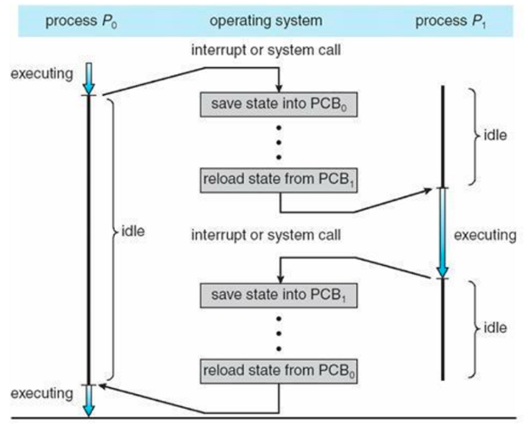

# 문맥 교환

### 문맥 교환(Context Switch)이란

- **의미**
  - CPU가 현재 실행 중인 프로세스의 상태(문맥)을 저장하고, 다음에 실행할 프로세스의 상태를 복원하여 CPU 제어를 넘기는 작업
- 운영체제가 프로세스를 선점하거나, I/O 대기·이벤트 완료 등으로 CPU를 다른 프로세스에게 할당할 때 반드시 발생

### 문맥(Context)의 구성

문맥이란 **프로세스를 다시 이어서 실행하기 위해 필요한 모든 정보**를 말한다.

- CPU 레지스터 값 (PC, SP, 범용 레지스터 등)
- 프로그램 카운터 (PC) - 다음에 실행할 명령어 주소
- 프로세스 상태(PCB에 저장) - Ready/Wait 등
- 메모리 관리 정보 - 페이지 테이블 포인터 등

이 정보들은 PCB(Process Control Block)에 저장되었다가 재실행 시 복원된다.

### 문맥 교환의 단계

1. 현재 프로세스의 레지스터 값, 프로그램 카운터 등을 PCB에 저장
2. 스케줄러가 다음 실행할 프로세스 선정
3. 선택된 프로세스의 PCB에서 레지스터 값과 프로그램 카운터 복원
4. CPU가 새로운 프로세스의 명령어 실행 재개

### 비용(오버헤드)

- 문맥 교환 자체는 유용한 계산을 하지 않음 → CPU 자원 낭비
- 레지스터 저장/복원, 캐시 무효화, TLB flush 등으로 시간 소요
- 스케줄링을 너무 자주 하면 오히려 전체 성능이 떨어질 수 있음.

## 관련 면접 질문

- 문맥 교환이 필요한 상황은 언제인가요?
  - 선점형 스케줄링에서 타이머 인터럽트, I/O 완료로 우선순위 높은 프로세스가 Ready 상태가 될 때 등
- 문맥 교환 비용을 줄이는 방법에는 어떤 것이 있나요?
  - 타임 퀀텀 조정, 선점 빈도 관리, 스레드 사용(스레드 전환은 주소공간 공유로 비용 낮음)
