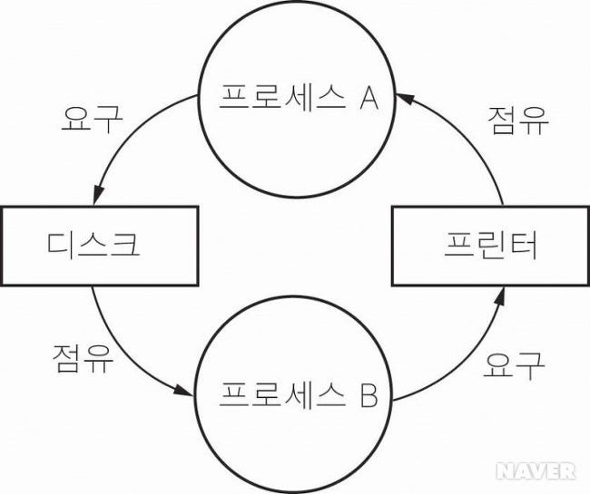

# 교착 상태

### 교착상태(Deadlock)란

**정의**

- 두 개 이상의 프로세스가 서로가 가진 자원을 기다리며 **무한 대기** 하는 상태

**예시**

- 프로세스 A는 자원1을, 프로세스 B는 자원2를 점유한 채 서로 상대방의 자원을 요구하며 기다리는 상황
  

### 발생 조건(Coffman의 4가지 필요조건)

교착상태가 발생하려면 **네 가지가 모두 동시에 만족**해야한다.

1. **상호 배제 (Mutual Exclusion)**
   - 한 번에 한 프로세스만 특정 자원을 사용할 수 있음.
2. **점유 대기 (Hold and Wait)**
   - 최소 한 자원을 보유한 프로세스가 다른 자원을 추가로 요청하며 대기
3. **비선점 (No Preemption)**
   - 이미 할당된 자원을 강제로 회수할 수 없음
4. **환형 대기 (Circular Wait)**
   - 자원을 기다리는 프로세스들이 원형으로 서로의 자원을 기다림

### 대처 전략

교착상태에 대한 운영체제의 접근 방법은 크게 네 가지

1. **예방 (Prevention)**
   - 4가지 조건 중 하나 이상을 원천적으로 깨뜨려 교착상태가 일어나지 않게 함.
   - ex) 자원 할당 순서 지정(환형 대기 차단), 자원 요청 시 모두 한 번에 할당(점유 대기 차단)
   - 장점
     - 확실히 예방 가능
   - 단점
     - 자원 활용률 저하
2. **회피 (Avoidance)**
   - 교착상태가 될 위험이 있는 자원 할당(Unsafe Allocation)을 미리 차단
   - 대표적 알고리즘 : 은행가 알고리즘(Banker’s Algorithm), 자원 할당 그래프 알고리즘(Resource-Allocation Graph Algorithm)
   - 장점
     - 자원 활용률 유지
   - 단점
     - 프로세스의 최대 자원 요구량을 사전에 알아야 함.
3. **탐지 (Detection) & 복구(Recovery)**
   - 교착상태가 발생한 뒤 주기적으로 검사 후 해결
   - 복구 방법 : 프로세스 강제 종료, 일부 자원 회수
   - 장점
     - 자원 활용률 높음
   - 단점
     - 탐지·복구 오버헤드
4. **무시 (Ignore)**
   - 교착상태가 드물게 발생하면 아무 처리 없이 방지
   - 실제 많은 범용 OS는 이 방식을 사용, 교착상태는 사용자가 수동 해결

## 관련 면접 질문

- 교착상태가 발생하기 위한 조건은 무엇인가요?
  - **상호 배제, 점유 대기, 비선점, 환형 대기** 네 가지가 동시에 만족해야 한다.
- 교착상태 해결 방법에는 무엇이 있나요?
  - **예방**, **회피(은행가 알고리즘)**, **탐지 후 복구**, **무시** 네 가지 전략이 있다.
- 은행가 알고리즘의 기본 아이디어는?
  - 프로세스가 최대 자원 요구량을 미리 알려주면, 시스템이 **안전 상태(Safe State)** 를 유지하도록만 자원을 할당해 교착 상태를 회피한다.
