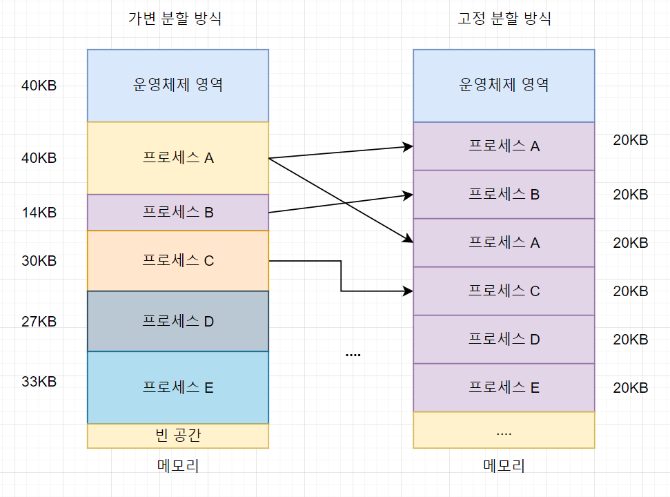
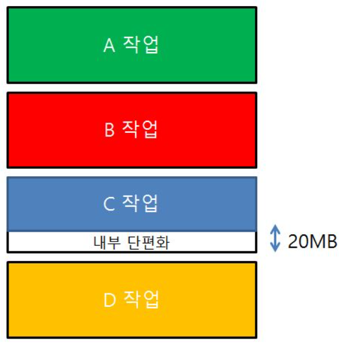
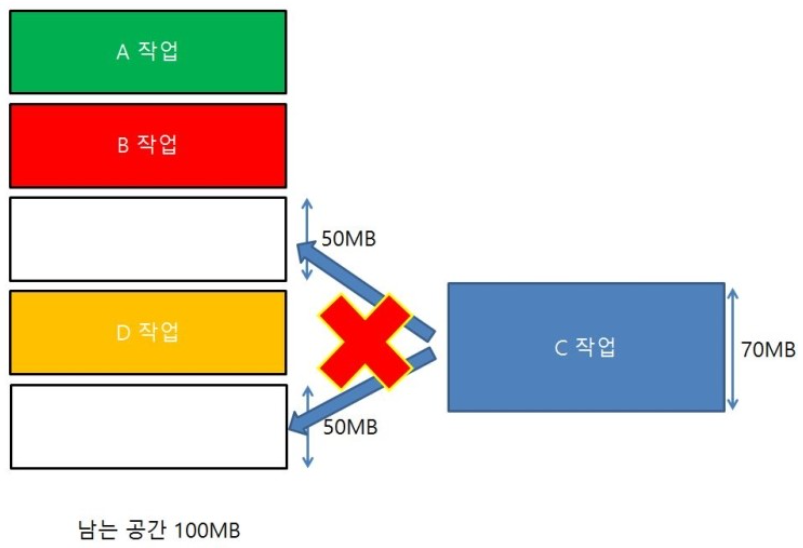

# 메모리 관리

### 메모리 관리의 개념

**정의**

- 운영체제가 프로세스에 메모리를 효율적으로 할당·회수·보호하는 기능

**목적**

- CPU가 필요한 데이터를 빠르게 접근할 수 있게 함
- 프로세스 간 메모리 보호 및 안정성 확보
- 메모리 낭비 최소화(단편화 문제 해결)

### 메모리 할당(Memory Allocation) 기법

1. 연속 메모리 할당

   

   - 고정 분할(Fixed Partitioning) : 메모리를 미리 일정 크기로 나눠 프로세스 할당
     
     - 단점 : **내부 단편화**(Partition보다 작은 프로세스 → 남는 공간)
   - 가변 분할(Variable Partitioning) : 프로세스 크기에 맞게 동적 할당
     
     - 단점 : **외부 단편화**(프로세스가 종료돼 흩어진 빈 공간)

   → 내부 단편화 해결 : 페이지(블록) 크기를 줄여 낭비되는 공간을 최소화하거나, 필요 시 세그멘테이션처럼 가변 크기 할당 방식을 사용해 프로세스 크기에 맞게 메모리를 줘서 낭비를 줄임.

   → 외부 단편화 해결 : **압축(Compaction)** 으로 빈 공간을 모아 연속 영역 확보

2. 불연속 메모리 할당
   - **페이징(Paging)** : 메모리를 같은 크기 페이지 단위로 나누고, 프로세스도 페이지 단위로 저장
     - 장점 : 외부 단편화 제거, 관리 단순
     - 단점 : 마지막 페이지가 꽉 차지 않으면 내부 단편화 발생
   - **세그멘테이션(Segmentation)** : 프로그램을 논리적 단위(코드, 데이터 등)로 가변 크기 세그먼트로 나눔.
     - 장점 : 논리적 구조 반영, 공유·보호 용이
     - 단점 : 외부 단편화 가능

### 가상 메모리 (Virtual Memory)

- 개념 : 실제 물리 메모리보다 큰 논리적 메모리 공간을 제공, 자주 쓰는 페이지만 메모리에 올려 실행
- 장점 : 메모리 부족 시에도 대형 프로그램 실행 가능, 다중 프로세스 동시 실행
- 구현 : Demand Paging - 필요한 페이지가 없으면 Page Fault 발생 → 디스크에서 메모리로 로드

### 페이지 교체 알고리즘

- FIFO : 가장 먼저 들어온 페이지 교체
- LRU(Least Recently Used) : 가장 오래 사용하지 않은 페이지 교체
- Optimal : 앞으로 가장 오래 사용하지 않을 페이지 교체(이론적 최적)
- Clock(Second Chance) : FIFO 변형, 최근 사용 여부 비트로 교체 여부 판단

## 관련 면접 질문

- 페이징과 세그멘테이션 차이는 무엇인가요?
  - 페이징은 **고정 크기 페이지**, 세그멘테이션은 **가변 크기 세그먼트**로 메모리를 나눈다.
- 가상 메모리의 장점은 무엇인가요?
  - 실제 물리 메모리보다 큰 논리적 주소 공간을 제공해 **대형 프로그램 실행**과 **다중 프로세스 동시 실행**이 가능하다.
- 페이지 교체 알고리즘 중 LRU의 특징은 무엇인가요?
  - 가장 오랫동안 사용하지 않은 페이지를 교체, 실제 워크로드에 근접한 성능을 보여 널리 쓰인다.
