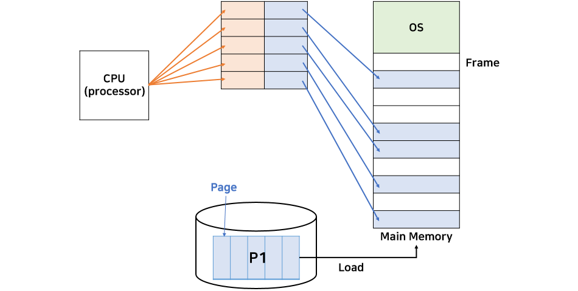
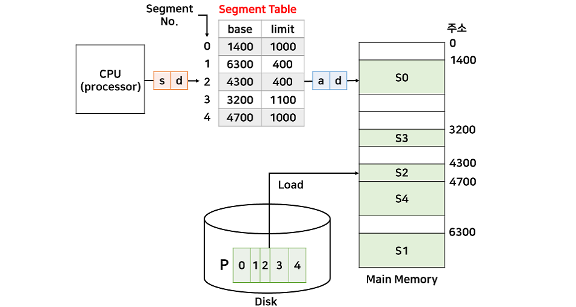

# 페이징 & 세그멘테이션

### 페이징 (Paging)

---

**개념**

- 가상 메모리 공간을 고정 크기의 **페이지(Page)** 로 나누고,
- 물리 메모리도 같은 크기의 **프레임(Frame)** 으로 나눈 뒤,
- 페이지 → 프레임 단위로 **매핑**

**특징**

- 고정 크기 (ex: 4KB)
- 프로그램 전체가 연속된 물리 주소에 있을 필요가 없음 → **외부 단편화(External Fragmentation)** 없음.
- 하지만 마지막 페이지가 프레임보다 작으면 **내부 단편화(Internal Fragmentation)** 발생 가능

**구조**

- 페이지 테이블 : 각 가상 페이지가 물리 프레임의 어디에 있는지 저장
- CPU가 논리 주소를 참조하면
  - 상위 비트 : 페이지 번호(Page Number) → 페이지 테이블 참조
  - 하위 비트 : 페이지 오프셋(Page Offset) → 프레임 내 위치

**장·단점**

- 장점 : 외부 단편화 해소, 메모리 관리 단순
- 단점 : 페이지 테이블 관리 비용(메모리/시간) 증가 → **TLB(Translation Lookaside Buffer)** 로 성능 보완

### 세그멘테이션 (Segmentation)

---

**개념**

- 논리적 단위(코드, 데이터, 스택 등) 를 가변 크기 세그먼트(Segment)로 나눔.
- 각 세그먼트는 크기가 서로 다름

**특징**

- 가변 크기 : 프로그램 구조와 일치 (ex : 함수, 배열 단위)
- 세그먼트 테이블
  - 세그먼트 번호 → (Base, Limit)
  - Base : 세그먼트의 물리 메모리 시작 주소
  - Limit : 세그먼트 길이

**장·단점**

- 장점 : 프로그램 논리적 구조 반영 → 보호와 공유가 용이
- 단점 : 외부 단편화 발생 가능, 세그먼트 크기 관리 복잡

### 혼합 방식

- 페이징 + 세그멘테이션 : 현대 OS가 주로 채택
  - 세그먼트를 다시 페이지 단위로 쪼개, 세그먼트의 논리적 구조 + 페이지의 물리적 관리 장점을 결합

## 관련 면접 질문

- 페이징의 장단점은 무엇인가요?
  - 외부 단편화를 없앨 수 있지만, 페이지 테이블 관리 비용과 내부 단편화가 생길 수 있다.
- 세그멘테이션의 장단점은 무엇인가요?
  - 프로그램의 논리적 단위를 반영하고 보호·공유가 쉬우나 외부 단편화가 발생한다.
