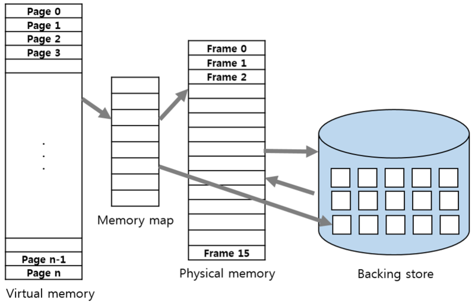
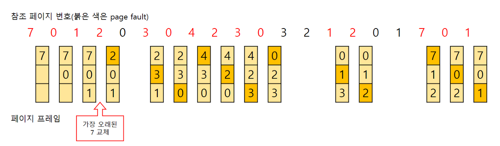
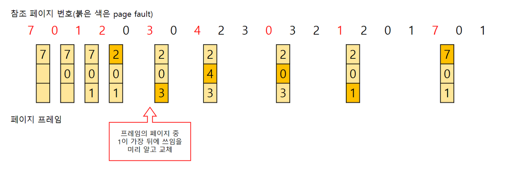
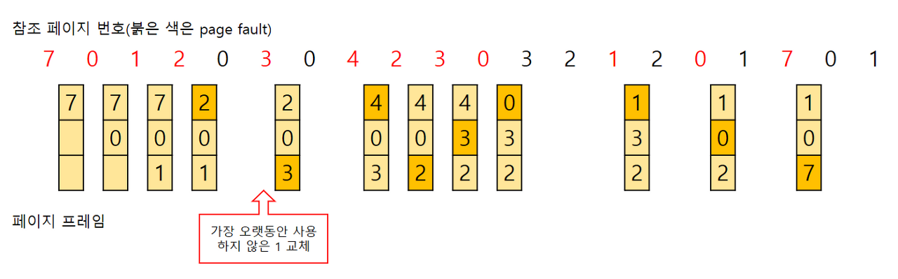
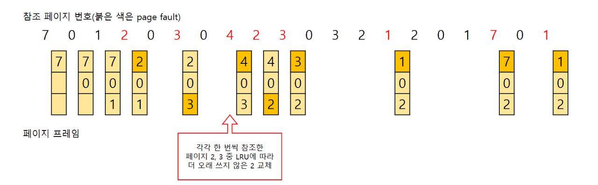
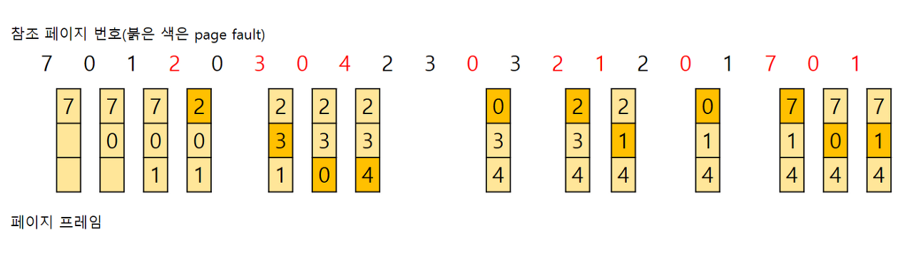

# 가상 메모리 & 페이지 교체

### 가상 메모리 (Virtual Memory)

---

**개념**

- 프로세스가 실제 물리 메모리보다 큰 주소 공간을 사용할 수 있게 운영체제가 제공하는 **추상화된 메모리 공간**
- 프로그램 전체를 한꺼번에 메모리에 올리지 않고, 실제 필요한 **일부 페이지만 물리 메모리에 적재**하여 실행

**동작 원리**

1. 가상 주소 → 물리 주소 변환 : MMU(Memory Management Unit) + 페이지 테이블
2. 필요한 페이지가 메모리에 없으면 Page Fault 발생
3. 운영체제가 디스크(보조기억장치)에서 해당 페이지를 메모리로 Swap In

**장점**

- 물리 메모리보다 큰 프로그램 실행 가능(메모리 확장 효과)
- 프로세스 간 메모리 보호 및 독립성 보장
- 프로그램 간 메모리 공유도 가능(공유 라이브러리 등)

### 페이지 교체 (Page Replacement)

---

**필요성**

- 물리 메모리(프레임) 수가 제한적
- Page Fault 시, 메모리에 여유 프레임이 없으면 기존 페이지를 디스크로 내보내고, 새 페이지를 올려야 함.
  → 어떤 페이지를 내보낼지 결정하는 알고리즘 필요

**페이지 교체 알고리즘**

1. **FIFO**

   

   - 가장 먼저 메모리에 들어온 페이지를 교체
   - 장점 : 구현 단순, 이해하기 쉬움
   - 단점 : 오래된 페이지가 자주 사용될 수 있음 → Belady’s anomaly 가능

2. **Optimal(Optimal Page Replacement, 최적 페이지 교체)**

   

   - 앞으로 가장 오랫동안 사용되지 않을 페이지를 교체
   - 장점 : Page Fault 최소
   - 단점 : 구현 불가, 미래 예측 필요 → 이론적 기준

3. **LRU(Least Recently Used)**

   

   - 가장 오랫동안 참조되지 않은 페이지를 교체
   - 실제로 많이 사용되는 알고리즘

4. **LFU(Least Frequently Used)**

   

   - 참조 횟수가 가장 적은 페이지를 교체, 활발하게 사용되는 페이지는 참조 횟수가 많아질거라는 가정에서 만들어짐.
   - 단점 : 구현이 복잡해 잘 쓰이지 않음

5. **MFU(Most Frequently Used)**

   

   - 가장 많이 사용된 페이지를 교체
   - 가장 적게 사용된 페이지가 최근에 올라오고 계속 사용될 것이라는 가정에서 만들어짐.
   - 단점 : 구현에 상당한 비용이 든다.

6. **Clock(Second Chance)**
   - FIFO + 참조 비트(Reference bit)로 2차 기회 부여
   - LRU 근사 + 구현 효율적

**Page Fault 발생 흐름**

1. CPU가 가상 주소 참조
2. MMU가 페이지 테이블 확인 → 페이지가 메모리에 없으면 Page Fault 인터럽트
3. OS가 빈 프레임이 있으면 페이지를 디스크에서 로드
4. 빈 프레임이 없으면 페이지 교체 알고리즘으로 희생 페이지 선정
5. 새 페이지를 로드하고 페이지 테이블 갱신

## 관련 면접 질문

- 가상 메모리의 장점은 무엇인가요?
  - 물리 메모리보다 큰 프로그램 실행 가능, 프로세스 간 메모리 보호, 메모리 공유 용이.
- LRU와 FIFO의 차이점은 무엇인가요?
  - FIFO는 단순히 오래된 페이지를 교체, LRU는 최근에 가장 오래 안 쓰인 페이지를 교체해 실제 성능이 더 좋다.
- Belady’s anomaly란 무엇인가요?
  - FIFO에서 프레임 수를 늘려도 오히려 Page Fault가 증가하는 현상.
