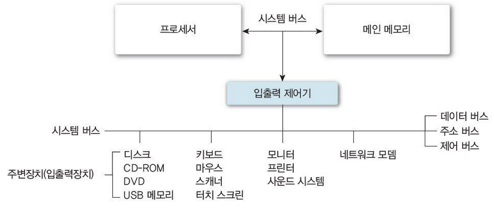
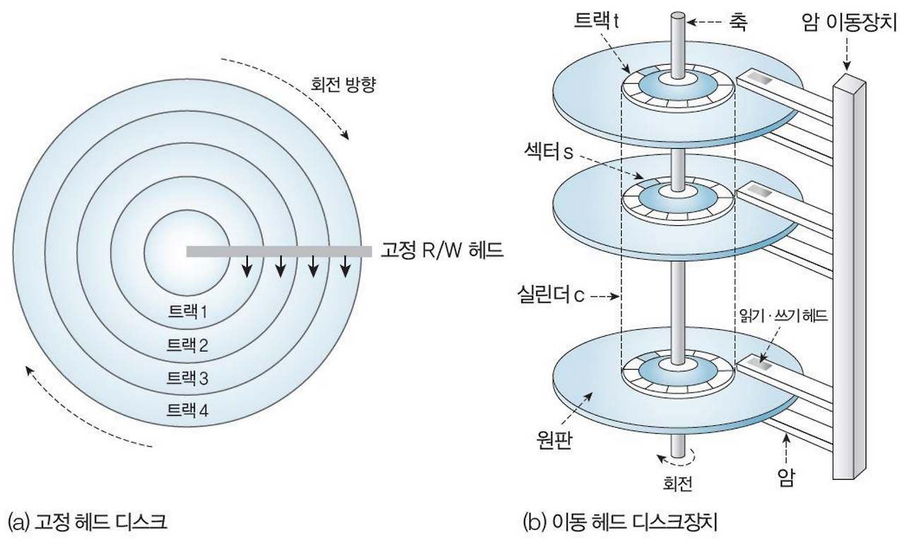

# 입출력 시스템 & 디스크 스케줄링

### 입출력 시스템 (I/O System)

---

**개념**

- CPU와 입출력 장치 사이에서 데이터를 전송·관리하는 체계
- 운영체제는 속도가 느리고 동작 방식이 다양한 장치들을 표준화된 인터페이스로 묶어 관리

**입출력 모듈과 제어기**

- 입출력 장치 : 모니터, 프린터, 키보드 등 실제 입출력 수행
- 입출력 모듈 : CPU ↔ 메모리 ↔ 입출력 장치 간 데이터 전송 지원
- 입출력 제어기(장치제어기) : 프로세서 대신 장치 제어 담당
- 입출력 프로세서/채널 : 프로세서로부터 독립적으로 복잡한 I/O 제어 수행

**입출력 수행 방식**

1. **프로그램 제어 I/O(폴링)**
   - CPU가 장치 상태를 주기적으로 점검 후 전송
   - 단순하지만 CPU 낭비 큼 → 키보드 같은 저속 장치에 적합
2. **인터럽트 기반 I/O**
   - 장치가 준비되면 CPU에 인터럽트 발생
   - CPU가 다른 작업을 하면서도 I/O 가능 → 효율적, 불규칙적 이벤트 처리 적합
3. **DMA(Direct Memory Access)**
   - 장치가 메모리에 직접 접근하여 블록 단위 전송
   - CPU는 요청과 종료만 관여 → 대용량 전송에 적합

### 디스크 구조

---

**보조기억장치 특징**

- 메인 메모리의 용량/휘발성 한계 보완
- 자기 디스크(HDD)는 대표적 장치 : 원판에 데이터 기록, 헤드로 읽기/쓰기

**디스크 구성요소**

- **트랙(Track)** : 원판의 동심원
- **섹터(Sector)** : 디스크 입출력 최소 단위 (수백 ~ 수천 Byte)
- **실린더(Cylinder)** : 동일 반경에 있는 모든 트랙 집합
- **헤드** : 트랙 위의 섹터 읽기/쓰기 담당

**디스크 엑세스 시간**

- **탐색 시간(Seek Time)** : 헤드를 목표 트랙으로 이동시키는 시간
- **회전 지연(Rotational Latency)** : 섹터가 헤드 아래로 올 때까지 회전 대기 시간
- **전송 시간(Transmission Time)** : 실제 데이터 전송 시간

### 디스크 스케줄링 (Disk Scheduling)

---

**개념**

- 여러 디스크 요청이 대기할 때, 요청 순서를 최적화해 **헤드 이동·회전 지연**을 최소화하는 알고리즘

**평가 기준**

- 처리량(Throughput) ↑, 평균 반응 시간(Response Time) ↓, 기아 방지, 응답 시간의 변동 최소화

**주요 알고리즘**

1. **FCFS(First Come First Served: 선입 선처리)**
   - 도착 순서대로 처리 → 공정하지만 이동 거리↑
2. **SSTF(Shortest Seek Time First: 최소 탐색 시간 우선)**
   - 가장 가까운 요청 우선 처리 → 평균 탐색시간↓, 기아 발생 가능
3. **SCAN (엘리베이터 알고리즘)**
   - 헤드가 한쪽 끝까지 이동하며 처리 후 반대 방향 이동 → 대기 편차 완화
4. **C-SCAN(Circular SCAN)**
   - 한 방향으로만 처리, 끝에 도달하면 처음으로 점프 → 응답 시간 균일
5. **LOOK / C-LOOK**
   - 실제 요청이 있는 지점까지만 이동 → 불필요한 끝단 이동 제거

**추가 변형**

- **F-SCAN / N-Step SCAN**: 요청 묶음을 나누어 기아 방지
- **SLTF (Shortest Latency Time First)**: 회전 지연 최소화
- **SPTF (Shortest Positioning Time First)**: 탐색+회전 지연 합산 최적화

### RAID (Redundant Array of Independent Disks)

---

**개념**

- 여러 디스크를 묶어 **논리적 단일 디스크**처럼 사용
- 목적: **성능 향상(병렬 처리)** + **가용성 향상(데이터 중복/복구)**

**대표 레벨**

- **RAID 0 (스트라이핑)**: 분산 저장, 빠르지만 내결함성 없음
- **RAID 1 (미러링)**: 중복 저장, 안정성↑, 공간 효율↓
- **RAID 5**: 데이터+패리티 분산 저장, 성능+안정성 균형
- **RAID 0+1**: 스트라이핑+미러링 혼합, 속도+복구 모두 지원

## 관련 면접 질문

- 디스크 액세스 시간은 어떤 요소들로 구성되나요?
  - **탐색 시간(헤드 이동)**, **회전 지연 시간(섹터 도착 대기)**, **전송 시간(데이터 읽기/쓰기)**
- RAID 0, 1, 5의 특징과 차이점을 설명해보세요.
  - RAID 0은 스트라이핑으로 성능↑, 하지만 내결함성 없음,
    RAID 1은 미러링으로 안정성↑, 하지만 저장 공간 절반 소모,
    RAID 5는 패리티를 분산 저장해 성능과 안정성을 균형 있게 제공
