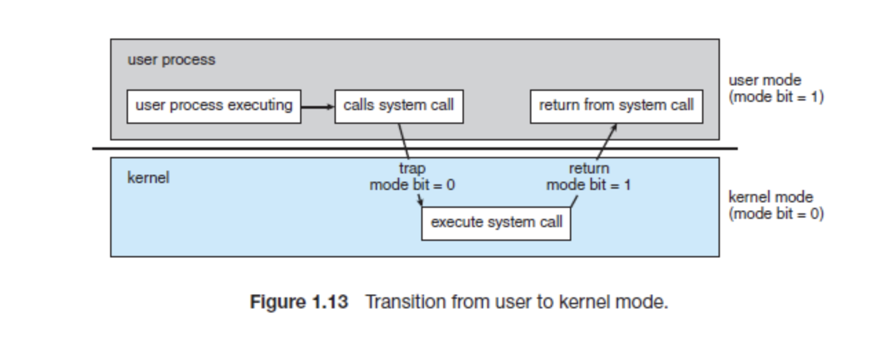
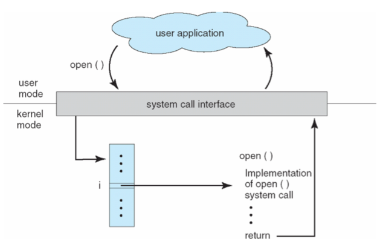

# 시스템 콜 & OS 구조

### 유저 모드(User Mode) & 커널 모드(Kernel Mode)

---

**개념**

- 현대 CPU는 **모드 비트(mode bit)** 를 두어, 현재 실행 중인 코드가 사용자 프로그램인지 운영체제 커널인지 구분한다.
- 이를 통해 **보호된 자원(메모리, I/O 장치, 특권 명령 등)** 을 일반 응용 프로그램이 직접 다루지 못하게 하고, 시스템 안정성과 보안을 보장한다.

**유저 모드(User Mode)**

- 응용 프로그램이 실행되는 모드
- 일반 명령(산술, 논리, 메모리 접근 등)만 수행 가능
- I/O, 메모리 보호, 프로세스 제어 같은 **특권 명령은 수행 불가**
- 보호된 자원이 필요할 때는 반드시 **시스템 콜을 통해 커널에 요청**해야 함

**커널 모드(Kernel Mode)**

- 운영체제 커널 코드가 실행되는 모드
- 모든 명령 실행 가능, 하드웨어 자원과 특권 명령 접근 가능
- CPU가 인터럽트 처리, 메모리 관리, I/O 제어를 수행할 때 커널 모드로 전환됨
- 잘못된 명령 수행 시 시스템 전체에 영향을 줄 수 있으므로 접근 제한 필요

## 시스템 콜 (System Call)

---

**개념**

- 운영체제 커널이 제공하는 기능(파일 I/O, 프로세스 관리, 메모리 제어 등)을 응용 프로그램이 요청하기 위한 인터페이스
- 사용자 모드에서 커널 모드로 전환하여 **특권 명령(privileged instruction)** 을 대신 실행

**동작 방식**

- 각 시스템 콜은 번호와 핸들러 주소가 테이블에 등록되어 있음
- 프로그램이 호출 → 시스템 콜 인터페이스가 trap 발생 → 커널이 해당 루틴 실행 후 결과 반환
- 매개변수 전달 방법 : 레지스터, 메모리 주소 전달, 스택 이용

**예시**

- `open()`, `read()`, `write()`, `close()` 같은 파일 제어
- `fork()`, `exec()`, `wait()` 같은 프로세스 제어

**유형**

1. 프로세스 제어 : 생성, 종료, 메모리 로드/실행 (ex. fork, exec)
2. 파일 관리 : 생성, 열기, 읽기/쓰기 (ex. open, read, write)
3. 장치 관리 : 디바이스 요청/해제, 읽기/쓰기
4. 정보 관리 : 시간, 속성 값 확인 및 변경
5. 통신 : 메시지 송수신, 연결 설정/해제
6. 보안 : 접근 권한 확인, 설정

**필요성**

- 응용 프로그램은 하드웨어 자원에 직접 접근할 수 없음 → 보안/안정성 확보
- 커널만 특권 명령 실행 가능, 사용자 모드에서 요청 시 trap 발생

## 관련 면접 질문

- 시스템 콜이란 무엇이며 왜 필요한가요?
  - 시스템 콜은 응용 프로그램이 커널 기능을 요청하는 인터페이스, 자원 보호와 안정적 접근을 위해 필요
- 유저 모드와 커널 모드의 차이는 무엇인가요?
  - 유저 모드는 제한된 명령만 수행 가능, 커널 모드는 모든 자원 접근과 특권 명령 실행이 가능
