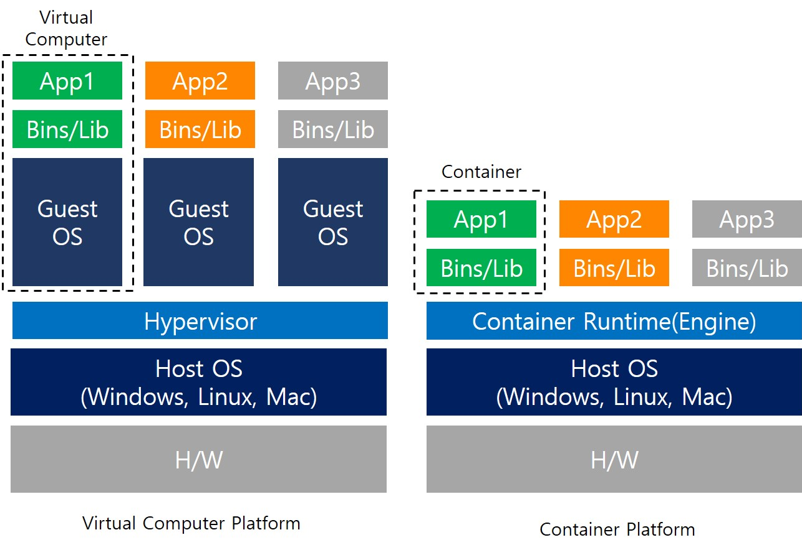

# IPC & 가상화/보안

### IPC (Inter-Process Communication, 프로세스 간 통신)

---

**1) 파이프 (Pipe)**

- 가장 단순한 IPC 방법으로, 한 프로세스의 출력이 다른 프로세스의 입력이 됨.
- 기본적으로 **단방향 통신**만 지원.
- 주로 **부모-자식 프로세스 간 통신**에 사용되며, 쉘에서 `ls | grep txt` 같은 파이프라인이 대표적 예시.
- 확장: **FIFO(named pipe)**는 이름을 가진 특별한 파일을 통해 **서로 무관한 프로세스** 간에도 통신 가능.

```c
// Anonymous Pipe
pipe(), dup2(), close()
// Named Pipe(FIFO)
mkfifo(), open(), read(), write()
```

---

**2) 메시지 큐 (Message Queue)**

- 운영체제가 메시지를 큐 형태로 관리하며 프로세스들이 메시지를 송수신.
- 파이프보다 유연하며, **비동기 통신**이 가능(보내는 프로세스가 받는 프로세스를 기다릴 필요 없음).
- 메시지에 **우선순위(priority)**를 부여할 수 있어 특정 순서로 처리 가능.
- 단점: 커널 공간의 큐 크기에 제한이 있어 대용량 데이터에는 부적합.

```c
// System V
msgget(), msgsnd(), msgrcv(), msgctl()
// POSIX
mq_open(), mq_send(), mq_receive()
```

---

**3) 공유 메모리 (Shared Memory)**

- 여러 프로세스가 **동일한 물리 메모리 영역**을 매핑해서 사용.
- 커널이 개입할 필요 없이 프로세스 간 데이터를 직접 읽고 쓰므로 **가장 빠른 IPC 방법**.
- 단점: 동시에 접근하면 데이터 충돌이 발생할 수 있음 → **세마포어/뮤텍스 같은 동기화 기법 필요**.
- 예: 데이터베이스 캐시, 고속 IPC 구현.

```c
// System V
shmget(), shmat(), shmdt(), shmctl()
// POSIX
mq_open(), mq_send(), mq_receive()
```

---

**4) 세마포어 (Semaphore) & 뮤텍스 (Mutex)**

- **데이터 교환 자체보다는 동기화와 상호 배제**를 위한 기법.
- **세마포어**: 정수 값을 통해 자원 사용 가능 여부를 제어 (공유 자원 접근 개수 제한 가능).
- **뮤텍스**: 이진 세마포어로, 오직 하나의 프로세스만 임계 구역에 진입할 수 있도록 보장.
- 주로 **공유 메모리와 함께** 사용되어 데이터 일관성을 보장.

```c
// System V
semget(), semop(), semctl()
// POSIX
sem_init(), sem_wait(), sem_post()
```

---

**5) 소켓 (Socket)**

- 원래 네트워크 통신을 위해 설계되었으나, 로컬 프로세스 간 통신에도 사용 가능.
- 프로세스 간에 **네트워크 API(TCP/UDP)** 를 통해 데이터를 송수신.
- 장점: **로컬/원격 모두 지원** → 분산 시스템에 적합.
- 단점: 다른 IPC보다 오버헤드가 크고 속도가 느림.
- 예: 클라이언트-서버 모델 (웹 서버, DB 서버).

```c
socket(), bind(), listen(), accept(), connect(), send(), recv()
```

### 가상화 & 보안

---

**가상화 (Virtualization)**



- 운영체제/하드웨어 자원을 **추상화**하여 다수의 독립 환경을 제공하는 기술
- 종류
  1. **호스트 OS 가상화**
     - 호스트 OS 위에 Virtual Machine Monitor(VMM)을 설치해 Guest OS를 동작시키는 것
     - 장점
       - 완전한 운영체제 환경을 제공 → **높은 호환성**
       - 일반 PC 환경에서도 쉽게 사용 가능
     - 단점
       - 하드웨어 접근이 호스트 OS를 경유 → **성능 손실** 발생
       - 시스템 자원 사용량이 큼
     - ex) WMware Workstation, MS Virtual PC, VirtualBosx
  2. **하이퍼바이저 가상화**
     - 호스트 OS 없이 VMM을 직접 H/W에 동작시키는 방식
     - 유형
       - **전가상화(Full Virtualization)** – 하드웨어를 완전히 가상화하여 게스트 OS 수정 불필요
       - **반가상화(Para Virtualization)** – 게스트 OS 일부 수정 → 하이퍼바이저와 직접 통신
     - 장점
       - 호스트 OS 단계 제거 → **오버헤드 적음**, **리소스 효율적**
       - 대규모 서버/클라우드 환경에 적합
     - 단점
       - 자체 관리 기능이 부족 → 별도의 **관리 콘솔/서버** 필요
     - ex) Citrix XenServer, MS hyper-V, KVM
  3. **컨테이너 가상화**
     - SW를 가상화여 프로세스간 격리 구조
     - 장점
       - 게스트 OS 불필요 → **가볍고 부팅 빠름**
       - 환경 일관성 보장 → 어디서든 동일하게 실행 가능
       - **복제/배포 용이**, 클라우드·DevOps 환경에 적합
     - 단점
       - 커널 공유로 인해 **완전한 격리 어려움**
       - OS 커널에 의존적 → 특정 OS에서만 실행 가능
     - ex) Docker, Kubernetes, OpenShift

**보안 (Security)**

- 운영체제는 사용자와 프로세스를 격리하고 자원 접근을 제어하여 보안을 보장
- 주요 기법
  1. **접근 제어 (Access Control)**
     - 사용자별 접근 권한을 제한하여 자원 보호 (`rwx`, ACL, 사용자 그룹 권한 등).
     - _예:_ 리눅스의 `chmod`, `chown`, 윈도우의 NTFS ACL.
  2. **격리 (Isolation)**
     - 프로세스·가상머신·컨테이너 간 메모리와 파일 시스템을 분리하여 침입 확산 방지.
     - _예:_ VM 간 격리, Docker namespace, chroot jail.
  3. **암호화 (Encryption)**
     - 저장 데이터와 통신 데이터에 암호화를 적용하여 정보 유출 방지.
     - _예:_ 파일 암호화(EFS), 네트워크 암호화(TLS/SSL).
  4. **감사 / 로그 (Auditing & Logging)**
     - 시스템 활동을 기록하고 분석해 **이상 행위 탐지** 및 **사후 추적** 가능.
     - _예:_ Linux `auditd`, Windows Event Log.

## 관련 면접 질문

- IPC의 대표적인 방식에는 어떤 것들이 있나요?
  - 파이프, 메시지 큐, 공유 메모리, 소켓, 세마포어 등이 있으며 목적에 따라 선택됨.
- 가상화와 컨테이너의 차이는 무엇인가요?
  - 가상화는 하이퍼바이저 위에 독립된 OS를 실행, 컨테이너는 커널을 공유하며 가볍게 격리된 환경을 제공
