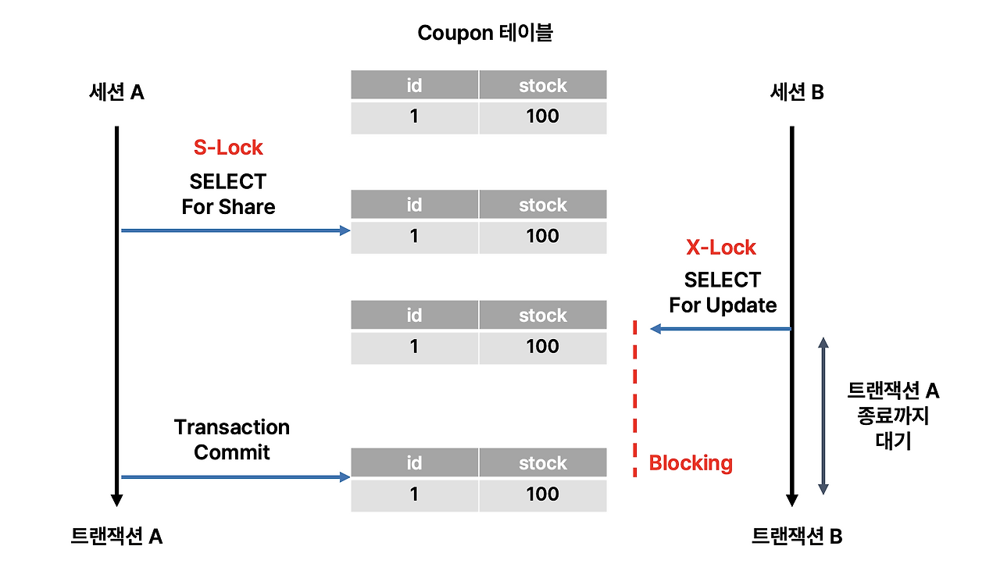

# 🧱 DB Lock & 동시성 제어 (Concurrency Control)

> 데이터베이스는 **여러 트랜잭션이 동시에 실행될 때**
> 데이터의 정합성을 보장하기 위해 **Lock(잠금)** 과 **Concurrency Control(동시성 제어)** 기법을 사용합니다.

---

## 📘 1️⃣ 왜 동시성 제어가 필요한가?

### ✅ 목표

* 여러 사용자가 동시에 DB를 사용할 때,
  **데이터의 일관성(Consistency)** 과 **무결성(Integrity)** 을 유지하는 것

### ⚠️ 문제점

동시 접근 시 다음과 같은 **이상 현상(Concurrency Anomalies)** 이 발생할 수 있습니다.

| 문제                      | 설명                                  |
| ----------------------- | ----------------------------------- |
| **Dirty Read**          | 커밋되지 않은 데이터를 다른 트랜잭션이 읽음            |
| **Non-Repeatable Read** | 같은 쿼리를 두 번 실행했을 때 결과가 다름            |
| **Phantom Read**        | 다른 트랜잭션의 INSERT/DELETE로 결과 행 수가 달라짐 |
| **Lost Update**         | 동시에 수정 시, 한쪽의 변경이 덮어써짐              |

👉 이를 방지하기 위해 DB는 **Lock 메커니즘**과 **격리 수준(Isolation Level)** 을 사용합니다.

---

## 🔒 2️⃣ Lock(잠금)이란?

> 트랜잭션이 특정 데이터(행, 테이블 등)에 접근하는 동안
> 다른 트랜잭션이 **동시에 변경하지 못하도록 보호하는 장치**

---

### 🔹 Lock의 기본 분류

| 구분                                 | 설명                                 | 예시                 |
| ---------------------------------- | ---------------------------------- | ------------------ |
| **Shared Lock (S-Lock, 공유 잠금)**    | 읽기(SELECT)는 가능하지만, 쓰기(UPDATE)는 불가능 | 여러 트랜잭션이 동시에 읽기 가능 |
| **Exclusive Lock (X-Lock, 배타 잠금)** | 읽기/쓰기 모두 단독 점유                     | 다른 트랜잭션은 접근 불가     |

> 즉,
>
> * **S-Lock + S-Lock** ✅ (공존 가능)
> * **S-Lock + X-Lock** ❌ (충돌)
> * **X-Lock + X-Lock** ❌ (충돌)

#### 공유 Lock
- 공유 Lock은 데이터를 변경하지 않는 읽기 작업을 위해 잠그는 것
- 하나의 세션에서 읽기 작업을 수행할 때, 다른 세션에서 해당 데이터를 읽어도 데이터의 정합성은 지켜지므로 다른 세션의 공유 Lock을 막을 이유가 없음
- 하나의 세션에서 읽기 작업을 수행할 때, 다른 세션에서 해당 데이터에 쓰기 작업을 수행하면 기존 세션의 작업 결과가 달라질 수 있기 때문에 데이터 정합성이 지켜지지 않아 다른 세션의 배타Lock 획득은 막는다.
- 다른 세션에서 해당 데이터에 공유 Lock을 걸고 접근할 수 있다.
- 다른 세션에서 해당 데이터에 배타 Lock을 걸고 접근할 수 없다.
##### 세션 'A'가 공유 Lock을 획득했다
  -> 세션 A가 특정 데이터를 읽기 위해 공유 Lock을 획득했고, 다른 세션 B도 같은 데이터를 공유 Lock을 걸고 읽을 수 있지만 어떤 세션도 해당 데이터를 배타 Lock을 걸고 수정할 수 없다.

#### 배타 Lock
- 배타 Lock은 데이터를 변경하는 작업을 위해 잠그는 것
- 다른 세션에서 배타 Lock이 걸린 데이터를 읽으면 작업 결과가 달라질 수 있어 데이터 정합성이 지켜지지 않으므로 다른 세션의 공유 Lock을 막는다.
- 다른 세션에서 배타 Lock이 걸린 데이터에 쓰기 작업을 한다면 작업 결과가 달라질 수 있어 데이터 정합성이 지켜지지 않아 다른 세션의 배타 Lock을 막는다.
- 다른 세션에서 해당 데이터에 공유 Lock을 걸고 접근할 수 없다.
- 다른 세션에서 해당 데이터에 배타 Lock을 걸고 접근할 수 없다.

##### 세션 'A'가 배타 Lock을 획득했다
  -> 세션 A가 특정 데이터를 쓰기 위해 배타 Lock을 획득했고, 어떤 세션도 해당 데이터에 Lock을 걸고 읽거나 쓸 수 없다.

### 블로킹(Blocking)

- Lock 간의 경합이 발생해서 특정 트랜잭션이 작업을 진행하지 못하고 대기하는 상태
  - 특정 데이터에 공유 Lock이 걸린 상태에서 해당 데이터에 배타 Lock을 설정하려고 할 때
  - 특정 데이터에 배타 Lock이 걸린 상태에서 해당 데이터에 공유 Lock을 설정하려고 할 때
  - 특정 데이터에 배타 Lock이 걸린 상태에서 해당 데이터에 배타 Lock을 설정하려고 할 때
- 블로킹 해결을 위해서는 이전의 트랜잭션이 완료(커밋 OR 롤백) 되어야 한다.


---

### 🔹 Lock의 범위(Level)

| Lock Level           | 설명                   | 예시                                      |
| -------------------- | -------------------- | --------------------------------------- |
| **Row-Level Lock**   | 특정 행(Row)만 잠금        | `UPDATE users SET name='A' WHERE id=1;` |
| **Table-Level Lock** | 테이블 전체 잠금            | DDL(`ALTER`, `DROP`) 수행 시               |
| **Page-Level Lock**  | 특정 페이지(메모리 블록 단위) 잠금 | MS-SQL, DB2 등 일부 엔진 사용                  |
| **DB-Level Lock**    | 데이터베이스 전체 잠금         | 백업, 복구, 유지보수 시                          |

📊 **일반적으로**

* **Row-Level Lock** → 동시성 높음 (선호)
* **Table-Level Lock** → 관리 단순하지만 동시성 낮음

---

### 🔹 Lock 모드별 병행성 예시

| Transaction A                | Transaction B                       | 결과                                 |
| ---------------------------- | ----------------------------------- | ---------------------------------- |
| A: `SELECT ... FOR SHARE`    | B: `SELECT ... FOR SHARE`           | ✅ 동시에 읽기 가능                        |
| A: `SELECT ... FOR UPDATE`   | B: `SELECT ... FOR UPDATE`          | ❌ B는 A 커밋 전까지 대기                   |
| A: `UPDATE users SET age=30` | B: `SELECT * FROM users WHERE id=1` | ✅ 가능 (단, Snapshot Isolation 시점 기준) |

---

## ⚙️ 3️⃣ 동시성 제어 (Concurrency Control)

> 여러 트랜잭션이 동시에 실행될 때 **일관성을 유지하기 위한 제어 기법**

---

### 🔹 ① 락 기반 동시성 제어 (Lock-Based Concurrency Control)

트랜잭션이 데이터를 읽거나 쓸 때 **Lock을 획득하고 해제**하면서 진행하는 방식.

#### 🔸 동작 과정

1. 트랜잭션이 데이터 접근 시 Lock 요청
2. Lock을 획득하면 작업 수행
3. 트랜잭션 종료 시 Lock 해제

#### 🔸 단점

* 교착상태(Deadlock) 발생 가능
  → 두 트랜잭션이 서로의 Lock을 기다리며 무한 대기

#### 🧩 Deadlock 예시

| Transaction A                           | Transaction B                           |
| --------------------------------------- | --------------------------------------- |
| `UPDATE users SET name='A' WHERE id=1;` | `UPDATE users SET name='B' WHERE id=2;` |
| `UPDATE users SET name='A' WHERE id=2;` | `UPDATE users SET name='B' WHERE id=1;` |

→ A는 id=2의 Lock을 기다리고, B는 id=1의 Lock을 기다림 → ❌ 교착 발생

#### 💡 해결 방법

* Lock 획득 순서를 일관되게 유지
* 타임아웃 설정 (`innodb_lock_wait_timeout`)
* Deadlock 발생 시 한 트랜잭션 자동 롤백

---

### 🔹 ② 낙관적 동시성 제어 (Optimistic Concurrency Control)

* **Lock을 걸지 않고 작업 수행 후, 커밋 시점에 충돌 검사**
* 충돌이 감지되면 트랜잭션을 **롤백 후 재시도**

📈 **특징**

* 읽기 위주(READ-heavy) 트랜잭션에 적합
* 잠금 비용 없음
* 충돌 시 재시도 비용 발생

> ✅ 주로 **웹 트랜잭션, 로그성 데이터 처리, NoSQL 계열**에서 사용

---

### 🔹 ③ 타임스탬프 기반 제어 (Timestamp Ordering)

* 각 트랜잭션에 **고유한 타임스탬프(Timestamp)** 부여
* 트랜잭션 간의 순서를 보장하여 충돌 방지
* 타임스탬프 순서 위반 시 **롤백 처리**

📊 **사용 예시**
MVCC (Multi-Version Concurrency Control) 기반 엔진 (ex: MySQL InnoDB, PostgreSQL)

---

## 🧮 4️⃣ MVCC (다중 버전 동시성 제어)

> **잠금 없이 동시 읽기를 가능하게 하는 기술**

* 각 트랜잭션은 자신이 시작될 때의 **데이터 스냅샷(View)** 을 읽음
* 쓰기 연산은 새 버전을 만들어 저장
* `trx_id`(트랜잭션 ID)와 `roll_pointer`(Undo 포인터)를 통해 버전 관리

📈 **장점**

* 읽기 작업은 다른 트랜잭션과 충돌하지 않음 (Non-blocking Read)
* Lock 경합 최소화

💡 MySQL InnoDB의 **REPEATABLE READ** 격리 수준은
MVCC로 대부분의 PHANTOM READ를 방지합니다.

---

## 🧩 5️⃣ Lock 상태 모니터링 (MySQL 예시)

```sql
-- 현재 활성화된 잠금 조회
SHOW ENGINE INNODB STATUS;

-- 대기 중인 잠금 확인
SELECT * FROM information_schema.innodb_locks;

-- 교착상태 감지 로그 확인
SHOW ENGINE INNODB STATUS \G
```

---

## ⚖️ 6️⃣ 정리: 동시성 제어 요약표

| 구분                  | 설명                | 장점       | 단점            | 대표 적용             |
| ------------------- | ----------------- | -------- | ------------- | ----------------- |
| **Lock-Based**      | 읽기/쓰기 시 명시적 잠금    | 안정적, 직관적 | Deadlock 가능   | 대부분의 RDBMS        |
| **Optimistic**      | Lock 없이 충돌 시 재시도  | 빠름, 단순   | 충돌 많으면 오히려 느림 | 웹 트랜잭션            |
| **Timestamp-Based** | 트랜잭션 순서로 충돌 제어    | Lock 불필요 | 복잡, 롤백 많음     | MVCC              |
| **MVCC**            | 데이터 버전 관리로 비잠금 읽기 | 높은 동시성   | Undo 공간 필요    | MySQL, PostgreSQL |

---

## ✅ 7️⃣ 핵심 요약

| 항목                      | 핵심 내용                     |
| ----------------------- | ------------------------- |
| **Lock**                | 트랜잭션 간의 충돌을 막기 위한 잠금 메커니즘 |
| **Shared Lock (S)**     | 읽기 전용 잠금 (여러 트랜잭션 공유 가능)  |
| **Exclusive Lock (X)**  | 쓰기 전용 잠금 (단독 점유)          |
| **Deadlock**            | 서로의 Lock을 기다리며 무한 대기      |
| **MVCC**                | 다중 버전으로 Lock 없이 읽기 가능     |
| **Concurrency Control** | 여러 트랜잭션의 일관성 유지 전략        |

---

> 💡 **정리 한 줄 요약**
>
> * "Lock은 **동시성 제어를 위한 보호장치**이고,
>   MVCC는 **Lock 없이 읽기를 가능하게 하는 진화된 형태**다."

---
