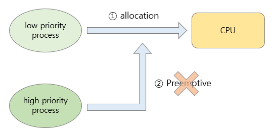
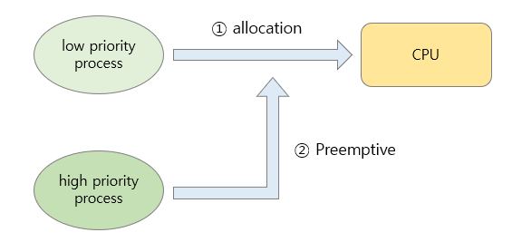
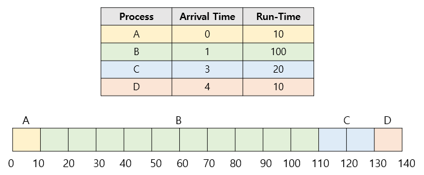
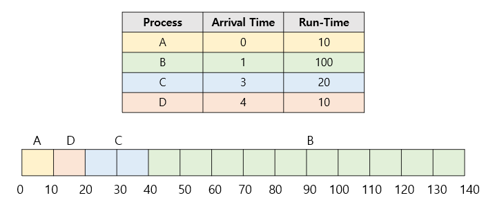
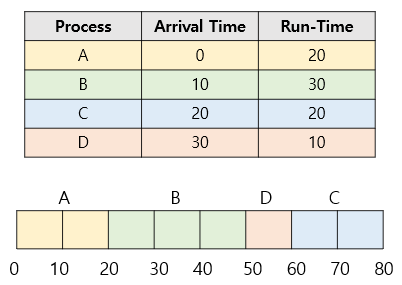
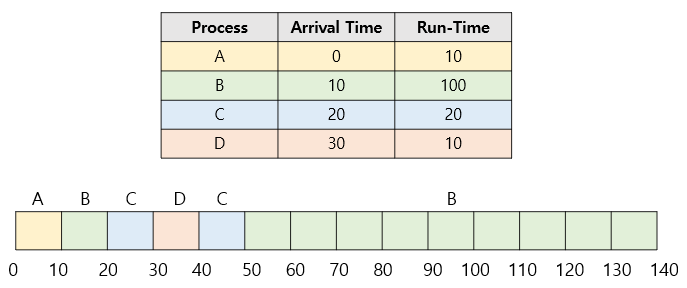
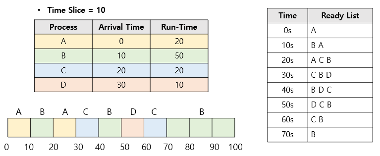
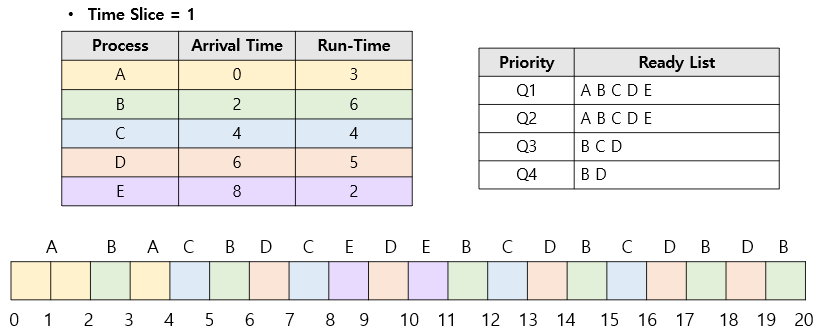

# CPU 스케줄링 알고리즘 정리

## 선점형 vs 비선점형 알고리즘
 

- **비선점형 (Non-preemptive)**  
  - 한 프로세스가 CPU를 점유하면 스스로 종료하거나 대기 상태에 들어갈 때까지 CPU를 뺏기지 않음  
  - 장점: Context Switching 오버헤드 적음  
  - 단점: 대기 시간이 길어질 수 있음 (특히 긴 작업 앞에 있을 경우)  

 

- **선점형 (Preemptive)**  
  - 스케줄러가 CPU를 강제로 회수하여 다른 프로세스에 할당 가능  
  - 장점: 응답 시간 단축, 인터랙티브 시스템에 적합  
  - 단점: Context Switching 오버헤드 증가  

---

## 1. FCFS (First Come, First Served)
 

### 설명
- **비선점형**: 도착한 순서대로 실행  
- 구현이 단순하고 공정  
- 단점: 긴 작업이 먼저 오면 짧은 작업이 오래 기다리는 **Convoy Effect** 발생  

### 예제
| 프로세스 | 도착시간 | 실행시간 |
|----------|---------|---------|
| A | 0 | 10 |
| B | 1 | 100 |
| C | 3 | 20 |
| D | 4 | 10 |

### 예제 풀이
- 실행 순서: **A(0~10) → B(10~110) → C(110~130) → D(130~140)**
- 계산
  - A: 반환=10−0=10, 응답=0−0=0
  - B: 반환=110−1=109, 응답=10−1=9
  - C: 반환=130−3=127, 응답=110−3=107
  - D: 반환=140−4=136, 응답=130−4=126
- 평균 반환 시간 = **95.5**  
- 평균 응답 시간 = **63**

---

## 2. SJF (Shortest Job First)
 

### 설명
- **비선점형**: 준비 큐에서 실행 시간이 가장 짧은 프로세스 우선  
- 평균 대기시간 최소화  
- 단점: 긴 작업 기아(Starvation) 문제 발생  

### 예제
| 프로세스 | 도착시간 | 실행시간 |
|----------|---------|---------|
| A | 0 | 10 |
| B | 1 | 40 |
| C | 3 | 20 |
| D | 4 | 10 |

### 예제 풀이
- 실행 순서: **A(0~10) → D(10~20) → C(20~40) → B(40~80)**
- 계산
  - A: 반환=10−0=10, 응답=0
  - B: 반환=80−1=79, 응답=39
  - C: 반환=40−3=37, 응답=17
  - D: 반환=20−4=16, 응답=6
- 평균 반환 시간 = **35.5**  
- 평균 응답 시간 = **15.5**

---

## 3. HRN (Highest Response Ratio Next)
 

### 설명
- **비선점형**  
- 우선순위 = (대기시간 + 실행시간) / 실행시간  
- 오래 기다린 프로세스의 우선순위 ↑ → SJF의 기아 문제 해결  

### 예제
| 프로세스 | 도착시간 | 실행시간 |
|----------|---------|---------|
| A | 0 | 20 |
| B | 10 | 30 |
| C | 20 | 60 |
| D | 30 | 50 |

### 예제 풀이
- 실행 순서: **A(0~20) → B(20~50) → C(50~110) → D(110~160)**
- 평균 반환 시간 = **37.5**  
- 평균 응답 시간 = **17.5**

---

## 4. SRT (Shortest Remaining Time First)
 

### 설명
- **선점형 SJF**  
- 새 프로세스 도착 시, 현재 실행 중인 프로세스보다 남은 시간이 짧으면 선점  
- 평균 대기시간 최소화  
- 단점: Context Switching 많음, 긴 작업 기아 발생 가능  

### 예제
| 프로세스 | 도착시간 | 실행시간 |
|----------|---------|---------|
| A | 0 | 10 |
| B | 10 | 140 |
| C | 20 | 50 |
| D | 30 | 40 |

### 예제 풀이
- 실행 순서(요약):  
  - 0~10: A 실행 완료  
  - 10~20: B 실행 시작  
  - 20: C 도착(50<130) → C 실행  
  - 30: D 도착(40<50) → D 실행  
  - 이후 C, D 완료 후 B 마무리
- 평균 반환 시간 = **45**  
- 평균 응답 시간 = **0**

---

## 5. RR (Round Robin)
 

### 설명
- **선점형**  
- 동일한 시간 할당량(Time Quantum)을 주고, 시간 초과 시 Ready 큐 뒤로 이동  
- Time Quantum 크기에 따라 성능 변화  
  - 크면 FCFS와 유사  
  - 작으면 Context Switching 과다  

### 예제
| 프로세스 | 도착시간 | 실행시간 |
|----------|---------|---------|
| A | 0 | 30 |
| B | 10 | 100 |
| C | 20 | 70 |
| D | 30 | 60 |

### 예제 풀이
- Time Quantum = 10  
- 실행 순서: A(0~10) → B(10~20) → C(20~30) → D(30~40) → A(10 남음)… 반복  
- 평균 반환 시간 = **50**  
- 평균 응답 시간 = **7.5**

---

## 6. MLFQ (Multilevel Feedback Queue)
 

### 설명
- **혼합형(선점/비선점 모두 가능)**  
- 여러 큐로 나누고, CPU 사용 패턴에 따라 프로세스가 큐 사이를 이동  
- CPU 많이 쓰면 낮은 큐로, 오래 대기하면 높은 큐로 승격 (**Aging 내장**)  
- 다양한 작업 특성에 대응 가능한 가장 유연한 방식  

### 예제
| 프로세스 | 도착시간 | 실행시간 |
|----------|---------|---------|
| A | 0 | 4 |
| B | 2 | 20 |
| C | 4 | 16 |
| D | 6 | 19 |
| E | 8 | 11 |

### 예제 풀이
- 짧은 작업 A는 최상위 큐에서 빠르게 실행  
- 긴 작업 B, C, D, E는 CPU 사용량에 따라 점차 낮은 큐로 이동  
- Boosting을 통해 기아 방지  
- 평균 반환 시간 = **10**  
- 평균 응답 시간 = **0**

---

# 최종 비교 요약표

| 알고리즘 | 선점 여부 | 실행 순서/특징 | 평균 반환 시간 | 평균 응답 시간 | 비고 |
|----------|-----------|----------------|----------------|----------------|------|
| FCFS | 비선점 | 도착 순 실행, Convoy Effect 발생 | 95.5 | 63 | 구현 단순 |
| SJF | 비선점 | 실행시간 짧은 순, 기아 문제 | 35.5 | 15.5 | 평균 대기 최소화 |
| HRN | 비선점 | 응답 비율 우선, 기아 해결 | 37.5 | 17.5 | Aging 내장 |
| SRT | 선점 | 남은 실행시간 짧은 순, 잦은 선점 | 45 | 0 | SJF 선점형 |
| RR | 선점 | Time Quantum 기반 순환 | 50 | 7.5 | 시분할 시스템 |
| MLFQ | 혼합 | 다단계 큐, 프로세스 이동 가능 | 10 | 0 | 가장 유연 |
