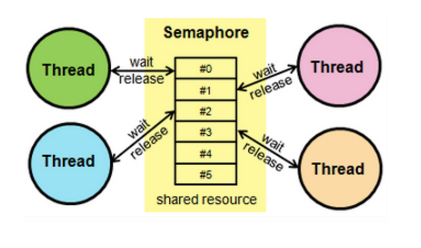
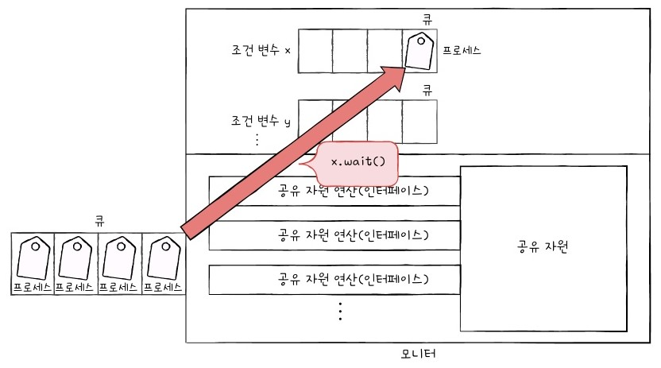
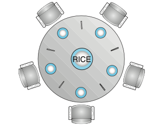

# 프로세스 동기화 (Process Synchronization)

## 동기화란?
- 다수의 프로세스/스레드가 **공유 자원**에 접근할 때 실행 순서를 제어하는 기법  
- 목적: 데이터 일관성 보장, 경쟁 상태(Race Condition) 방지  

---

## 동기화가 필요한 이유
- 멀티프로세스, 멀티스레드 환경에서는 **동시에 같은 데이터**를 접근/수정할 수 있음  
- 제어하지 않으면 데이터 불일치 발생  
- 예: 은행 계좌에서 동시에 출금하면 최종 잔액이 잘못 기록될 수 있음  

---

## 동기화 문제 (Classic Problems)
- **Race Condition**: 실행 순서에 따라 결과가 달라지는 문제  
- **Deadlock**: 서로 자원을 점유한 채 무한 대기  
- **Starvation**: 우선순위에 밀려 특정 프로세스가 무한정 대기  

---

## 동기화 주요 기법

### 1. 뮤텍스(Mutex)
 

- Lock/Unlock 기반, 한 번에 하나의 실행 단위만 임계 구역 진입 가능  
- 연산: `acquire`, `release`

---

### 2. 세마포어(Semaphore)
 

- 카운터 기반 동기화 도구  
- **Counting Semaphore**: 자원의 개수를 세어 여러 스레드 접근 허용  
- **Binary Semaphore**: 뮤텍스와 동일하게 0/1 상태만 가짐  
- 연산: `wait`, `signal`

---

### 3. 모니터(Monitor)
 

- 공유 자원 + 임계 구역 접근 함수를 묶어서 고급 언어 수준에서 관리  
- 개발자가 직접 Lock/Unlock 다루지 않아도 됨  
- 연산: `enter`, `leave`

---

### 4. 조건 변수 (Condition Variable)
- 모니터 내부에서 특정 조건 충족 시까지 대기/신호를 관리  
- 연산: `wait`, `signal`, `broadcast`

---

## 생산자-소비자 문제 (Producer-Consumer Problem)
- 버퍼를 공유하며 **생산자**는 데이터를 추가, **소비자**는 데이터를 가져감  
- 세마포어로 동기화  

- 변수
  - `full`: 채워진 버퍼 개수  
  - `empty`: 비어 있는 버퍼 개수  
  - `mutex`: 임계 구역 보호  

- 연산 흐름
  - 생산자: `wait(empty) → wait(mutex) → insert → signal(mutex) → signal(full)`  
  - 소비자: `wait(full) → wait(mutex) → remove → signal(mutex) → signal(empty)`

 

---

## Readers-Writers 문제
- 여러 **Reader**가 동시에 읽는 것은 허용되지만, **Writer**는 배타적 접근 필요  
- 해결책: 우선순위를 Reader 혹은 Writer에 두는 방식 다양  

- 변수
  - `readCount`: 현재 읽고 있는 Reader 수  
  - `mutex`: readCount 보호  
  - `rw_mutex`: Reader/Writer 상호 배제  

- 연산 흐름
  - Reader:  
    - `wait(mutex) → readCount++ → if (readCount==1) wait(rw_mutex) → signal(mutex)`  
    - 읽기 수행  
    - `wait(mutex) → readCount-- → if (readCount==0) signal(rw_mutex) → signal(mutex)`  
  - Writer:  
    - `wait(rw_mutex)`  
    - 쓰기 수행  
    - `signal(rw_mutex)`

---

## Dining Philosophers 문제
 

- N명의 철학자가 원탁에 앉아 있고, 각자 좌우에 포크 하나씩 존재  
- 철학자는 생각(thinking)과 식사(eating)을 반복  
- 문제: 두 개의 포크를 모두 잡아야 식사 가능  

- 변수
  - 철학자 i는 `fork[i]`와 `fork[(i+1)%N]` 필요  

- 연산 흐름 (기본)
  - `wait(fork[i])`  
  - `wait(fork[(i+1)%N])`  
  - 식사  
  - `signal(fork[i])`  
  - `signal(fork[(i+1)%N])`  

- 교착 상태(Deadlock) 방지 기법
  - 비대칭 접근: 짝수 철학자는 왼쪽→오른쪽, 홀수 철학자는 오른쪽→왼쪽 순으로 집기  
  - 한 명은 제한적으로 포크를 잡지 않도록 허용 (최대 N-1명만 동시에 시도)

---

## 동기화 기법 비교

| 기법 | 특징 | 장점 | 단점 |
|------|------|------|------|
| Mutex | Lock/Unlock 기반 | 단순, 효율적 | 교착상태 가능 |
| Semaphore | 카운터 기반 | 자원 개수 관리 | P/V 연산 복잡, 오용 가능 |
| Monitor | 언어 수준 제공 | 직관적, 안전성 ↑ | 언어 제약 존재 |
| Condition Variable | 모니터 보조 도구 | 조건 충족 기반 제어 | 뮤텍스와 함께 사용 필요 |

---

## 요약
- 동기화는 공유 자원 접근 시 **데이터 무결성** 보장  
- 주요 기법: **Mutex, Semaphore, Monitor, Condition Variable**  
- 대표 문제: **생산자-소비자, Readers-Writers, Dining Philosophers**  
- 잘못된 동기화는 **Race Condition, Deadlock, Starvation**을 유발  
