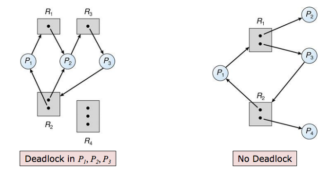
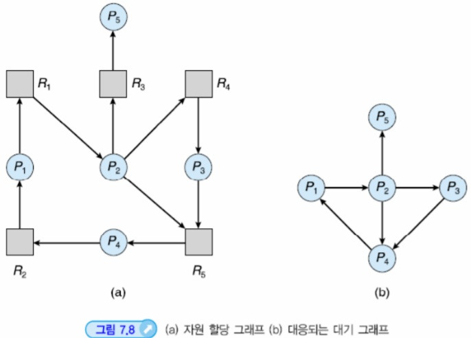

# 교착상태(Deadlock)

## 1. 교착상태란?
 
운영체제에서 여러 프로세스가 동시에 실행되면서 **한정된 자원을 서로 차지하려고 할 때** 발생하는 문제
예를 들어,

* 프로세스 A는 **프린터**를 잡고 있고 **스캐너**를 기다림
* 프로세스 B는 **스캐너**를 잡고 있고 **프린터**를 기다림

두 프로세스 모두 상대방이 가진 자원을 기다리느라 **아무도 앞으로 나아가지 못하는 상태**가 바로 교착상태
즉, 시스템 전체가 **무한 대기 상태**에 빠지는 것

---

## 2. 교착상태 발생 조건 (Coffman의 네 가지 조건)

교착상태가 발생하려면 반드시 **다음 네 가지 조건이 동시에 성립**해야 한다.

1. **상호 배제 (Mutual Exclusion)**

   * 어떤 자원은 동시에 한 프로세스만 사용할 수 있음.
   * 예: 프린터는 한 번에 한 프로세스만 출력 가능.

2. **점유와 대기 (Hold and Wait)**

   * 프로세스가 하나의 자원을 가진 상태에서, 추가 자원을 요청하면서 대기.
   * 예: A가 프린터를 점유한 상태에서 스캐너 요청.

3. **비선점 (No Preemption)**

   * 다른 프로세스가 점유 중인 자원을 강제로 빼앗을 수 없음.
   * 자원은 오직 점유한 프로세스가 자발적으로 반환할 때만 회수됨.

4. **환형 대기 (Circular Wait)**

   * 여러 프로세스가 원형 고리처럼 서로가 가진 자원을 기다리는 관계가 형성됨.
   * 예: A → 스캐너, B → 프린터, 서로 무한 대기.

👉 교착상태는 이 4가지 조건이 동시에 만족할 때만 발생합니다.
따라서 하나라도 깨뜨리면 교착상태는 예방할 수 있습니다.

---

## 3. 교착상태 해결 방법

### (1) 예방 (Prevention)

* 애초에 교착상태 발생 조건 중 하나를 만족하지 못하도록 시스템을 설계.
* 예: 모든 자원을 한 번에 요청하게 하거나, 자원 사용 순서를 정해놓음.

  * 단점: 자원 활용도가 떨어져 비효율적.

### (2) 회피 (Avoidance)

* 교착상태가 일어날 가능성을 **사전에 피하는 전략**.
* 대표적 기법: **은행원 알고리즘 (Banker’s Algorithm)**

  * 프로세스가 자원을 요청했을 때, 시스템이 교착상태에 빠지지 않는 “안전 상태”라면 할당,
  * 위험하다면 대기시키는 방식.
* 단점: 미래 자원 요청을 미리 알아야 하므로 실제 적용은 어려움.

### (3) 탐지 (Detection)

* 교착상태가 발생했는지를 **실시간 또는 주기적으로 검사**.
* 방법: 자원 할당 그래프(RAG)에서 사이클이 생겼는지 확인.
* 단점: 이미 교착상태가 발생한 후에 알 수 있음.

### (4) 회복 (Recovery)

* 탐지 후 교착상태를 깨뜨리는 방법.

  * 교착상태에 걸린 프로세스를 강제로 종료.
  * 일부 자원을 강제 회수(선점).
* 단점: 데이터 손실이나 시스템 불안정성이 발생할 수 있음.

---

## 4. 자원 할당 그래프 (Resource Allocation Graph, RAG)
 

* 교착상태 여부를 판별하기 위해 **프로세스와 자원의 관계**를 그래프로 나타낸 것.
* 정점: 프로세스(P)와 자원(R)
* 간선:

  * **P → R** : 프로세스가 자원을 요청 중
  * **R → P** : 자원이 프로세스에 할당됨
* 그래프에 **사이클(cycle)**이 존재하면 교착상태가 발생했거나 발생 가능성이 있음.

---

## 5. 예시로 보는 교착상태

### 상황:

* 자원: 프린터(Printer), 스캐너(Scanner)
* 프로세스 A: 프린터를 점유 → 스캐너 필요
* 프로세스 B: 스캐너를 점유 → 프린터 필요

### 결과:

* A는 B가 가진 스캐너를 기다리고,
* B는 A가 가진 프린터를 기다림.
* 둘 다 무한 대기 상태에 빠짐 → **교착상태 발생**

---

## 6. 핵심 요약

* 교착상태 = 프로세스들이 자원을 점유하고 서로를 기다리며 멈추는 상태
* 발생 조건: **상호 배제, 점유와 대기, 비선점, 환형 대기**
* 해결 방법: **예방 / 회피 / 탐지 / 회복**

---
