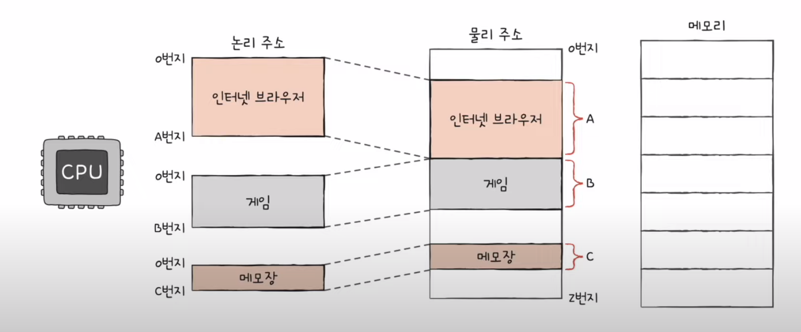
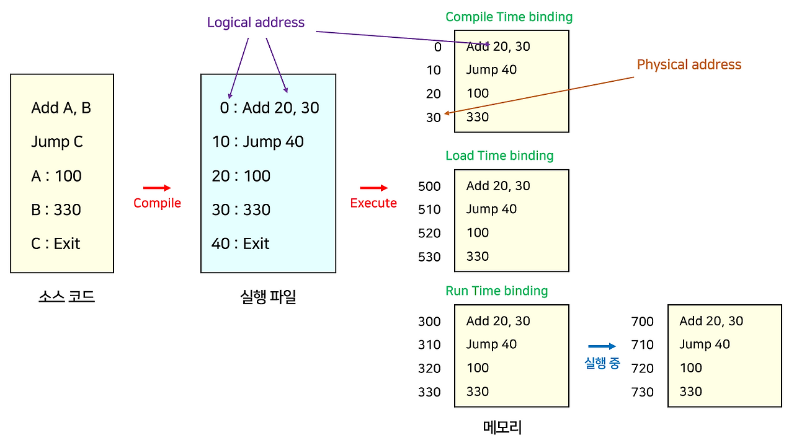

# 메모리 관리

운영체제(OS)의 핵심 기능 중 하나는 **메모리 관리(Memory Management)** 입니다.  
CPU가 프로그램을 실행하려면 반드시 메모리에 올라가야 하고, 여러 프로그램이 동시에 실행될 때는  
서로 침범하지 않고 효율적으로 자원을 활용할 수 있어야 합니다.  

---

## 1. 왜 메모리 관리가 필요할까?

* 프로그램은 실행되기 위해 반드시 **RAM(주기억장치)** 에 적재되어야 함
* 동시에 여러 프로그램이 실행되면, 서로 **메모리를 침범하지 않도록 보호**가 필요
* 한정된 메모리를 효율적으로 나눠 쓰기 위해 운영체제가 **메모리 관리자(Memory Manager)** 역할 수행

---

## 2. 주소(Address)의 종류
 
 

### (1) 논리 주소 (Logical Address)
* 프로세스와 프로그래머가 인식하는 주소 (즉, **가상 주소**)  
* 예: 배열 `a[10]`의 시작 주소를 1000이라고 인식  
* CPU가 생성하는 주소이며, 실제 물리 메모리와 직접 연결되지 않음

### (2) 물리 주소 (Physical Address)
* 실제 **RAM(물리 메모리)** 상의 주소  
* 예: `a[10]`이 실제로는 RAM의 5000번지부터 저장될 수 있음  

👉 변환 과정: **논리 주소 → MMU → 물리 주소**

---

## 3. 메모리 할당 방식

### (1) 연속 할당 (Contiguous Allocation)
* 하나의 프로세스를 연속된 공간에 통째로 적재
* 단순하지만, **외부 단편화** 문제 발생

#### 연속 할당의 대표 전략
1. **최초 적합 (First Fit)**  
   * 앞에서부터 탐색해 **처음 맞는 공간**에 할당  
   * 빠르지만, 앞쪽에 작은 조각난 공간이 많이 생김  

2. **최적 적합 (Best Fit)**  
   * 전체 빈 공간 중 **가장 크기가 딱 맞는 곳**에 할당  
   * 메모리 낭비 최소화 가능  
   * 하지만 작은 조각들이 많이 생길 수 있고, 탐색 시간이 오래 걸림  

3. **최악 적합 (Worst Fit)**  
   * 가장 큰 빈 공간에 할당  
   * 작은 조각이 생기지 않지만 전체적으로 비효율적  

---

### (2) 불연속 할당 (Non-Contiguous Allocation)
프로세스를 여러 조각으로 나눠서 배치 가능

#### (a) 페이징 (Paging)
* 메모리 → 프레임(Frame), 프로그램 → 페이지(Page)로 동일 크기로 분할  
* 장점: 외부 단편화 없음  
* 단점: 페이지 끝이 비면 내부 단편화 발생  
* 비유: 책을 페이지별로 나눠 아무 칸에 꽂는 느낌  

#### (b) 세그멘테이션 (Segmentation)
* 프로그램을 **논리적 단위**(코드, 데이터, 스택 등)로 나눠서 배치  
* 장점: 구조적 관리 가능  
* 단점: 크기가 제각각이므로 외부 단편화 발생  
* 비유: 책을 “소설 / 그림 / 참고자료”처럼 챕터별로 나눠 보관하는 느낌  

---

## 4. 단편화 (Fragmentation)

메모리를 할당하다 보면 낭비되는 공간이 생김

### (1) 내부 단편화 (Internal Fragmentation)
* 할당된 블록 내부의 낭비  
* 예: 100KB 공간에 95KB 프로그램 → 5KB 사용 불가  

### (2) 외부 단편화 (External Fragmentation)
* 전체 빈 공간은 충분하지만, 조각나 있어서 큰 프로그램을 못 올리는 경우  
* 해결책: 메모리 압축(Compaction) → 하지만 오버헤드가 크고 완전한 해결은 어려움  
* 궁극적 해결: **불연속 할당 (페이징, 세그멘테이션)**  

---

## 5. 스와핑 (Swapping)

* **프로세스 단위**로 메모리 ↔ 디스크 간 교체하는 기법
* 멀티프로그래밍 환경에서 메모리가 부족할 때 사용
* 스왑 영역(swap space): 디스크의 일부 영역을 스와핑에 사용

### 동작
* **스왑아웃(Swap-Out)** : 실행 중이지 않은 프로세스를 메모리에서 디스크로 내보냄  
* **스왑인(Swap-In)** : 다시 필요해진 프로세스를 디스크에서 메모리로 불러옴  

👉 스와핑의 목적은 **메모리 부족 상황 해결 및 시분할 시스템 지원**이지,  
   **단편화 문제 해결**이 아님! (단편화는 페이징/세그멘테이션으로 해결)  

---

## 6. 가상 메모리 (Virtual Memory)
 

* 실제 메모리보다 큰 공간을 쓰는 것처럼 보이게 하는 기술  
* 프로세스 전체가 아닌, **일부만 메모리에 올리고 나머지는 디스크에 보관**  
* 필요할 때만 불러오는 방식 (**Demand Paging**)  

### 중요 개념
* **페이지 부재(Page Fault)**: 필요한 페이지가 메모리에 없을 때 발생  
* **페이지 교체 알고리즘**  
  * FIFO : 먼저 들어온 페이지 제거  
  * LRU : 가장 오래 안 쓴 페이지 제거  
  * Optimal : 앞으로 가장 오래 안 쓸 페이지 제거 (이론적 최적)  

---

## 7. 한눈에 보는 핵심 요약

* **주소 변환** : 논리 ↔ 물리 (MMU가 담당)  
* **연속 할당** : 간단하지만 외부 단편화 존재 (First Fit / Best Fit / Worst Fit)  
* **불연속 할당** : 페이징(외부 단편화 없음, 내부 단편화 가능) / 세그멘테이션(논리적 단위, 외부 단편화 있음)  
* **단편화** : 내부(블록 내부 낭비) / 외부(공간 흩어져 있음)  
* **스와핑** : 프로세스를 디스크와 메모리 간 교체 (메모리 부족 해결)  
* **가상 메모리** : 실제보다 큰 공간처럼 사용, 페이지 교체 알고리즘 필요  
