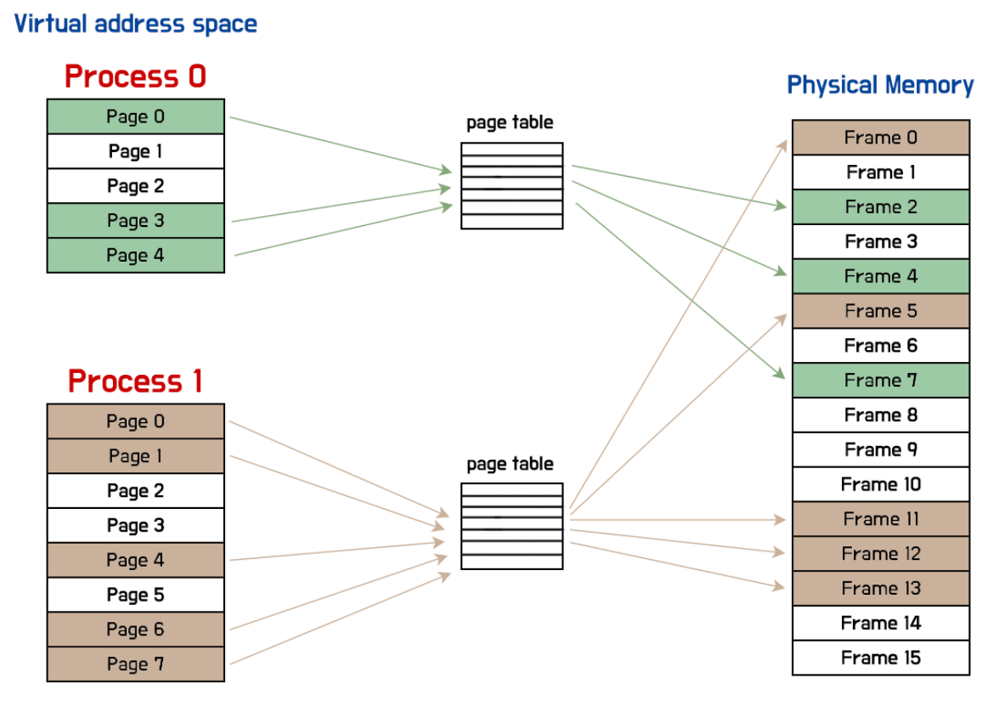
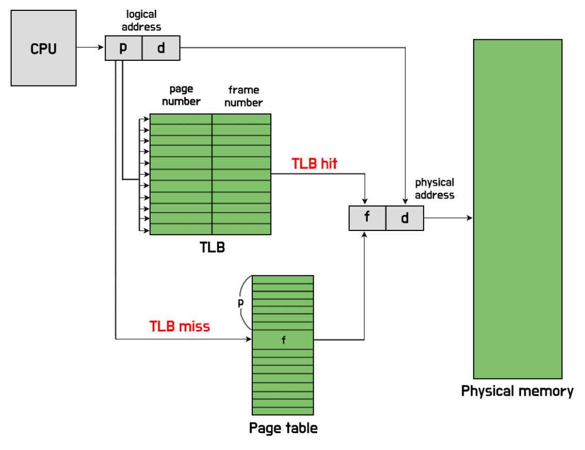
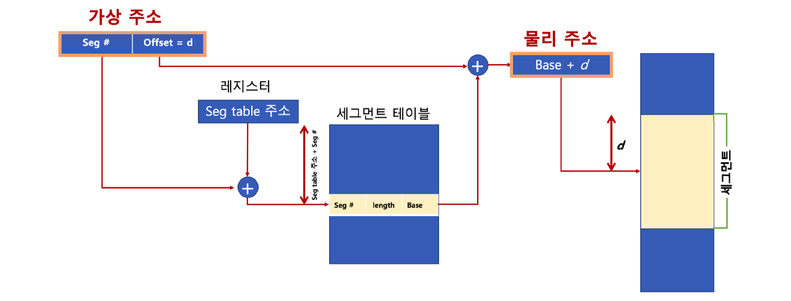

# 페이징 (Paging) vs 세그멘테이션 (Segmentation)

## 1. 페이징 (Paging)

### 개념
 
* 메모리를 고정된 크기의 **프레임(Frame)** 으로 나누고, 프로세스를 같은 크기의 **페이지(Page)** 단위로 쪼개어 올리는 방식
* 외부 단편화를 구조적으로 제거(프로세스가 물리적으로 흩어져 있어도 OK). 단, compaction 없이도 해결되지만 페이지 끝 여유분은 낭비될 수 있음.

### 페이지 테이블 (Page Table) — ★핵심 추가

* **역할:** 논리 주소의 **페이지 번호 → 프레임 번호** 매핑 표
* **주소 형식:**

  * 논리 주소 = (페이지 번호, 페이지 오프셋)
  * 물리 주소 = (프레임 번호, 페이지 오프셋)
* **PTE(페이지 테이블 엔트리) 주요 비트 예시:**

  * **Present/Valid**: 메모리에 존재 여부
  * **R/W, U/S**: 읽기/쓰기, 사용자/커널 권한
  * **Accessed(Referenced)**: 참조 여부 (Clock/LRU 근사에 활용)
  * **Dirty**: 수정됨(디스크에 다시 써야 함)
  * **Frame Number**: 매핑되는 물리 프레임 번호

#### 주소 변환 예시

* 페이지 크기 = 1KB(1024B), 논리 주소 = **2500**

  * 페이지 번호 = 2500 ÷ 1024 = **2**
  * 오프셋 = 2500 % 1024 = **452**
  * 페이지 테이블: page 2 → frame **5**
  * 물리 주소 = (5 × 1024) + 452 = **5572**

### TLB(Translation Lookaside Buffer)
 
* 페이지 번호→프레임 번호 매핑을 **캐시**하여 주소 변환 속도를 높임(히트 시 메모리 접근 1회로 단축, 미스 시 페이지 테이블 접근).

### 페이지 테이블 최적화

* **다단계 페이지 테이블(Multi-level PT):** 거대한 단일 테이블 대신 상위/하위 테이블로 분할해 **희소 공간**에서 메모리 절약.
* **역 페이지 테이블(Inverted PT):** “프레임 중심” 역색인 구조(프로세스 ID+페이지 번호로 탐색)로 테이블 크기 축소.
* **페이지 크기 트레이드오프:**

  * 크기가 **크면** : 테이블 작아지고 TLB 도달 범위↑, **내부 단편화↑**
  * 크기가 **작으면** : 내부 단편화↓, 하지만 테이블/오버헤드↑
  * (현대 OS는 일반/대형/거대 페이지를 혼용)

### 페이지 부재(Page Fault)와 처리 흐름

1. 유효 비트(Valid/Present) 확인 → 없으면 PF 발생
2. 커널 ISR로 진입, 디스크에서 해당 페이지 읽기
3. 빈 프레임에 적재(필요 시 **페이지 교체** )
4. PTE 갱신(프레임 번호·비트), 명령 재실행

### 예시

* 물리 메모리가 4KB 프레임 10개
* 12KB 프로그램 → 3페이지

  * Page0→Frame2, Page1→Frame7, Page2→Frame5
  * **물리적으로 연속되지 않아도 실행 가능**

### 장단점

* **장점:** 외부 단편화 없음, 프로세스 연속 배치 불필요
* **단점:** **내부 단편화** (마지막 페이지 여유 공간), 주소 변환 오버헤드(TLB 의존)

---

## 2. 세그멘테이션 (Segmentation)
 

### 개념

* 프로그램을 의미 단위인 **세그먼트(Segment)** (코드, 데이터, 스택, 라이브러리 등)로 나눠 메모리에 배치하는 **가변 크기** 관리 방식.

### 세그먼트 테이블

* **엔트리:** (Base 시작 주소, Limit 크기, 권한 비트)
* **주소 변환:** 물리 주소 = base + offset (단, offset ≤ limit; 위반 시 예외)
* **보호/공유:** 각 세그먼트별 r/w/x, 사용자/커널 권한 설정 및 **코드 세그먼트 공유** 용이. 
### 예시

* 코드 10KB, 데이터 5KB, 스택 2KB → 각기 다른 위치에 연속 배치
* 접근은 (세그먼트 번호, 오프셋)으로 수행

### 장단점

* **장점:** 의미 단위 관리로 모듈 보호·공유 유리(개발자 관점과 잘 맞음)
* **단점:** 크기 제각각 → **외부 단편화** 발생 가능(큰 세그먼트를 놓을 연속 영역이 없을 수 있음)

---

## 3. 단편화(Fragmentation) — ★보강

### 내부 단편화 (Internal)

* **원인:** **고정 크기** 블록(페이지/프레임) 때문에 남는 자투리 공간
* **예:** 100KB 블록에 95KB 적재 → 5KB 낭비
* **관련:** 페이징에서 주로 나타남

### 외부 단편화 (External)

* **원인:** **가변 크기** 블록을 연속 배치하려다 빈 공간이 잘게 조각남
* **현상:** 총합은 충분해도 **연속 큰 블록** 이 없어 수용 불가
* **대응:** compaction(재배치)이나 페이징 도입(구조적 해결). compaction은 비용/중단 오버헤드 큼.

---

## 4. 페이징 vs 세그멘테이션 비교

| 구분  | 페이징 (Paging)           | 세그멘테이션 (Segmentation)       |
| --- | ---------------------- | --------------------------- |
| 단위  | **고정 크기** 페이지          | **가변 크기** 세그먼트              |
| 기준  | 물리적 단위(프레임)            | 논리적 단위(코드/데이터/스택 등)         |
| 테이블 | **페이지 테이블(PTE 비트 포함)** | **세그먼트 테이블(base/limit/권한)** |
| 주소  | (페이지 번호, 오프셋)          | (세그먼트 번호, 오프셋)              |
| 장점  | 외부 단편화 X, 스와핑/요구적재에 적합 | 보호/공유·모듈 관리 용이              |
| 단점  | **내부 단편화 O** , 변환 오버헤드  | **외부 단편화 O** , compaction 고려 |
| 활용  | 가상 메모리 기본 구조           | 논리 구조 반영, 일부 OS에서 병행        |

---

## 5. 혼합 기법 (Segmentation + Paging)

* 세그먼트를 먼저 나누고, 각 세그먼트를 **페이지 단위**로 다시 분할해 배치
* **효과:** 세그멘테이션의 **논리적 장점** + 페이징의 **외부 단편화 해결** 결합
* **대가:** 주소 변환 단계 증가(테이블 다중 조회)
