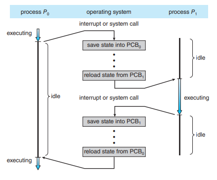
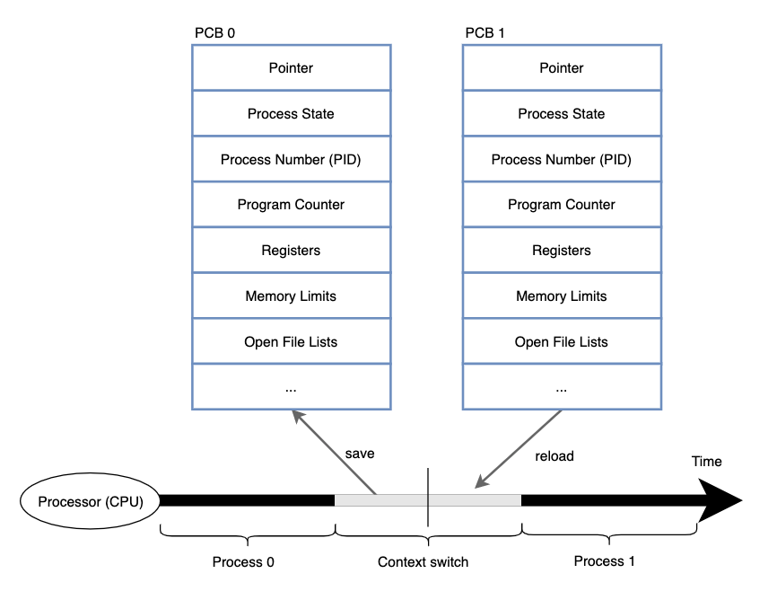

# Context Switching (문맥 전환)

## Context Switching 이란?
- 실행 중인 프로세스/스레드에서 다른 프로세스/스레드로 전환하는 과정  
- CPU가 현재 실행 상태를 저장하고, 다음 실행 단위의 상태를 복원하는 작업  
- 운영체제가 **멀티태스킹, 멀티프로세싱, 멀티스레딩**을 지원하기 위해 반드시 필요  

 

---

## Context Switching 발생 원인
- **프로세스 종료**: 하나의 프로세스 실행이 끝나면 다른 프로세스로 교체  
- **인터럽트 발생**: I/O 완료, 타이머 인터럽트 등 외부 이벤트 처리 필요  
- **시스템 호출 (System Call)**: 프로세스가 커널 서비스를 요청한 경우  
- **스케줄링 정책**: 선점형 스케줄링에서 Time Quantum 초과 시 강제 전환  

---

## Context Switching 과정
 

1. **현재 실행 중인 프로세스의 상태(context) 저장**  
   - Program Counter (PC)  
   - CPU 레지스터 값  
   - 메모리 관리 정보 (페이지 테이블 등)  
   - PCB(Process Control Block)에 기록  

2. **새로운 프로세스/스레드 선택** (스케줄러에 의해 결정)  

3. **새로운 프로세스의 context 복원**  
   - PCB에서 PC, 레지스터 값 등을 복원  
   - CPU가 해당 프로세스를 이어 실행  

---

## Context Switching 비용
- **CPU 오버헤드**: 실제 작업이 아닌, 상태 저장/복원에 CPU 자원이 소비됨  
- **캐시 무효화(Cache Miss)**: CPU 캐시, TLB(Translation Lookaside Buffer), 파이프라인 등이 초기화되어 성능 저하  
- **메모리 접근 증가**: PCB 저장/복원 시 메모리 접근 발생  

➡️ 따라서 Context Switching은 **필요 최소한**으로 발생해야 성능 유지 가능  

---

## 프로세스 vs 스레드 Context Switching
- **프로세스 전환**  
  - 독립된 메모리 공간(페이지 테이블, 주소 공간 등)을 교체  
  - 캐시 flush 발생 → 비용 큼  
- **스레드 전환 (동일 프로세스 내)**  
  - 코드/데이터/힙 공유  
  - 스택/레지스터/PC만 교체  
  - 프로세스 전환보다 훨씬 가벼움  

---

## Context Switching 최적화
- **스케줄링 정책 개선**: 불필요한 전환 최소화  
- **Time Quantum 조정**: 너무 짧으면 전환 과다, 너무 길면 응답성 저하  
- **스레드 활용**: 동일 프로세스 내 스레드 전환을 통해 전환 비용 감소  
- **하드웨어 지원**: 하드웨어 레벨에서 빠른 context save/restore 지원 (레지스터 윈도우 등)  

---

## 요약
- Context Switching은 멀티태스킹 시스템에서 필수  
- 하지만 상태 저장/복원에 따른 비용 존재  
- **프로세스 전환 > 스레드 전환** (비용이 더 큼)  
- 최적화 포인트: 불필요한 전환 줄이고, 하드웨어/스케줄링 정책으로 보완  
